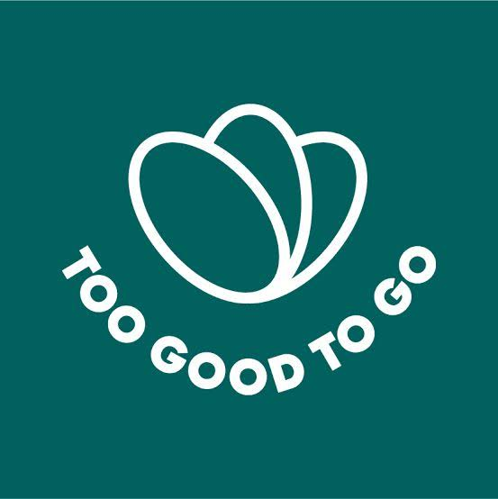
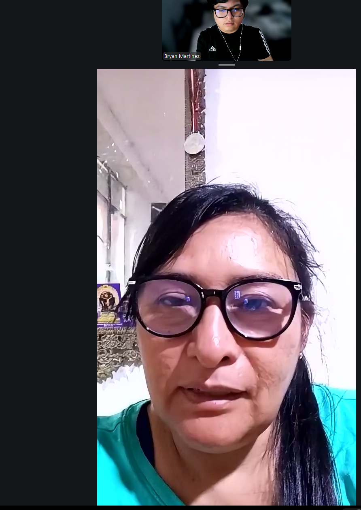
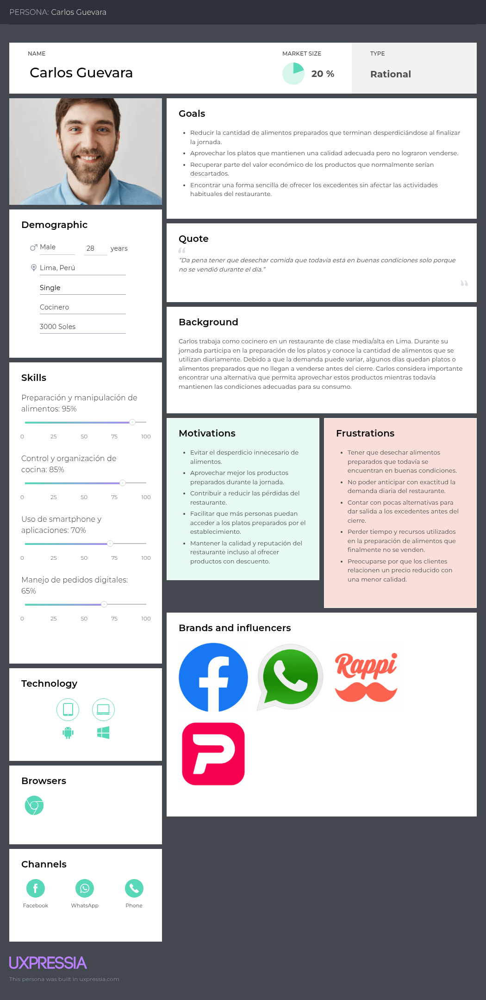
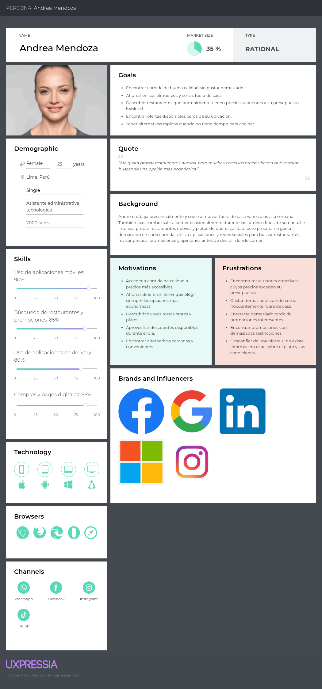
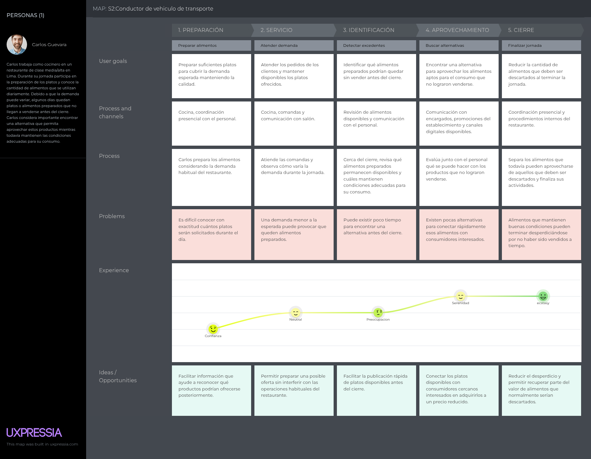
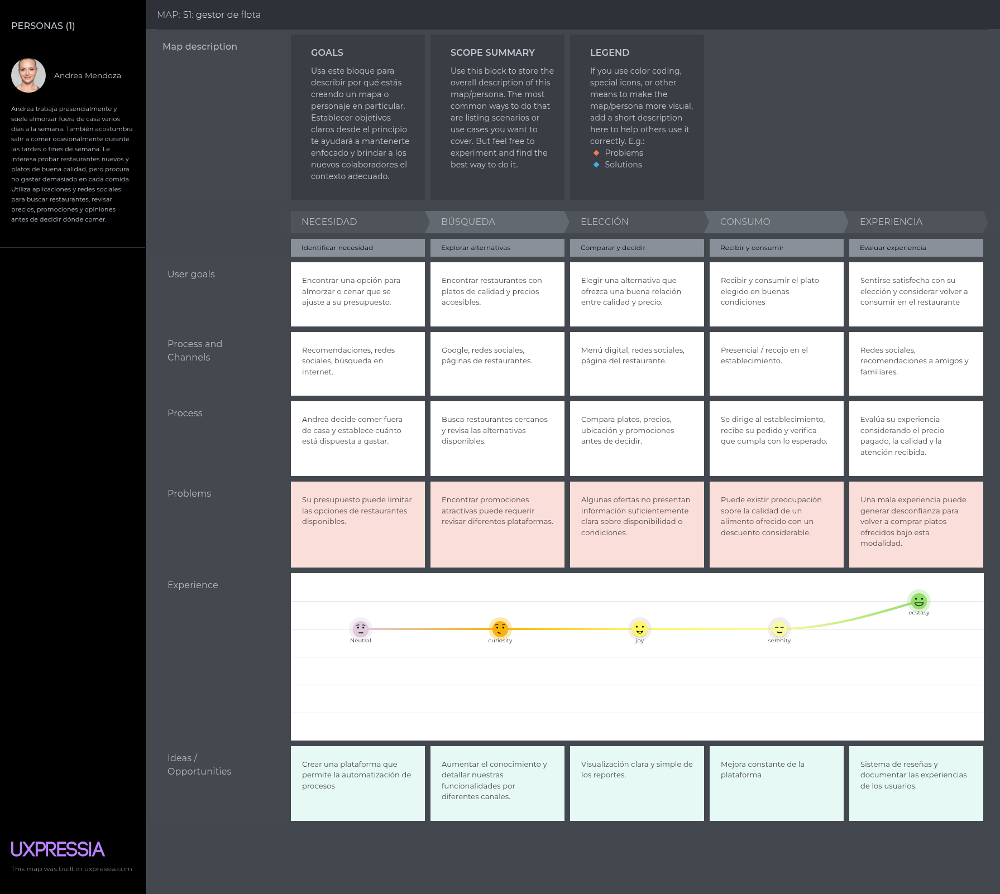

<!-- Carátula -->

    

 

<h1 style="text-align: center;">Universidad Peruana de Ciencias Aplicadas</h1>

<h3 style="text-align: center; font-weight: normal; font-size: 22px; margin-top: 0;">
Faculta de Ingeniería
</h3>

 

<strong>Carreras:</strong> INGENIERÍA DE SOFTWARE

<strong>Ciclo:</strong> 2026-20

1ASI0729 - Desarrollo de Aplicaciones Open Source

<strong>NRC:</strong> 7747

<strong>Docente:</strong>  Robles Fernández, Ivan

 

## "Informe del trabajo final"

**Startup:**  
 

**Producto:**  
 

## Relación de integrantes

<table style="margin: 0 auto; border-collapse: collapse;" border="1">
<tr>
<th>Código</th>
<th>Integrantes</th>
</tr>
<tr>
<td>U202326295</td>
<td>Huayra Moreyra José Maria</td>
</tr>
<tr>
<td>U202321590</td>
<td>Xin Yu Shi Lin</td>
</tr>
<tr>
<td>U20221e121</td>
<td>Giuliano Angel Peláez Vargas</td>
</tr>
<tr>
<td>U202316246</td>
<td>Martínez Ramos Bryan Felix</td>
</tr>
<tr>
<td>U202213185</td>
<td>Medina Merma, Ingrid Melani</td>
</tr>
</table>

Agosto 2026

<!-- Salto de Pagina -->

## Registro de Versiones del Informe

| Versión | Fecha    | Autor       | Descripción de Modificación            |
| ------- | -------- | ----------- | -------------------------------------- |
| 1.0     | // |  | Desarrollo de la Estructura del informe |

<!-- Salto de Pagina -->

## Project Report Collaboration Insights

<!-- Salto de Pagina -->

# Tabla de Contenidos

- [Capítulo I: Introducción](./Capitulo_1.md)
  - [1.1. Startup Profile](./Capitulo_1.md#11-startup-profile)
    - [1.1.1. Descripción de la Startup](./Capitulo_1.md#111-descripción-de-la-startup)
    - [1.1.2. Perfiles de integrantes del equipo](./Capitulo_1.md#112-perfiles-de-integrantes-del-equipo)
  - [1.2. Solution Profile](./Capitulo_1.md#12-solution-profile)
    - [1.2.1. Antecedentes y problemática](./Capitulo_1.md#121-antecedentes-y-problemática)
    - [1.2.2. Lean UX Process](./Capitulo_1.md#122-lean-ux-process)
      - [1.2.2.1. Lean UX Problem Statements](./Capitulo_1.md#1221-lean-ux-problem-statements)
      - [1.2.2.2. Lean UX Assumptions](./Capitulo_1.md#1222-lean-ux-assumptions)
      - [1.2.2.3. Lean UX Hypothesis Statements](./Capitulo_1.md#1223-lean-ux-hypothesis-statements)
      - [1.2.2.4. Lean UX Canvas](./Capitulo_1.md#1224-lean-ux-canvas)
  - [1.3. Segmentos objetivo](./Capitulo_1.md#13-segmentos-objetivo)

- [Capítulo II: Requirements Elicitation & Analysis](./Capitulo_2.md)
  - [2.1. Competidores](./Capitulo_2.md#21-competidores)
    - [2.1.1. Análisis competitivo](./Capitulo_2.md#211-análisis-competitivo)
    - [2.1.2. Estrategias y tácticas frente a competidores](./Capitulo_2.md#212-estrategias-y-tácticas-frente-a-competidores)
  - [2.2. Entrevistas](./Capitulo_2.md#22-entrevistas)
    - [2.2.1. Diseño de entrevistas](./Capitulo_2.md#221-diseño-de-entrevistas)
    - [2.2.2. Registro de entrevistas](./Capitulo_2.md#222-registro-de-entrevistas)
    - [2.2.3. Análisis de entrevistas](./Capitulo_2.md#223-análisis-de-entrevistas)
  - [2.3. Needfinding](./Capitulo_2.md#23-needfinding)
    - [2.3.1. User Personas](./Capitulo_2.md#231-user-personas)
    - [2.3.2. User Task Matrix](./Capitulo_2.md#232-user-task-matrix)
    - [2.3.3. User Journey Mapping](./Capitulo_2.md#233-user-journey-mapping)
    - [2.3.4. Empathy Mapping](./Capitulo_2.md#234-empathy-mapping)
  - [2.4. Big Picture Event Storming](./Capitulo_2.md#24-big-picture-event-storming)
  - [2.5. Ubiquitous Language](./Capitulo_2.md#25-ubiquitous-language)

- [Capítulo III: Requirements Specification](./Capitulo_3.md)
  - [3.1. User Stories](./Capitulo_3.md#31-user-stories)
  - [3.2. Impact Mapping](./Capitulo_3.md#32-impact-mapping)
  - [3.3. Product Backlog](./Capitulo_3.md#33-product-backlog)

- [Capítulo IV: Product Design](./Capitulo_4.md)
  - [4.1. Style Guidelines](./Capitulo_4.md#41-style-guidelines)
    - [4.1.1. General Style Guidelines](./Capitulo_4.md#411-general-style-guidelines)
    - [4.1.2. Web Style Guidelines](./Capitulo_4.md#412-web-style-guidelines)
  - [4.2. Information Architecture](./Capitulo_4.md#42-information-architecture)
    - [4.2.1. Organization Systems](./Capitulo_4.md#421-organization-systems)
    - [4.2.2. Labeling Systems](./Capitulo_4.md#422-labeling-systems)
    - [4.2.3. SEO Tags and Meta Tags](./Capitulo_4.md#423-seo-tags-and-meta-tags)
    - [4.2.4. Searching Systems](./Capitulo_4.md#424-searching-systems)
    - [4.2.5. Navigation Systems](./Capitulo_4.md#425-navigation-systems)
  - [4.3. Landing Page UI Design](./Capitulo_4.md#43-landing-page-ui-design)
    - [4.3.1. Landing Page Wireframe](./Capitulo_4.md#431-landing-page-wireframe)
    - [4.3.2. Landing Page Mock-up](./Capitulo_4.md#432-landing-page-mock-up)
  - [4.4. Web Applications UX/UI Design](./Capitulo_4.md#44-web-applications-uxui-design)
    - [4.4.1. Web Applications Wireframes](./Capitulo_4.md#441-web-applications-wireframes)
    - [4.4.2. Web Applications Wireflow Diagrams](./Capitulo_4.md#442-web-applications-wireflow-diagrams)
    - [4.4.2. Web Applications Mock-ups](./Capitulo_4.md#442-web-applications-mock-ups)
    - [4.4.3. Web Applications User Flow Diagrams](./Capitulo_4.md#443-web-applications-user-flow-diagrams)
  - [4.5. Web Applications Prototyping](./Capitulo_4.md#45-web-applications-prototyping)
  - [4.6. Domain-Driven Software Architecture](./Capitulo_4.md#46-domain-driven-software-architecture)
    - [4.6.1. Design-Level Event Storming](./Capitulo_4.md#461-design-level-event-storming)
    - [4.6.2. Software Architecture Context Diagram](./Capitulo_4.md#462-software-architecture-context-diagram)
    - [4.6.3. Software Architecture Container Diagrams](./Capitulo_4.md#463-software-architecture-container-diagrams)
    - [4.6.4. Software Architecture Components Diagrams](./Capitulo_4.md#464-software-architecture-components-diagrams)
  - [4.7. Software Object-Oriented Design](./Capitulo_4.md#47-software-object-oriented-design)
    - [4.7.1. Class Diagrams](./Capitulo_4.md#471-class-diagrams)
  - [4.8. Database Design](./Capitulo_4.md#48-database-design)
    - [4.8.1. Database Diagrams](./Capitulo_4.md#481-database-diagrams)

- [Capítulo V: Product Implementation, Validation & Deployment](./Capitulo_5.md)
  - [5.1. Software Configuration Management](./Capitulo_5.md#51-software-configuration-management)
    - [5.1.1. Software Development Environment Configuration](./Capitulo_5.md#511-software-development-environment-configuration)
    - [5.1.2. Source Code Management](./Capitulo_5.md#512-source-code-management)
    - [5.1.3. Source Code Style Guide & Conventions](./Capitulo_5.md#513-source-code-style-guide--conventions)
    - [5.1.4. Software Deployment Configuration](./Capitulo_5.md#514-software-deployment-configuration)
  - [5.2. Landing Page, Services & Applications Implementation](./Capitulo_5.md#52-landing-page-services--applications-implementation)
    - [5.2.X. Sprint n](./Capitulo_5.md#52x-sprint-n)
      - [5.2.X.1. Sprint Planning n](./Capitulo_5.md#52x1-sprint-planning-n)
      - [5.2.X.2. Aspect Leaders and Collaborators](./Capitulo_5.md#52x2-aspect-leaders-and-collaborators)
      - [5.2.X.3. Sprint Backlog n](./Capitulo_5.md#52x3-sprint-backlog-n)
      - [5.2.X.4. Development Evidence for Sprint Review](./Capitulo_5.md#52x4-development-evidence-for-sprint-review)
      - [5.2.X.5. Execution Evidence for Sprint Review](./Capitulo_5.md#52x5-execution-evidence-for-sprint-review)
      - [5.2.X.6. Services Documentation Evidence for Sprint Review](./Capitulo_5.md#52x6-services-documentation-evidence-for-sprint-review)
      - [5.2.X.7. Software Deployment Evidence for Sprint Review](./Capitulo_5.md#52x7-software-deployment-evidence-for-sprint-review)
      - [5.2.X.8. Team Collaboration Insights during Sprint](./Capitulo_5.md#52x8-team-collaboration-insights-during-sprint)
  - [5.3. Validation Interviews](./Capitulo_5.md#53-validation-interviews)
    - [5.3.1. Diseño de Entrevistas](./Capitulo_5.md#531-diseño-de-entrevistas)
    - [5.3.2. Registro de Entrevistas](./Capitulo_5.md#532-registro-de-entrevistas)
    - [5.3.3. Evaluaciones según heurísticas](./Capitulo_5.md#533-evaluaciones-según-heurísticas)
  - [5.4. Video About-the-Product](./Capitulo_5.md#54-video-about-the-product)

- [Anexos](./Anexos.md)
- [Conclusiones y Bibliografía](./Conclusiones-Bibliografia.md)

<!-- Salto de Pagina -->

## Student Outcome
| Criterio específico | Acciones realizadas | Conclusiones |
|---|---|---|
| Trabaja en equipo para proporcionar liderazgo en forma conjunta |*AV1*    |    |
| Crea un entorno colaborativo e inclusivo, establece metas, planifica tareas y cumple objetivos. | *AV1*  |  |

# Capítulo I: Introducción
 
## 1.1. Startup Profile

### 1.1.1. Descripción de la Startup

### 1.1.2. Perfiles de integrantes del equipo

## 1.2. Solution Profile

### 1.2.1. Antecedentes y problemática

### 1.2.2. Lean UX Process

#### 1.2.2.1. Lean UX Problem Statements

#### 1.2.2.2. Lean UX Assumptions

#### 1.2.2.3. Lean UX Hypothesis Statements

#### 1.2.2.4. Lean UX Canvas

## 1.3. Segmentos objetivo

# Capítulo II: Requirements Elicitation & Analysis

## 2.1. Competidores

FoodSave analiza a Cirkula como competidor directo peruano, Too Good To Go como referente internacional de marketplace de excedentes y Sinba como competidor indirecto de gestión y valorización de residuos.

### 2.1.1. Análisis competitivo
 **¿Por qué llevar a cabo este análisis?**

Para identificar cómo FoodSave puede diferenciar su propuesta de publicación y reserva transparente de excedentes frente a alternativas existentes, sin asumir que el modelo es inexistente en Perú.

<table style="width:100%; border-collapse:collapse; table-layout:fixed;" border="1" align="center">
  <!-- Título principal -->
  <tr>
    <th colspan="6" align="center">Competitive Analysis Landscape</th>
  </tr>
  <!-- Justificación -->
  <tr>
    <td rowspan="2" align="center"><b>¿Por qué llevar a cabo este análisis?</b></td>
    <td colspan="5" align="center">
      Identificar fortalezas, debilidades y brechas de los competidores directos e indirectos de FoodSave. 
    </td>
  </tr>
  <tr>
    <td colspan="5">
      <b>Objetivo:</b> Identificar el posicionamiento, la propuesta de valor y el modelo operativo de los actores que ya atienden el problema del desperdicio de alimentos, para definir en qué se diferencia FoodSave y validar los supuestos de su modelo antes de escalar.   
    </td>
  </tr>
  <!-- Encabezados con logos -->
  <tr>
    <th colspan="2" style="width:20%">Competidores</th>
    <th style="width:20%">
      
    </th>
    <th style="width:20%">
      
    </th>
    <th style="width:20%">
      
    </th>   
    <th style="width:20%">
      
    </th>
  </tr>
  <!-- PERFIL -->
  <tr>
    <td rowspan="2" align="center"><b>Perfil</b></td>
    <td><b>Overview</b></td>
    <td>Marketplace propuesto para excedentes aptos para consumo.</td>
    <td>Marketplace peruano de excedentes de alimentos.</td>
    <td>Marketplace internacional de alimentos no vendidos.</td>
    <td>Gestión y valorización de residuos.</td>
  </tr>
  <tr>
    <td><b>Ventaja competitiva: ¿Qué valor ofrece a los clientes?</b></td>
    <td>Transparencia de producto, ingredientes/alérgenos, precio original, unidades y horario; código de recojo.</td>
    <td>Descuentos en excedentes de establecimientos de comida.</td>
    <td>Reserva y recojo de excedentes a precio reducido; bolsas sorpresa como formato frecuente.</td>
    <td>Segregación, recolección y transformación de residuos.</td>
  </tr>
  <!-- PERFIL DE MARKETING -->
  <tr>
    <td rowspan="2" align="center"><b>Perfil de Marketing</b></td>
    <td><b>Mercado objetivo</b></td>
    <td>Restaurantes A1 de Lima Metropolitana y clientes cercanos.</td>
    <td>Negocios de comida y usuarios que adquieren ofertas en Lima.</td>
    <td>Negocios de comida, panaderías, tiendas y usuarios de los países donde opera.</td>
    <td>Empresas, restaurantes, hogares y organizaciones que gestionan residuos.</td>
  </tr>
  <tr>
    <td><b>Estrategias de marketing</b></td>
    <td>Comunicar ahorro económico y reducción de desperdicio, con notificaciones geolocalizadas de ofertas cercanas.</td>
    <td>Comunica el beneficio “come, ahorra, ayuda”, para negocios promueve recuperar costos, captar tráfico y reducir desperdicio.</td>
    <td>Promueve las <b>Surprise Bags</b>, el descubrimiento en el mapa/app y la captación de nuevos clientes para negocios asociados.</td>
    <td>Ofrece educación y soluciones circulares para que empresas y restaurantes gestionen residuos de forma más sostenible.</td>
  </tr>
  <!-- PERFIL DE PRODUCTO -->
  <tr>
    <td rowspan="3" align="center"><b>Perfil de Producto</b></td>
    <td><b>Productos & Servicios</b></td>
    <td>App con publicación de platos con descuento, reserva/compra y notificaciones en tiempo real por ubicación.</td>
    <td>Aplicación/plataforma de ofertas de comida con descuento.</td>
    <td>Aplicación/plataforma de reservas y recojo de excedentes.</td>
    <td>Servicios de gestión y valorización de residuos.</td>
  </tr>
  <tr>
    <td><b>Precios & Costos</b></td>
    <td>Comisión por transacción al restaurante; usuario paga precio reducido. Pendiente de validar.</td>
    <td>Publicita descuentos de al menos 40 % para usuarios, la tarifa al negocio no se publica en la fuente consultada.</td>
    <td>El usuario paga aproximadamente un tercio del precio regular, sus términos para negocios mencionan una <b>Partnership Fee</b> y una <b>Reservation Fee</b>, sin un monto único aplicable a todos los mercados.</td>
    <td>La tarifa se cotiza según el servicio o solución circular; no se publica una lista de precios en la fuente consultada.</td>
  </tr>
  <tr>
    <td><b>Canales de distribución (Web y/o Móvil)</b></td>
    <td>Aplicación desarrollada en Angular, con enfoque web y potencial de extensión a app móvil(disponible para Android/iOS).</td>
    <td>Sitio web y aplicación disponible en Google Play y App Store.</td>
    <td>Aplicación y sitio web del marketplace; descubrimiento, reserva y recojo se gestionan en la app.</td>
    <td>Web, consultoría, capacitación y operación física de reaprovechamiento de residuos; no es un marketplace de compra y recojo.</td>
  </tr>
  <!-- SWOT -->
  <tr>
    <td rowspan="4" align="center"><b>Análisis SWOT</b></td>
    <td><b>Fortalezas</b></td>
    <td>Transparencia de producto y trazabilidad (ingredientes, precio, horario) como diferenciador frente a bolsas sorpresa.</td>
    <td>Marca local con marketplace operativo, descuentos y una propuesta clara para comercios y usuarios.</td>
    <td>Escala del marketplace, red internacional y proceso formal de publicación, reserva y recojo</td>
    <td>Especialización en sostenibilidad y manejo de residuos del sector gastronómico.</td>
  </tr>
  <tr>
    <td><b>Debilidades</b></td>
    <td>Marca nueva, sin red de comercios ni evidencia propia de demanda al inicio.</td>
    <td>La información pública consultada no detalla la tarifa del negocio ni el control operativo por cada establecimiento.</td>
    <td>Su formato de <b>Surprise Bag</b> reduce la certeza sobre el contenido antes del recojo; esto abre espacio para que FoodSave pruebe ofertas detalladas.</td>
    <td>No resuelve la venta o reserva de alimentos aptos para consumo antes de que se conviertan en residuo.</td>
  </tr>
  <tr>
    <td><b>Oportunidades</b></td>
    <td>Crear alianzas con restaurantes de clase media y alta y validar si la información de ingredientes, alérgenos y condiciones impulsa la reserva.</td>
    <td>Ampliar negocios, productos y cobertura aprovechando el interés por ahorro y reducción de desperdicio.</td>
    <td>Aplicar su experiencia de marketplace a nuevos mercados, categorías y soluciones de gestión de excedentes.</td>
    <td>Complementar una plataforma de prevención: los residuos no aptos para consumo pueden derivarse a valorización.</td>
  </tr>
  <tr>
    <td><b>Amenazas</b></td>
    <td>Competidores establecidos, baja oferta inicial, reservas no recogidas y obligaciones sanitarias de cada negocio.</td>
    <td>La entrada de nuevos marketplaces o cambios en la disponibilidad de comercios pueden afectar su diferenciación local.</td>
    <td>La expansión y escala de un referente internacional elevan la expectativa de usuarios y negocios sobre el servicio.</td>
    <td>Puede competir por el presupuesto de sostenibilidad de restaurantes, aunque también puede convertirse en aliado para residuos no comercializables.</td>
  </tr>
</table>

### 2.1.2. Estrategias y tácticas frente a competidores
| Hallazgo competitivo | Estrategia preliminar de FoodSave | Táctica verificable |
|---|---|---|
| Existen marketplaces de excedentes. | Diferenciarse por transparencia y control operativo, no por afirmar exclusividad. | Exigir producto, ingredientes/alérgenos cuando correspondan, precios, unidades y hora límite al publicar. |
| La reserva no garantiza el recojo. | Hacer visible el compromiso y el límite de recojo. | Generar código único y mostrar la hora límite en reserva y catálogo. |
| La oferta inicial es crítica para el marketplace. | Iniciar con un segmento y zona acotados. | Medir negocios contactados, ofertas publicadas, reservas, cancelaciones y recojos. |
| Los residuos son una alternativa posterior a la prevención. | Priorizar venta de alimentos aptos antes de su disposición. | Comunicar la responsabilidad sanitaria del establecimiento y no prometer garantías que FoodSave no puede verificar. |

## 2.2. Entrevistas

### 2.2.1. Diseño de entrevistas

**User: Restaurantes de clase media y alta**

1. ¿Qué suelen hacer con los alimentos o platos preparados que no logran vender al finalizar el día?
2. ¿Con qué frecuencia suelen tener alimentos preparados que no llegan a venderse durante la jornada?
3. ¿Cuáles considera que son las principales razones por las que se generan estos excedentes?
4. ¿Qué impacto económico representa para el restaurante tener productos preparados que finalmente no se venden?
5. ¿Actualmente utilizan alguna estrategia para aprovechar o vender los alimentos que podrían quedar al finalizar el día?
6. ¿Estarían dispuestos a ofrecer estos alimentos a un precio reducido antes del cierre? ¿Por qué?
7. ¿Qué factores tomarían en cuenta para determinar el descuento de estos productos?
8. ¿Qué tan útil sería contar con una plataforma que les permita publicar ofertas de estos alimentos y llegar a consumidores interesados?
9. ¿Preferirían que los clientes recojan el pedido para llevar o permitirían también su consumo dentro del establecimiento? ¿Por qué?
10. ¿Qué aspectos o condiciones considerarían importantes antes de utilizar una plataforma de este tipo?

**User: Personas que consumen en restaurantes con frecuencia y buscan opciones de calidad a precios accesibles**

1. ¿Con qué frecuencia consumes alimentos en restaurantes durante la semana?
2. ¿Qué factores consideras más importantes al momento de elegir un restaurante o un plato?
3. ¿Qué tanto influye el precio en tu decisión de consumir en un determinado restaurante?
4. ¿Sueles buscar promociones o descuentos cuando decides comer en un restaurante? ¿De qué manera los encuentras?
5. ¿Estarías dispuesto a comprar a un precio reducido un plato preparado durante el mismo día que no llegó a venderse? ¿Por qué?
6. ¿Qué información necesitarías conocer sobre un plato antes de decidir comprarlo bajo esta modalidad?
7. ¿Qué nivel de descuento considerarías atractivo para decidir comprar este tipo de oferta?
8. ¿Estarías dispuesto a acudir a un restaurante dentro de un horario determinado para aprovechar una oferta disponible?
9. ¿Preferirías recoger el pedido para llevar o consumirlo directamente en el restaurante? ¿Por qué?
10. ¿Qué aspecto te generaría mayor preocupación o desconfianza al adquirir alimentos mediante este tipo de ofertas?

### 2.2.2. Registro de entrevistas

**User: Restaurantes de clase media y alta**
  <!-- Primera Entrevista -->
<table style="width:100%; border-collapse:collapse" border="1" align="center">
  <tr>
    <td style="background-color:#e3e3e3">Entrevistador</td>
    <td>Ingrid Medina</td>
  </tr>
  <tr>
    <td style="background-color:#e3e3e3">Entrevistado</td>
    <td>Flor Edith Pacheco</td>
  </tr>
  <tr>
    <td style="background-color:#e3e3e3">Edad</td>
    <td>21</td>
  </tr>
  <tr>
    <td style="background-color:#e3e3e3">Distrito</td>
    <td>Urbanización La Encantada, en Chorrillos, Lima</td>
  </tr>
  <tr>
    <td style="background-color:#e3e3e3">Evidencia</td>
    <td></td>
  </tr>
  <tr>
    <td style="background-color:#e3e3e3">Comienzo de Evidencia</td>
    <td>1:04</td>
  </tr>
  <tr>
    <td style="background-color:#e3e3e3">Resumen</td>
    <td>Flor Edith Pacheco, de 21 años, residente en Chorrillos, Lima, se encuentra vinculada a la gestión de una cebichería. El restaurante procura controlar las cantidades preparadas para evitar excedentes; sin embargo, debido a la dificultad de predecir la demanda, suelen generarse alimentos no vendidos algunas veces por semana. Los productos que aún se encuentran en buenas condiciones pueden conservarse para el día siguiente, mientras que los que no cumplen con las condiciones adecuadas son desechados.

La entrevistada reconoce que estos excedentes representan una pérdida económica debido a los costos de ingredientes, preparación y personal. Actualmente, utilizan el control de cantidades y promociones durante el horario de atención, pero no cuentan con una plataforma específica para vender los excedentes de último momento.

Flor muestra interés en utilizar una plataforma que permita ofrecer estos alimentos a precios reducidos, ya que podría ayudar a recuperar parte de la inversión y reducir el desperdicio. Considera importante que permita llegar a consumidores cercanos, controlar productos, cantidades y horarios, además de contar con pagos seguros y una comisión razonable. Prefiere principalmente el recojo para llevar, porque considera que afectaría menos la atención habitual del restaurante.
  </tr>
</table>

 
<!-- Segunda Entrevista -->

<table style="width:100%; border-collapse:collapse" border="1" align="center">
  <tr>
    <td style="background-color:#e3e3e3">Entrevistador</td>
    <td>Bryan Martinez</td>
  </tr>
  <tr>
    <td style="background-color:#e3e3e3">Entrevistado</td>
    <td>Janet Gomez</td>
  </tr>
  <tr>
    <td style="background-color:#e3e3e3">Edad</td>
    <td>52</td>
  </tr>
  <tr>
    <td style="background-color:#e3e3e3">Distrito</td>
    <td>Villa el salvador, Lima</td>
  </tr>
  <tr>
    <td style="background-color:#e3e3e3">Evidencia</td>
    <td></td>
  </tr>
  <tr>
    <td style="background-color:#e3e3e3">Comienzo de Evidencia</td>
    <td>0:10</td>
  </tr>
  <tr>
    <td style="background-color:#e3e3e3">Resumen</td>
    <td>.Janet Linda Gomez, tiene 21 años, vive en villa el salvador, Lima, se encarga en la gestion de un restaurante, se encarga de la gestion y organizacion de los platos preparados, ella comentan que si bien se ha tratado de reducir la perdida es muy dificil predecir y evitar perdidas por desechar alimentos, ya que muchas veces la gente no es recurrente con su consumo

La entrevistada reconoce que estos excedentes representan una pérdida económica debido a los costos de ingredientes, preparación y personal. Actualmente, utilizan el control de cantidades y promociones durante el horario de atención, pero no cuentan con una plataforma específica para vender los excedentes de último momento.

Janet confirma y admite que esta perdida existe y aunque se ha realizado diferentes métodos para evitar la perdida de capital, no se a logrado por completo, usan su experiencia en la preparación de comida, pero no es suficiente para reducir la perdida por completo

Janet muestra interés y le parece muy interesante la idea de un sistema que le permita poder vender estos productos a un precio mucho menor, cree que es una buena idea ya que sus metodos no han logrado un efecto visible y se animaria a probar este sistema
  </tr>
</table>

 

**User: Personas que consumen en restaurantes con frecuencia y buscan opciones de calidad a precios accesibles**
  <!-- Primera Entrevista -->

<table style="width:100%; border-collapse:collapse;" border="1" align="center">
  <tr>
    <td style="background-color:#e3e3e3">Entrevistador</td>
    <td>Ingrid Medina</td>
  </tr>
  <tr>
    <td style="background-color:#e3e3e3">Entrevistado</td>
    <td>Mayra Calderón Mosqueira</td>
  </tr>
  <tr>
    <td style="background-color:#e3e3e3">Edad</td>
    <td>21</td>
  </tr>
  <tr>
    <td style="background-color:#e3e3e3">Distrito</td>
    <td>San Miguel</td>
  </tr>
  <tr>
    <td style="background-color:#e3e3e3">Evidencia</td>
    <td></td>
  </tr>
    <tr>
    <td style="background-color:#e3e3e3">Comienzo de Evidencia</td>
    <td>0:46</td>
  </tr>
  <tr>
    <td style="background-color:#e3e3e3">Resumen</td>
    <td>Mayra Calderón Mosqueira, de 21 años, residente en San Miguel, Lima, consume alimentos fuera de casa aproximadamente cinco días a la semana, principalmente menús, debido a que es foránea y dispone de poco tiempo para cocinar. Al elegir un restaurante, considera principalmente el precio, la cercanía y la variedad del menú, mientras que para elegir un plato busca opciones que considere nutritivas, como ensaladas.

El precio influye considerablemente en sus decisiones de consumo, por lo que suele buscar promociones y descuentos mediante plataformas y redes sociales de restaurantes. Muestra disposición a comprar alimentos preparados no vendidos a un precio reducido, tanto por evitar el desperdicio de comida como por obtener una opción que se ajuste a su presupuesto. Considera atractivo un ahorro aproximado de 6 a 8 soles, ya que consume fuera de casa con frecuencia.

Para utilizar este tipo de ofertas, considera importante conocer la antigüedad del alimento y cuánto dinero estaría ahorrando. También estaría dispuesta a acudir a un restaurante dentro de un horario determinado, siempre que este se encuentre cerca de su trabajo, debido a su poco tiempo disponible. No presenta una preferencia entre recoger el pedido o consumirlo en el establecimiento. Finalmente, su principal preocupación es la seguridad y frescura de los alimentos, especialmente cuando se trata de productos perecibles como ensaladas, por lo que evitaría consumirlos si percibe que están en mal estado.</td>
  </tr>
</table>

 

<!-- Segunda Entrevista -->
<table style="width:100%; border-collapse:collapse;" border="1" align="center">
  <tr>
    <td style="background-color:#e3e3e3">Entrevistador</td>
    <td>Bryan Martinez</td>
  </tr>
  <tr>
    <td style="background-color:#e3e3e3">Entrevistado</td>
    <td>Victor Cuya</td>
  </tr>
  <tr>
    <td style="background-color:#e3e3e3">Edad</td>
    <td>18</td>
  </tr>
  <tr>
    <td style="background-color:#e3e3e3">Distrito</td>
    <td>Villa el salvador, Lima</td>
  </tr>
  <tr>
    <td style="background-color:#e3e3e3">Evidencia</td>
    <td></td>
  </tr>
    <tr>
    <td style="background-color:#e3e3e3">Comienzo de Evidencia</td>
    <td>0:08</td>
  </tr>
  <tr>
    <td style="background-color:#e3e3e3">Resumen</td>
    <td>Victor Cuya de 18 años vive en villa el salvador, consume en restaurantes diaraimente entre 5-6 dias por semana en restaurantes, ya que su tiempo no le permite almorzar en casa, el cuenta que le importa mucho tanto la presentancion como el precio al momento de elegir un restuarante

El precio tambien es un punto fundamental ya que a el le gusta mucho aprovechar las promociones, suele buscar mucho descuentos y promociones presencialmente y por redes sociales, aunque no tiene como tal una aplicacion que le permita ver, asi se ahorra dinero a la semana

Considera importante tener que saber el estado del producto porque aunque sea barato no comería algo malo, a su vez si estaría conforme de comer algo que vaya a ser desechado siempre y cuando este en buenas condiciones, ademas de que no le incomoda tener que ir a un horario exacto o en un rango siempre y cuando pueda aprovechar buenos descuentos .</td>
  </tr>
</table>

 

### 2.2.3. Análisis de entrevistas

Segmento 1:

Las entrevistas evidencian que uno de los principales problemas en los restaurantes es la dificultad para predecir la demanda diaria, lo que provoca la generación de alimentos excedentes y pérdidas económicas.

Aunque se aplican métodos como el control de cantidades, la experiencia del personal y promociones, estas estrategias no permiten eliminar completamente el desperdicio. Además, actualmente no se cuenta con una herramienta específica para vender los productos no vendidos al final del día.

Existe interés en utilizar una plataforma que permita ofrecer estos alimentos a precios reducidos, principalmente para recuperar parte de la inversión, disminuir las pérdidas y reducir el desperdicio. También se considera importante contar con control de cantidades, horarios, pagos seguros y una modalidad de recojo que no interfiera con la atención habitual del restaurante.

Segmento 2:

Las entrevistas muestran que el precio es uno de los principales factores al momento de elegir dónde comer, especialmente en personas que consumen frecuentemente en restaurantes y buscan reducir sus gastos mediante promociones y descuentos.

También existe disposición a comprar alimentos preparados que no hayan sido vendidos, siempre que se encuentren en buenas condiciones y se pueda conocer información sobre su frescura, antigüedad y ahorro obtenido. La seguridad del alimento es un aspecto fundamental, incluso cuando el precio sea bajo.

Además, se observa que los consumidores aceptarían horarios específicos de recojo o consumo si la oferta representa un ahorro atractivo y el establecimiento se encuentra en una ubicación conveniente. Esto demuestra interés en una plataforma que reúna descuentos de alimentos en buen estado, con información clara sobre el producto y condiciones de compra.

## 2.3. Needfinding

Vamos a identificar a nuestros usuarios por lo recopilamos lo mas importante 

### 2.3.1. User Personas

Segmento 1: Dueños de negocios de clase alta

Segmento 2: Cliente frencuente de restaurantes

### 2.3.2. User Task Matrix

El presente User Task Matrix identifica las principales actividades realizadas por los dos segmentos objetivos definidos para FoodSave. Las tareas se analizan de manera independiente debido a que cada segmento presenta necesidades y comportamientos diferentes. Por un lado, Carlos Guevara representa a los restaurantes de gama media-alta y alta desde su rol como cocinero; por otro lado, Andrea Mendoza representa a las personas que consumen frecuentemente en restaurantes y buscan opciones de calidad a precios accesibles.

### Segmento objetivo #1: Carlos Guevara (Negocios)

Carlos representa al dueño de restaurantes de gama media-alta y alta involucrado en la preparación y utilizacion de los alimentos. Sus actividades se encuentran relacionadas con la preparación diaria, la demanda de los clientes y los alimentos que permanecen disponibles al acercarse el cierre.

| **User Task (Tarea del usuario)** | **Frecuencia** | **Importancia** |
| :--- | :--- | :--- |
| Organizacion los alimentos y platos correspondientes a la jornada | Alta (diaria) | Crítica |
| Revisar la cantidad de alimentos preparados disponibles durante el servicio | Alta (diaria) | Alta |
| Identificar platos preparados que podrían quedar sin vender | Alta (diaria) | Crítica |
| Determinar si los alimentos no vendidos mantienen condiciones adecuadas para su consumo | Alta (diaria) | Crítica |
| Informar sobre los platos que permanecen disponibles cerca del cierre | Media | Alta |
| Evaluar alternativas para aprovechar los alimentos preparados que no fueron vendidos | Media | Alta |
| Ofrecer promociones o descuentos sobre determinados platos antes del cierre | Baja | Alta |
| Coordinar la entrega de platos vendidos durante las últimas horas de atención | Media | Media |
| Separar los alimentos que todavía pueden ser aprovechados de aquellos que deben descartarse | Alta (diaria) | Crítica |
| Desechar alimentos preparados que ya no pueden ser aprovechados | Media | Alta |

### Segmento objetivo #2: Andrea Mendoza (Consumidora)

Andrea representa a las personas que consumen frecuentemente en restaurantes y buscan opciones gastronómicas de calidad a precios accesibles. Sus actividades están relacionadas con la búsqueda, comparación y elección de alternativas para almorzar o cenar.

| **User Task (Tarea del usuario)** | **Frecuencia** | **Importancia** |
| :--- | :--- | :--- |
| Buscar opciones de restaurantes para almorzar o cenar | Alta | Alta |
| Consultar los precios de los platos antes de elegir un restaurante | Alta | Alta |
| Comparar alternativas según su relación entre precio y calidad | Alta | Crítica |
| Buscar promociones o descuentos disponibles en restaurantes | Media | Alta |
| Revisar qué platos se encuentran disponibles antes de acudir al establecimiento | Media | Alta |
| Consultar información y opiniones sobre restaurantes que no conoce | Media | Media |
| Evaluar si un descuento justifica trasladarse hasta el restaurante | Media | Alta |
| Elegir entre consumir el plato en el establecimiento o pedirlo para llevar | Media | Media |
| Comprar platos con descuento cuando encuentra una oferta conveniente | Media | Alta |
| Probar restaurantes que normalmente tienen precios superiores a su presupuesto habitual | Baja | Media |

**Análisis del User Task Matrix**

El análisis de ambos segmentos permite identificar una relación entre las actividades que realizan Carlos y Andrea. Carlos trabaja diariamente con alimentos preparados cuya demanda puede variar durante la jornada, generando situaciones en las que determinados platos permanecen disponibles al acercarse el cierre. Andrea, por su parte, busca regularmente alternativas para almorzar o cenar y considera factores como el precio, la calidad y las promociones antes de tomar una decisión.

En el primer segmento, las tareas de mayor importancia están relacionadas con la preparación de los alimentos, la identificación de platos que podrían quedar sin vender y la verificación de que estos mantengan condiciones adecuadas para su consumo. También existe la necesidad de encontrar alternativas que permitan aprovechar estos alimentos antes de que deban ser descartados.

En el segundo segmento, las actividades de mayor relevancia se concentran en buscar restaurantes, comparar precios y evaluar la relación entre calidad y costo. Las promociones y descuentos representan una oportunidad para que Andrea pueda acceder a establecimientos que normalmente podrían encontrarse fuera de su presupuesto habitual.

Finalmente, ambas matrices muestran una oportunidad de conexión entre los segmentos: mientras el restaurante necesita encontrar una alternativa para aprovechar alimentos preparados que permanecen disponibles, el consumidor busca acceder a comida de calidad a precios más convenientes. FoodSave busca conectar ambas necesidades facilitando que los excedentes aptos para el consumo puedan ser ofrecidos a consumidores interesados antes de ser desperdiciados.

### 2.3.3. User Journey Mapping

#Segmento objetivo 1:

#Segmento objetivo 2:

### 2.3.4. Empathy Mapping

#### Empathy Mapping - Segmento 1 (Negocios)

#### Empathy Mapping - Segmento 2 (Cliente)

## 2.4. Big Picture Event Storming

## 2.5. Ubiquitous Language

Para esta sección se planteó un diccionario de términos técnicos que son aplicados en el dominio de nuestro proyecto.

| Término | Definición |
|---|---|
| Offer (Oferta) | Publicación temporal de un producto con precio reducido, unidades disponibles y hora límite de recojo. |
| Surplus (Excedente) | Unidad de alimento apta para consumo que el negocio estima que no venderá al precio regular durante la jornada. |
| Reservation (Reserva) | Compromiso de compra de una oferta dentro de su ventana de recojo. |
| Pickup (Recojo) | Entrega de una reserva al cliente en el establecimiento y horario definidos. |
| Pickup Code (Código de recojo) | Código que permite al negocio validar una reserva activa al momento de la entrega. |
| Pickup Window (Ventana de recojo) | Intervalo dentro del cual el cliente puede recoger una reserva. |
| Expired Offer (Oferta vencida) | Oferta cuya hora límite pasó y ya no acepta nuevas reservas. |

# Capítulo III: Requirements Specification

## 3.1. User Stories

## 3.2. Impact Mapping

## 3.3. Product Backlog

# Capítulo IV: Product Design

## 4.1. Style Guidelines

### 4.1.1. General Style Guidelines

### 4.1.2. Web Style Guidelines

## 4.2. Information Architecture

### 4.2.1. Organization Systems

### 4.2.2. Labeling Systems

### 4.2.3. SEO Tags and Meta Tags

### 4.2.4. Searching Systems

### 4.2.5. Navigation Systems

## 4.3. Landing Page UI Design

### 4.3.1. Landing Page Wireframe

### 4.3.2. Landing Page Mock-up

## 4.4. Web Applications UX/UI Design

### 4.4.1. Web Applications Wireframes

### 4.4.2. Web Applications Wireflow Diagrams

### 4.4.2. Web Applications Mock-ups

### 4.4.3. Web Applications User Flow Diagrams

## 4.5. Web Applications Prototyping

## 4.6. Domain-Driven Software Architecture

### 4.6.1. Design-Level Event Storming

### 4.6.2. Software Architecture Context Diagram

### 4.6.3. Software Architecture Container Diagrams

### 4.6.4. Software Architecture Components Diagrams

## 4.7. Software Object-Oriented Design

### 4.7.1. Class Diagrams

## 4.8. Database Design

### 4.8.1. Database Diagrams

# Capítulo V: Product Implementation, Validation & Deployment

## 5.1. Software Configuration Management

### 5.1.1. Software Development Environment Configuration

### 5.1.2. Source Code Management

### 5.1.3. Source Code Style Guide & Conventions

### 5.1.4. Software Deployment Configuration

## 5.2. Landing Page, Services & Applications Implementation

### 5.2.X. Sprint n

#### 5.2.X.1. Sprint Planning n

#### 5.2.X.2. Aspect Leaders and Collaborators

#### 5.2.X.3. Sprint Backlog n

#### 5.2.X.4. Development Evidence for Sprint Review

#### 5.2.X.5. Execution Evidence for Sprint Review

#### 5.2.X.6. Services Documentation Evidence for Sprint Review

#### 5.2.X.7. Software Deployment Evidence for Sprint Review

#### 5.2.X.8. Team Collaboration Insights during Sprint

## 5.3. Validation Interviews

### 5.3.1. Diseño de Entrevistas

### 5.3.2. Registro de Entrevistas

### 5.3.3. Evaluaciones según heurísticas

## 5.4. Video About-the-Product

## Conclusiones

### Conclusiones y recomendaciones.

#### Conclusiones

#### Recomendaciones

## Bibliografía

## Anexos

### Anexo A. Contenido con Videos

<!-- Salto de Pagina -->

### Anexo B. 
