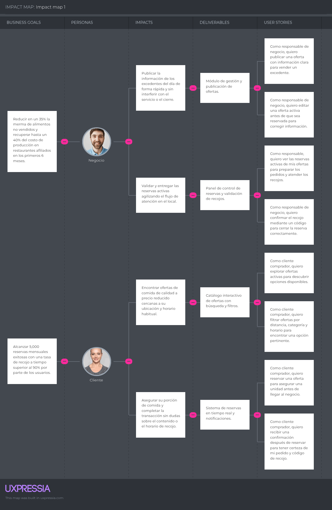

<!-- Carátula -->

    

 

<h1 style="text-align: center;">Universidad Peruana de Ciencias Aplicadas</h1>

<h3 style="text-align: center; font-weight: normal; font-size: 22px; margin-top: 0;">
Faculta de Ingeniería
</h3>

 

<strong>Carreras:</strong> INGENIERÍA DE SOFTWARE

<strong>Ciclo:</strong> 2026-20

1ASI0729 - Desarrollo de Aplicaciones Open Source

<strong>NRC:</strong> 7747

<strong>Docente:</strong>  Robles Fernández, Ivan

 

## "Informe del trabajo final"

**Startup:**  
 

**Producto:**  
 

## Relación de integrantes

<table style="margin: 0 auto; border-collapse: collapse;" border="1">
<tr>
<th>Código</th>
<th>Integrantes</th>
</tr>
<tr>
<td>U202326295</td>
<td>Huayra Moreyra José Maria</td>
</tr>
<tr>
<td>U202321590</td>
<td>Xin Yu Shi Lin</td>
</tr>
<tr>
<td>U20221e121</td>
<td>Giuliano Angel Peláez Vargas</td>
</tr>
<tr>
<td>U202316246</td>
<td>Martínez Ramos Bryan Felix</td>
</tr>
<tr>
<td>U202213185</td>
<td>Medina Merma, Ingrid Melani</td>
</tr>
</table>

Agosto 2026

<!-- Salto de Pagina -->

## Registro de Versiones del Informe

| Versión | Fecha    | Autor       | Descripción de Modificación            |
| ------- | -------- | ----------- | -------------------------------------- |
| 1.0     | // |  | Desarrollo de la Estructura del informe |

<!-- Salto de Pagina -->

## Project Report Collaboration Insights

<!-- Salto de Pagina -->

# Tabla de Contenidos

- [Capítulo I: Introducción](#capítulo-i-introducción)
  - [1.1. Startup Profile](#11-startup-profile)
    - [1.1.1. Descripción de la Startup](#111-descripción-de-la-startup)
    - [1.1.2. Perfiles de integrantes del equipo](#112-perfiles-de-integrantes-del-equipo)
  - [1.2. Solution Profile](#12-solution-profile)
    - [1.2.1. Antecedentes y problemática](#121-antecedentes-y-problemática)
    - [1.2.2. Lean UX Process](#122-lean-ux-process)
      - [1.2.2.1. Lean UX Problem Statements](#1221-lean-ux-problem-statements)
      - [1.2.2.2. Lean UX Assumptions](#1222-lean-ux-assumptions)
      - [1.2.2.3. Lean UX Hypothesis Statements](#1223-lean-ux-hypothesis-statements)
      - [1.2.2.4. Lean UX Canvas](#1224-lean-ux-canvas)
  - [1.3. Segmentos objetivo](#13-segmentos-objetivo)

- [Capítulo II: Requirements Elicitation & Analysis](#capítulo-ii-requirements-elicitation--analysis)
  - [2.1. Competidores](#21-competidores)
    - [2.1.1. Análisis competitivo](#211-análisis-competitivo)
    - [2.1.2. Estrategias y tácticas frente a competidores](#212-estrategias-y-tácticas-frente-a-competidores)
  - [2.2. Entrevistas](#22-entrevistas)
    - [2.2.1. Diseño de entrevistas](#221-diseño-de-entrevistas)
    - [2.2.2. Registro de entrevistas](#222-registro-de-entrevistas)
    - [2.2.3. Análisis de entrevistas](#223-análisis-de-entrevistas)
  - [2.3. Needfinding](#23-needfinding)
    - [2.3.1. User Personas](#231-user-personas)
    - [2.3.2. User Task Matrix](#232-user-task-matrix)
    - [2.3.3. User Journey Mapping](#233-user-journey-mapping)
    - [2.3.4. Empathy Mapping](#234-empathy-mapping)
  - [2.4. Big Picture Event Storming](#24-big-picture-event-storming)
  - [2.5. Ubiquitous Language](#25-ubiquitous-language)

- [Capítulo III: Requirements Specification](#capítulo-iii-requirements-specification)
  - [3.1. User Stories](#31-user-stories)
  - [3.2. Impact Mapping](#32-impact-mapping)
  - [3.3. Product Backlog](#33-product-backlog)

- [Capítulo IV: Product Design](#capítulo-iv-product-design)
  - [4.1. Style Guidelines](#41-style-guidelines)
    - [4.1.1. General Style Guidelines](#411-general-style-guidelines)
    - [4.1.2. Web Style Guidelines](#412-web-style-guidelines)
  - [4.2. Information Architecture](#42-information-architecture)
    - [4.2.1. Organization Systems](#421-organization-systems)
    - [4.2.2. Labeling Systems](#422-labeling-systems)
    - [4.2.3. SEO Tags and Meta Tags](#423-seo-tags-and-meta-tags)
    - [4.2.4. Searching Systems](#424-searching-systems)
    - [4.2.5. Navigation Systems](#425-navigation-systems)
  - [4.3. Landing Page UI Design](#43-landing-page-ui-design)
    - [4.3.1. Landing Page Wireframe](#431-landing-page-wireframe)
    - [4.3.2. Landing Page Mock-up](#432-landing-page-mock-up)
  - [4.4. Web Applications UX/UI Design](#44-web-applications-uxui-design)
    - [4.4.1. Web Applications Wireframes](#441-web-applications-wireframes)
    - [4.4.2. Web Applications Wireflow Diagrams](#442-web-applications-wireflow-diagrams)
    - [4.4.2. Web Applications Mock-ups](#442-web-applications-mock-ups)
    - [4.4.3. Web Applications User Flow Diagrams](#443-web-applications-user-flow-diagrams)
  - [4.5. Web Applications Prototyping](#45-web-applications-prototyping)
  - [4.6. Domain-Driven Software Architecture](#46-domain-driven-software-architecture)
    - [4.6.1. Design-Level Event Storming](#461-design-level-event-storming)
    - [4.6.2. Software Architecture Context Diagram](#462-software-architecture-context-diagram)
    - [4.6.3. Software Architecture Container Diagrams](#463-software-architecture-container-diagrams)
    - [4.6.4. Software Architecture Components Diagrams](#464-software-architecture-components-diagrams)
  - [4.7. Software Object-Oriented Design](#47-software-object-oriented-design)
    - [4.7.1. Class Diagrams](#471-class-diagrams)
  - [4.8. Database Design](#48-database-design)
    - [4.8.1. Database Diagrams](#481-database-diagrams)

- [Capítulo V: Product Implementation, Validation & Deployment](#capítulo-v-product-implementation-validation--deployment)
  - [5.1. Software Configuration Management](#51-software-configuration-management)
    - [5.1.1. Software Development Environment Configuration](#511-software-development-environment-configuration)
    - [5.1.2. Source Code Management](#512-source-code-management)
    - [5.1.3. Source Code Style Guide & Conventions](#513-source-code-style-guide--conventions)
    - [5.1.4. Software Deployment Configuration](#514-software-deployment-configuration)
  - [5.2. Landing Page, Services & Applications Implementation](#52-landing-page-services--applications-implementation)
    - [5.2.1. Sprint n](#521-sprint-1)
      - [5.2.1.1. Sprint Planning 1](#5211-sprint-planning-1)
      - [5.2.1.2. Aspect Leaders and Collaborators](#5212-aspect-leaders-and-collaborators)
      - [5.2.1.3. Sprint Backlog n](#5213-sprint-backlog-n)
      - [5.2.1.4. Development Evidence for Sprint Review](#52x4-development-evidence-for-sprint-review)
      - [5.2.1.5. Execution Evidence for Sprint Review](#5215-execution-evidence-for-sprint-review)
      - [5.2.1.6. Services Documentation Evidence for Sprint Review](#5216-services-documentation-evidence-for-sprint-review)
      - [5.2.1.7. Software Deployment Evidence for Sprint Review](#5217-software-deployment-evidence-for-sprint-review)
      - [5.2.1.8. Team Collaboration Insights during Sprint](#5218-team-collaboration-insights-during-sprint)

- [Conclusiones](#conclusiones)
  - [Conclusiones y recomendaciones](#conclusiones-y-recomendaciones)

- [Bibliografía](#bibliografía)

- [Anexos](#anexos)
  - [Anexo A. Contenido con Videos](#anexo-a-contenido-con-videos)

<!-- Salto de Pagina -->

## Student Outcome
| Entregable | Criterio específico | Acciones realizadas | Conclusiones |
|---|---|---|---|
|*AV1*| Trabaja en equipo para proporcionar liderazgo en forma conjunta |  - **Huayra José:** - **Xin Lin:** - **Peláez Giuliano:** - **Martínez Bryan:** - **Medina Ingrid:** |    |
|*AV1*| Crea un entorno colaborativo e inclusivo, establece metas, planifica tareas y cumple objetivos. |  - **Huayra José:** - **Xin Lin:** - **Peláez Giuliano:** - **Martínez Bryan:** - **Medina Ingrid:** |  |

<!-- Salto de Pagina -->

# Capítulo I: Introducción
 
## 1.1. Startup Profile
### 1.1.1. Descripción de la Startup

FoodSave es una startup peruana de tecnología orientada a la reducción del desperdicio de alimentos y al acceso a comida de calidad a precios accesibles. Nacemos frente a una problemática frecuente en el sector gastronómico: muchos restaurantes generan excedentes de alimentos preparados durante las últimas horas de atención que, pese a mantenerse aptos para el consumo, terminan siendo desechados debido a la demanda impredecible.

Nuestra propuesta tecnológica es FoodSave, una plataforma móvil que conecta restaurantes con consumidores para dar una segunda oportunidad a estos excedentes mediante ofertas de último horario, generando beneficios tanto económicos como sociales.

La aplicación se basa en tres funcionalidades principales:

* Publicación de platos disponibles con descuentos durante las últimas horas de atención.
* Reserva y compra de alimentos desde la aplicación para recoger en el local o consumir en el restaurante.
* Notificaciones en tiempo real sobre nuevas ofertas cercanas según la ubicación del usuario.

MISIÓN: Reducir el desperdicio de alimentos mediante una plataforma digital que conecte restaurantes con consumidores, promoviendo una alimentación más accesible, sostenible y económicamente beneficiosa para ambas partes.

VISIÓN: Convertirnos en la plataforma líder en aprovechamiento de excedentes gastronómicos en Latinoamérica, impulsando una cultura de consumo responsable y ayudando a los restaurantes a transformar el desperdicio en oportunidades.
 
### 1.1.2. Perfiles de integrantes del equipo

|                     Foto de perfil                      | Nombre Completo                      | Carrera                | Descripción                                                                                                         |
| :-----------------------------------------------------: | :----------------------------------- | :--------------------- | :------------------------------------------------------------------------------------------------------------------ |
|    | Giuliano Angel Peláez Vargas | Ingeniería de Software | Soy estudiante de la carrera de Ingeniería de Software. Tengo conocimientos técnicos en programación en lenguajes como C++, Python, C# y Java. Tengo experiencia en desarrollo de aplicaciones Web según distintos enfoques y herramientas, me considero una persona responsable con sus trabajos, si el equipo necesita de mi ayuda estaré más que dispuesto a ayudar para que el trabajo logre completarse. |
|   | Bryan Félix Martínez Ramos | Ingeneria de software | Soy Bryan Martinez, actualmente estudio la carrera de ingeniera de software en la universidad peruana de ciencias aplicadas, me encuentro a mitad de carrera. Tengo conocimientos de diferentes lenguajes de programación aprendidos durante la carrera como SQL,C++,C# Python y otros, ademas de otros habilidades como Excel, ingles y otros. Soy alguien que siempre trata de apoyar y resolver lo mas que pueda en los trabajos grupales, no me gusta que mis compañeros tengan que cargar con mis actividades y siempre estoy dispuesto a apoyar lo mas que puedo Me entusiasma el aprendizaje que obtendré con el curso de Appweb y las nuevas habilidades que aprenderé con este trabajo grupal |
|  | Ingrid Melani Medina Merma | Ingenieria de Software | Soy estudiante de la carrera de Ingeniería de Software. Poseo conocimiento en programas de edición y lenguajes como el c++, un poco de python y typescript, tengo una buena adaptabilidad y un gusto por aprender y ayudar en lo que pueda|
|  | Jose Maria Huayra Moreyra | Ingenieria de Software | Soy Jose Maria Huayra Moreyra, actualmente estudio la carrera de Ingenieria de Software, cursando el 6to ciclo. Tengo conocimientos basicos y medios en lenguaje C++, basico en python y un poco el javascript. Me considero una persona respetuosa, empática, amable y social con el grupo que trengo, a parte de ser responsable en el trabajo que tenemos en nuestro proyecto. |
| Foto5  |  |  |                       
---
 
## 1.2. Solution Profile
 
### 1.2.1. Antecedentes y problemática

Para comprender las necesidades de nuestros usuarios, aplicamos la metodología 5W's & 2H's, una herramienta que permite analizar el problema desde siete perspectivas clave: qué sucede, cuándo ocurre, dónde se presenta, quiénes son los afectados, por qué ocurre, cómo impacta y qué evidencia respalda la problemática.

**What (Qué) — ¿Cuál es el problema?**

En el Perú, muchos restaurantes generan excedentes de alimentos preparados que permanecen aptos para el consumo, pero que no logran venderse durante las últimas horas de atención. Como consecuencia, estos platos terminan siendo desperdiciados, representando una pérdida económica para el restaurante y una oportunidad desaprovechada para los consumidores.

**When (Cuándo) — ¿Cuándo sucede el problema?**

La situación ocurre principalmente durante las últimas horas antes del cierre, cuando los restaurantes pueden estimar qué platos preparados no serán vendidos.

**¿Cuándo utilizará el cliente el producto?**

Los restaurantes publicarán sus ofertas al finalizar la jornada comercial, mientras que los usuarios utilizarán la aplicación para descubrir, reservar y adquirir platos disponibles ese mismo día.

**Where (Dónde) — ¿Dónde está el cliente cuando usa el producto?**

La solución está dirigida inicialmente a restaurantes ubicados en distritos urbanos de Lima, especialmente en zonas con una amplia oferta gastronómica. Los consumidores utilizarán la aplicación desde cualquier lugar cercano para encontrar ofertas disponibles en establecimientos próximos.

**Who (Quién) — ¿A quiénes les sucede el problema?**

El problema afecta principalmente a restaurantes de gama media y alta, que buscan reducir pérdidas por alimentos no vendidos, y a personas de ingresos medios interesadas en acceder a comida de calidad a un precio más accesible.

**Why (Por qué) — ¿Cuál es la causa del problema?**

La principal causa es la demanda impredecible en los restaurantes. Aunque los establecimientos preparan alimentos para garantizar disponibilidad durante el servicio, no siempre logran vender toda su producción antes del cierre.

**How (Cómo) — ¿Cómo afecta este problema?**

El desperdicio de alimentos genera pérdidas económicas para los restaurantes, incrementa el impacto ambiental asociado a los residuos alimentarios y limita el acceso de los consumidores a opciones gastronómicas de calidad a precios más asequibles.

**How Much (Cuánto) — ¿Qué datos respaldan la problemática?**

Según un estudio publicado en 2022 en la revista científica Sustainability, realizado por investigadores de la Universidad Privada del Norte (UPN), la Universidad Nacional Jorge Basadre Grohmann (UNJBG) y otras instituciones, se analizaron 67 restaurantes de Lima y Tacna para estudiar la gestión de residuos y excedentes de alimentos. El estudio encontró que el 56,7 % de los restaurantes no medía la cantidad de residuos orgánicos generados, mientras que el 58,2 % destinaba los excedentes de comida preparada al personal y el 28,4 % los desechaba mediante rellenos sanitarios. Además, el estudio identificó la demanda impredecible y el exceso de comidas preparadas como una de las fuentes de generación de residuos
 
### 1.2.2. Lean UX Process
 
#### 1.2.2.1. Lean UX Problem Statements

**Problem Statement 1:** Los restaurantes generan excedentes de alimentos preparados que no siempre logran vender antes del cierre. Actualmente, existen pocas alternativas para ofrecer estos productos a consumidores durante las últimas horas de atención, por lo que una parte de estos alimentos termina siendo desperdiciada a pesar de mantenerse apta para el consumo.

**Problem Statement 2:** Los restaurantes tienen dificultades para recuperar parte del valor económico de los alimentos que no logran vender durante su jornada. La falta de un canal que permita ofrecer estos productos de manera rápida y dirigida a consumidores cercanos limita las posibilidades de reducir las pérdidas asociadas a los excedentes.

**Problem Statement 3:** Los consumidores de ingresos medios tienen un acceso limitado a determinados restaurantes debido al precio habitual de sus productos. A pesar de ello, existe una oportunidad de acceder a alimentos de estos establecimientos a precios más accesibles cuando existen excedentes disponibles al final de la jornada.
 
#### 1.2.2.2. Lean UX Assumptions

**Business Assumptions:**

* Creemos que los restaurantes estarán interesados en utilizar un canal digital que les permita vender alimentos excedentes antes de que sean desperdiciados.
* Suponemos que los restaurantes estarán dispuestos a ofrecer descuentos sobre sus excedentes si esto les permite recuperar parte del valor de productos que no fueron vendidos.
* Consideramos que los consumidores estarán interesados en adquirir alimentos de restaurantes de mayor nivel cuando estos se encuentren disponibles a precios significativamente más accesibles.
* Creemos que una plataforma que conecte la oferta de excedentes con consumidores cercanos puede generar beneficios tanto económicos para los restaurantes como de accesibilidad para los usuarios.

**Business Outcomes:**

* Reducir la cantidad de alimentos preparados que terminan siendo desperdiciados en los restaurantes afiliados.
* Permitir que los restaurantes recuperen parte del valor económico de sus excedentes.
* Incrementar la participación de restaurantes en la comercialización de alimentos de última oportunidad.
* Generar una nueva alternativa de acceso a comida de calidad a precios más accesibles.

**User Benefits:**

* Los restaurantes podrán obtener ingresos adicionales por alimentos que de otra manera podrían ser desperdiciados.
* Los restaurantes contarán con un canal adicional para dar salida a sus excedentes durante las últimas horas de atención.
* Los consumidores podrán acceder a platos de restaurantes de mayor nivel a precios reducidos.
* Los consumidores podrán encontrar ofertas de alimentos disponibles cerca de su ubicación.
 
#### 1.2.2.3. Lean UX Hypothesis Statements

**Hipótesis 1 (Basada en el Módulo de publicación de excedentes)**
*Creemos que lograremos* un aumento sostenido en la cantidad de excedentes publicados durante las últimas horas de atención *si* los restaurantes *logran* ofrecer de manera rápida sus excedentes a consumidores interesados *con* el Módulo de publicación de excedentes.

**Hipótesis 2 (Basada en el Motor de descuentos dinámicos)**
*Creemos que lograremos* un aumento en la tasa de conversión de compra en la plataforma *si* los consumidores *logran* adquirir platos de restaurantes de mayor nivel a precios significativamente inferiores a los habituales *con* el Motor de descuentos dinámicos.

**Hipótesis 3 (Basada en el Buscador de ofertas por geolocalización)**
*Creemos que lograremos* un aumento en la tasa de reservas completadas dentro de la app *si* los consumidores *logran* encontrar y aprovechar con mayor facilidad los excedentes disponibles cerca de ellos *con* el Buscador de ofertas por geolocalización. 

#### 1.2.2.4. Lean UX Canvas

| 1. BUSINESS PROBLEM | 5. SOLUTIONS | 2. BUSINESS OUTCOMES |
| :--- | :--- | :--- |
| **Restaurantes:** Generan excedentes de alimentos preparados que no siempre logran vender antes del cierre, ocasionando desperdicio y pérdida del valor de esos productos.  **Consumidores:** Las personas que consumen frecuentemente en restaurantes buscan opciones de calidad, pero el precio puede limitar las alternativas disponibles. | • **Publicación de excedentes:** Los restaurantes podrán ofrecer platos disponibles a precios reducidos antes del cierre.  • **Ofertas cercanas:** Los consumidores podrán encontrar establecimientos con platos disponibles y conocer sus descuentos.  • **Reserva de platos:** Los usuarios podrán reservar las ofertas disponibles para recogerlas o consumirlas en el establecimiento, según las condiciones del restaurante. | • Reducir el desperdicio de alimentos preparados en los restaurantes participantes.  • Permitir que los restaurantes recuperen parte del valor económico de productos que no lograron vender.  • Incrementar las oportunidades de venta durante las últimas horas de atención.  • Facilitar el acceso de los consumidores a comida de calidad a precios más accesibles. |
| **3. USERS & CUSTOMERS** | **6. HYPOTHESES** | **4. USER BENEFITS** |
| • **Restaurantes de clase media y alta:** Buscan reducir el desperdicio y recuperar parte del valor de los alimentos preparados que no lograron vender.  • **Personas que consumen en restaurantes con frecuencia y buscan opciones de calidad a precios accesibles:** Buscan aprovechar ofertas y descuentos en establecimientos de su interés. | • **H1:** Los restaurantes estarán dispuestos a publicar sus excedentes a precios reducidos antes del cierre.  • **H2:** Los consumidores mostrarán interés en adquirir platos preparados durante el mismo día cuando se ofrezcan a precios más accesibles.  • **H3:** Los consumidores estarán dispuestos a acudir al establecimiento dentro de un horario determinado para aprovechar las ofertas disponibles. | • Acceso a platos de calidad a precios más accesibles.  • Posibilidad de encontrar y aprovechar ofertas de restaurantes cercanos.  • Los restaurantes podrán generar ingresos por productos que podrían terminar siendo desperdiciados.  • Contribución a la reducción del desperdicio de alimentos. |
| **7. MOST IMPORTANT LEARNING (SUPUESTOS)** | | **8. MVP & EXPERIMENTS** |
| • ¿Los restaurantes están dispuestos a vender sus excedentes a precios reducidos en lugar de desecharlos?  • ¿Los consumidores confiarían en adquirir alimentos preparados durante el mismo día que no llegaron a venderse?  • ¿El descuento ofrecido es suficiente para motivar al consumidor a acudir al restaurante dentro del horario disponible? | | • **Prototipo de publicación:** Evaluar si los restaurantes pueden publicar fácilmente un plato, su precio reducido y disponibilidad.  • **Prototipo de búsqueda y reserva:** Evaluar si los consumidores pueden encontrar una oferta cercana, comprender sus condiciones y reservarla.  • **Entrevistas de validación:** Determinar el interés de restaurantes y consumidores en utilizar la propuesta. |
---

 
## 1.3. Segmentos objetivo

| Segmento objetivo | Características demográficas | Información estadística de sustento |
|-------------------|------------------------------|--------------------------------------|
| Negocio | Tipo de negocio: Restaurantes con servicio presencial. Nivel: Establecimientos de clase media y alta. Ubicación: Principalmente zonas urbanas de Lima Metropolitana. Interés: Reducir el desperdicio de alimentos y recuperar parte del valor de productos no vendidos. | Un estudio publicado en 2022 en la revista científica Sustainability, realizado en 67 restaurantes de Lima y Tacna, encontró que el 56,7 % no medía la cantidad de residuos orgánicos generados, mientras que el 28,4 % enviaba los excedentes de comida preparada a rellenos sanitarios. |
| Clientes | Edad: Jóvenes y adultos. Ubicación: Lima Metropolitana, principalmente zonas cercanas a establecimientos afiliados. Comportamiento: Consumo frecuente de comida en restaurantes. Interés: Encontrar platos de calidad a precios reducidos y aprovechar ofertas disponibles. | Según el Instituto Peruano de Economía (IPE, 2025), el gasto en alimentación fuera del hogar representa una parte importante del presupuesto de los hogares peruanos, mientras que la inseguridad alimentaria y las restricciones económicas hacen relevante buscar alternativas de consumo más accesibles. |

# Capítulo II: Requirements Elicitation & Analysis

## 2.1. Competidores

FoodSave analiza a Cirkula como competidor directo peruano, Too Good To Go como referente internacional de marketplace de excedentes y Sinba como competidor indirecto de gestión y valorización de residuos.

### 2.1.1. Análisis competitivo
 **¿Por qué llevar a cabo este análisis?**

Para identificar cómo FoodSave puede diferenciar su propuesta de publicación y reserva transparente de excedentes frente a alternativas existentes, sin asumir que el modelo es inexistente en Perú.

<table style="width:100%; border-collapse:collapse; table-layout:fixed;" border="1" align="center">
  <!-- Título principal -->
  <tr>
    <th colspan="6" align="center">Competitive Analysis Landscape</th>
  </tr>
  <!-- Justificación -->
  <tr>
    <td rowspan="2" align="center"><b>¿Por qué llevar a cabo este análisis?</b></td>
    <td colspan="5" align="center">
      Identificar fortalezas, debilidades y brechas de los competidores directos e indirectos de FoodSave. 
    </td>
  </tr>
  <tr>
    <td colspan="5">
      <b>Objetivo:</b> Identificar el posicionamiento, la propuesta de valor y el modelo operativo de los actores que ya atienden el problema del desperdicio de alimentos, para definir en qué se diferencia FoodSave y validar los supuestos de su modelo antes de escalar.   
    </td>
  </tr>
  <!-- Encabezados con logos -->
  <tr>
    <th colspan="2" style="width:20%">Competidores</th>
    <th style="width:20%">
      
    </th>
    <th style="width:20%">
      
    </th>
    <th style="width:20%">
      
    </th>   
    <th style="width:20%">
      
    </th>
  </tr>
  <!-- PERFIL -->
  <tr>
    <td rowspan="2" align="center"><b>Perfil</b></td>
    <td><b>Overview</b></td>
    <td>Marketplace propuesto para excedentes aptos para consumo.</td>
    <td>Marketplace peruano de excedentes de alimentos.</td>
    <td>Marketplace internacional de alimentos no vendidos.</td>
    <td>Gestión y valorización de residuos.</td>
  </tr>
  <tr>
    <td><b>Ventaja competitiva: ¿Qué valor ofrece a los clientes?</b></td>
    <td>Transparencia de producto, ingredientes/alérgenos, precio original, unidades y horario; código de recojo.</td>
    <td>Descuentos en excedentes de establecimientos de comida.</td>
    <td>Reserva y recojo de excedentes a precio reducido; bolsas sorpresa como formato frecuente.</td>
    <td>Segregación, recolección y transformación de residuos.</td>
  </tr>
  <!-- PERFIL DE MARKETING -->
  <tr>
    <td rowspan="2" align="center"><b>Perfil de Marketing</b></td>
    <td><b>Mercado objetivo</b></td>
    <td>Restaurantes A1 de Lima Metropolitana y clientes cercanos.</td>
    <td>Negocios de comida y usuarios que adquieren ofertas en Lima.</td>
    <td>Negocios de comida, panaderías, tiendas y usuarios de los países donde opera.</td>
    <td>Empresas, restaurantes, hogares y organizaciones que gestionan residuos.</td>
  </tr>
  <tr>
    <td><b>Estrategias de marketing</b></td>
    <td>Comunicar ahorro económico y reducción de desperdicio, con notificaciones geolocalizadas de ofertas cercanas.</td>
    <td>Comunica el beneficio “come, ahorra, ayuda”, para negocios promueve recuperar costos, captar tráfico y reducir desperdicio.</td>
    <td>Promueve las <b>Surprise Bags</b>, el descubrimiento en el mapa/app y la captación de nuevos clientes para negocios asociados.</td>
    <td>Ofrece educación y soluciones circulares para que empresas y restaurantes gestionen residuos de forma más sostenible.</td>
  </tr>
  <!-- PERFIL DE PRODUCTO -->
  <tr>
    <td rowspan="3" align="center"><b>Perfil de Producto</b></td>
    <td><b>Productos & Servicios</b></td>
    <td>App con publicación de platos con descuento, reserva/compra y notificaciones en tiempo real por ubicación.</td>
    <td>Aplicación/plataforma de ofertas de comida con descuento.</td>
    <td>Aplicación/plataforma de reservas y recojo de excedentes.</td>
    <td>Servicios de gestión y valorización de residuos.</td>
  </tr>
  <tr>
    <td><b>Precios & Costos</b></td>
    <td>Comisión por transacción al restaurante; usuario paga precio reducido. Pendiente de validar.</td>
    <td>Publicita descuentos de al menos 40 % para usuarios, la tarifa al negocio no se publica en la fuente consultada.</td>
    <td>El usuario paga aproximadamente un tercio del precio regular, sus términos para negocios mencionan una <b>Partnership Fee</b> y una <b>Reservation Fee</b>, sin un monto único aplicable a todos los mercados.</td>
    <td>La tarifa se cotiza según el servicio o solución circular; no se publica una lista de precios en la fuente consultada.</td>
  </tr>
  <tr>
    <td><b>Canales de distribución (Web y/o Móvil)</b></td>
    <td>Aplicación desarrollada en Angular, con enfoque web y potencial de extensión a app móvil(disponible para Android/iOS).</td>
    <td>Sitio web y aplicación disponible en Google Play y App Store.</td>
    <td>Aplicación y sitio web del marketplace; descubrimiento, reserva y recojo se gestionan en la app.</td>
    <td>Web, consultoría, capacitación y operación física de reaprovechamiento de residuos; no es un marketplace de compra y recojo.</td>
  </tr>
  <!-- SWOT -->
  <tr>
    <td rowspan="4" align="center"><b>Análisis SWOT</b></td>
    <td><b>Fortalezas</b></td>
    <td>Transparencia de producto y trazabilidad (ingredientes, precio, horario) como diferenciador frente a bolsas sorpresa.</td>
    <td>Marca local con marketplace operativo, descuentos y una propuesta clara para comercios y usuarios.</td>
    <td>Escala del marketplace, red internacional y proceso formal de publicación, reserva y recojo</td>
    <td>Especialización en sostenibilidad y manejo de residuos del sector gastronómico.</td>
  </tr>
  <tr>
    <td><b>Debilidades</b></td>
    <td>Marca nueva, sin red de comercios ni evidencia propia de demanda al inicio.</td>
    <td>La información pública consultada no detalla la tarifa del negocio ni el control operativo por cada establecimiento.</td>
    <td>Su formato de <b>Surprise Bag</b> reduce la certeza sobre el contenido antes del recojo; esto abre espacio para que FoodSave pruebe ofertas detalladas.</td>
    <td>No resuelve la venta o reserva de alimentos aptos para consumo antes de que se conviertan en residuo.</td>
  </tr>
  <tr>
    <td><b>Oportunidades</b></td>
    <td>Crear alianzas con restaurantes de clase media y alta y validar si la información de ingredientes, alérgenos y condiciones impulsa la reserva.</td>
    <td>Ampliar negocios, productos y cobertura aprovechando el interés por ahorro y reducción de desperdicio.</td>
    <td>Aplicar su experiencia de marketplace a nuevos mercados, categorías y soluciones de gestión de excedentes.</td>
    <td>Complementar una plataforma de prevención: los residuos no aptos para consumo pueden derivarse a valorización.</td>
  </tr>
  <tr>
    <td><b>Amenazas</b></td>
    <td>Competidores establecidos, baja oferta inicial, reservas no recogidas y obligaciones sanitarias de cada negocio.</td>
    <td>La entrada de nuevos marketplaces o cambios en la disponibilidad de comercios pueden afectar su diferenciación local.</td>
    <td>La expansión y escala de un referente internacional elevan la expectativa de usuarios y negocios sobre el servicio.</td>
    <td>Puede competir por el presupuesto de sostenibilidad de restaurantes, aunque también puede convertirse en aliado para residuos no comercializables.</td>
  </tr>
</table>

### 2.1.2. Estrategias y tácticas frente a competidores
| Hallazgo competitivo | Estrategia preliminar de FoodSave | Táctica verificable |
|---|---|---|
| Existen marketplaces de excedentes. | Diferenciarse por transparencia y control operativo, no por afirmar exclusividad. | Exigir producto, ingredientes/alérgenos cuando correspondan, precios, unidades y hora límite al publicar. |
| La reserva no garantiza el recojo. | Hacer visible el compromiso y el límite de recojo. | Generar código único y mostrar la hora límite en reserva y catálogo. |
| La oferta inicial es crítica para el marketplace. | Iniciar con un segmento y zona acotados. | Medir negocios contactados, ofertas publicadas, reservas, cancelaciones y recojos. |
| Los residuos son una alternativa posterior a la prevención. | Priorizar venta de alimentos aptos antes de su disposición. | Comunicar la responsabilidad sanitaria del establecimiento y no prometer garantías que FoodSave no puede verificar. |

## 2.2. Entrevistas

### 2.2.1. Diseño de entrevistas

**User: Restaurantes de clase media y alta**

1. ¿Qué suelen hacer con los alimentos o platos preparados que no logran vender al finalizar el día?
2. ¿Con qué frecuencia suelen tener alimentos preparados que no llegan a venderse durante la jornada?
3. ¿Cuáles considera que son las principales razones por las que se generan estos excedentes?
4. ¿Qué impacto económico representa para el restaurante tener productos preparados que finalmente no se venden?
5. ¿Actualmente utilizan alguna estrategia para aprovechar o vender los alimentos que podrían quedar al finalizar el día?
6. ¿Estarían dispuestos a ofrecer estos alimentos a un precio reducido antes del cierre? ¿Por qué?
7. ¿Qué factores tomarían en cuenta para determinar el descuento de estos productos?
8. ¿Qué tan útil sería contar con una plataforma que les permita publicar ofertas de estos alimentos y llegar a consumidores interesados?
9. ¿Preferirían que los clientes recojan el pedido para llevar o permitirían también su consumo dentro del establecimiento? ¿Por qué?
10. ¿Qué aspectos o condiciones considerarían importantes antes de utilizar una plataforma de este tipo?

**User: Personas que consumen en restaurantes con frecuencia y buscan opciones de calidad a precios accesibles**

1. ¿Con qué frecuencia consumes alimentos en restaurantes durante la semana?
2. ¿Qué factores consideras más importantes al momento de elegir un restaurante o un plato?
3. ¿Qué tanto influye el precio en tu decisión de consumir en un determinado restaurante?
4. ¿Sueles buscar promociones o descuentos cuando decides comer en un restaurante? ¿De qué manera los encuentras?
5. ¿Estarías dispuesto a comprar a un precio reducido un plato preparado durante el mismo día que no llegó a venderse? ¿Por qué?
6. ¿Qué información necesitarías conocer sobre un plato antes de decidir comprarlo bajo esta modalidad?
7. ¿Qué nivel de descuento considerarías atractivo para decidir comprar este tipo de oferta?
8. ¿Estarías dispuesto a acudir a un restaurante dentro de un horario determinado para aprovechar una oferta disponible?
9. ¿Preferirías recoger el pedido para llevar o consumirlo directamente en el restaurante? ¿Por qué?
10. ¿Qué aspecto te generaría mayor preocupación o desconfianza al adquirir alimentos mediante este tipo de ofertas?

### 2.2.2. Registro de entrevistas

**User: Restaurantes de clase media y alta**
  <!-- Primera Entrevista -->
<table style="width:100%; border-collapse:collapse" border="1" align="center">
  <tr>
    <td style="background-color:#e3e3e3">Entrevistador</td>
    <td>Ingrid Medina</td>
  </tr>
  <tr>
    <td style="background-color:#e3e3e3">Entrevistado</td>
    <td>Flor Edith Pacheco</td>
  </tr>
  <tr>
    <td style="background-color:#e3e3e3">Edad</td>
    <td>21</td>
  </tr>
  <tr>
    <td style="background-color:#e3e3e3">Distrito</td>
    <td>Urbanización La Encantada, en Chorrillos, Lima</td>
  </tr>
  <tr>
    <td style="background-color:#e3e3e3">Evidencia</td>
    <td></td>
  </tr>
  <tr>
    <td style="background-color:#e3e3e3">Comienzo de Evidencia</td>
    <td>1:04</td>
  </tr>
  <tr>
    <td style="background-color:#e3e3e3">Resumen</td>
    <td>Flor Edith Pacheco, de 21 años, residente en Chorrillos, Lima, se encuentra vinculada a la gestión de una cebichería. El restaurante procura controlar las cantidades preparadas para evitar excedentes; sin embargo, debido a la dificultad de predecir la demanda, suelen generarse alimentos no vendidos algunas veces por semana. Los productos que aún se encuentran en buenas condiciones pueden conservarse para el día siguiente, mientras que los que no cumplen con las condiciones adecuadas son desechados.

La entrevistada reconoce que estos excedentes representan una pérdida económica debido a los costos de ingredientes, preparación y personal. Actualmente, utilizan el control de cantidades y promociones durante el horario de atención, pero no cuentan con una plataforma específica para vender los excedentes de último momento.

Flor muestra interés en utilizar una plataforma que permita ofrecer estos alimentos a precios reducidos, ya que podría ayudar a recuperar parte de la inversión y reducir el desperdicio. Considera importante que permita llegar a consumidores cercanos, controlar productos, cantidades y horarios, además de contar con pagos seguros y una comisión razonable. Prefiere principalmente el recojo para llevar, porque considera que afectaría menos la atención habitual del restaurante.
  </tr>
</table>

 
<!-- Segunda Entrevista -->

<table style="width:100%; border-collapse:collapse" border="1" align="center">
  <tr>
    <td style="background-color:#e3e3e3">Entrevistador</td>
    <td>Bryan Martinez</td>
  </tr>
  <tr>
    <td style="background-color:#e3e3e3">Entrevistado</td>
    <td>Janet Gomez</td>
  </tr>
  <tr>
    <td style="background-color:#e3e3e3">Edad</td>
    <td>52</td>
  </tr>
  <tr>
    <td style="background-color:#e3e3e3">Distrito</td>
    <td>Villa el salvador, Lima</td>
  </tr>
  <tr>
    <td style="background-color:#e3e3e3">Evidencia</td>
    <td></td>
  </tr>
  <tr>
    <td style="background-color:#e3e3e3">Comienzo de Evidencia</td>
    <td>0:10</td>
  </tr>
  <tr>
    <td style="background-color:#e3e3e3">Resumen</td>
    <td>.Janet Linda Gomez, tiene 21 años, vive en villa el salvador, Lima, se encarga en la gestion de un restaurante, se encarga de la gestion y organizacion de los platos preparados, ella comentan que si bien se ha tratado de reducir la perdida es muy dificil predecir y evitar perdidas por desechar alimentos, ya que muchas veces la gente no es recurrente con su consumo

La entrevistada reconoce que estos excedentes representan una pérdida económica debido a los costos de ingredientes, preparación y personal. Actualmente, utilizan el control de cantidades y promociones durante el horario de atención, pero no cuentan con una plataforma específica para vender los excedentes de último momento.

Janet confirma y admite que esta perdida existe y aunque se ha realizado diferentes métodos para evitar la perdida de capital, no se a logrado por completo, usan su experiencia en la preparación de comida, pero no es suficiente para reducir la perdida por completo

Janet muestra interés y le parece muy interesante la idea de un sistema que le permita poder vender estos productos a un precio mucho menor, cree que es una buena idea ya que sus metodos no han logrado un efecto visible y se animaria a probar este sistema
  </tr>
</table>

 

**User: Personas que consumen en restaurantes con frecuencia y buscan opciones de calidad a precios accesibles**
  <!-- Primera Entrevista -->

<table style="width:100%; border-collapse:collapse;" border="1" align="center">
  <tr>
    <td style="background-color:#e3e3e3">Entrevistador</td>
    <td>Ingrid Medina</td>
  </tr>
  <tr>
    <td style="background-color:#e3e3e3">Entrevistado</td>
    <td>Mayra Calderón Mosqueira</td>
  </tr>
  <tr>
    <td style="background-color:#e3e3e3">Edad</td>
    <td>21</td>
  </tr>
  <tr>
    <td style="background-color:#e3e3e3">Distrito</td>
    <td>San Miguel</td>
  </tr>
  <tr>
    <td style="background-color:#e3e3e3">Evidencia</td>
    <td></td>
  </tr>
    <tr>
    <td style="background-color:#e3e3e3">Comienzo de Evidencia</td>
    <td>0:46</td>
  </tr>
  <tr>
    <td style="background-color:#e3e3e3">Resumen</td>
    <td>Mayra Calderón Mosqueira, de 21 años, residente en San Miguel, Lima, consume alimentos fuera de casa aproximadamente cinco días a la semana, principalmente menús, debido a que es foránea y dispone de poco tiempo para cocinar. Al elegir un restaurante, considera principalmente el precio, la cercanía y la variedad del menú, mientras que para elegir un plato busca opciones que considere nutritivas, como ensaladas.

El precio influye considerablemente en sus decisiones de consumo, por lo que suele buscar promociones y descuentos mediante plataformas y redes sociales de restaurantes. Muestra disposición a comprar alimentos preparados no vendidos a un precio reducido, tanto por evitar el desperdicio de comida como por obtener una opción que se ajuste a su presupuesto. Considera atractivo un ahorro aproximado de 6 a 8 soles, ya que consume fuera de casa con frecuencia.

Para utilizar este tipo de ofertas, considera importante conocer la antigüedad del alimento y cuánto dinero estaría ahorrando. También estaría dispuesta a acudir a un restaurante dentro de un horario determinado, siempre que este se encuentre cerca de su trabajo, debido a su poco tiempo disponible. No presenta una preferencia entre recoger el pedido o consumirlo en el establecimiento. Finalmente, su principal preocupación es la seguridad y frescura de los alimentos, especialmente cuando se trata de productos perecibles como ensaladas, por lo que evitaría consumirlos si percibe que están en mal estado.</td>
  </tr>
</table>

 

<!-- Segunda Entrevista -->
<table style="width:100%; border-collapse:collapse;" border="1" align="center">
  <tr>
    <td style="background-color:#e3e3e3">Entrevistador</td>
    <td>Bryan Martinez</td>
  </tr>
  <tr>
    <td style="background-color:#e3e3e3">Entrevistado</td>
    <td>Victor Cuya</td>
  </tr>
  <tr>
    <td style="background-color:#e3e3e3">Edad</td>
    <td>18</td>
  </tr>
  <tr>
    <td style="background-color:#e3e3e3">Distrito</td>
    <td>Villa el salvador, Lima</td>
  </tr>
  <tr>
    <td style="background-color:#e3e3e3">Evidencia</td>
    <td></td>
  </tr>
    <tr>
    <td style="background-color:#e3e3e3">Comienzo de Evidencia</td>
    <td>0:08</td>
  </tr>
  <tr>
    <td style="background-color:#e3e3e3">Resumen</td>
    <td>Victor Cuya de 18 años vive en villa el salvador, consume en restaurantes diaraimente entre 5-6 dias por semana en restaurantes, ya que su tiempo no le permite almorzar en casa, el cuenta que le importa mucho tanto la presentancion como el precio al momento de elegir un restuarante

El precio tambien es un punto fundamental ya que a el le gusta mucho aprovechar las promociones, suele buscar mucho descuentos y promociones presencialmente y por redes sociales, aunque no tiene como tal una aplicacion que le permita ver, asi se ahorra dinero a la semana

Considera importante tener que saber el estado del producto porque aunque sea barato no comería algo malo, a su vez si estaría conforme de comer algo que vaya a ser desechado siempre y cuando este en buenas condiciones, ademas de que no le incomoda tener que ir a un horario exacto o en un rango siempre y cuando pueda aprovechar buenos descuentos .</td>
  </tr>
</table>

 

### 2.2.3. Análisis de entrevistas

Segmento 1:

Las entrevistas evidencian que uno de los principales problemas en los restaurantes es la dificultad para predecir la demanda diaria, lo que provoca la generación de alimentos excedentes y pérdidas económicas.

Aunque se aplican métodos como el control de cantidades, la experiencia del personal y promociones, estas estrategias no permiten eliminar completamente el desperdicio. Además, actualmente no se cuenta con una herramienta específica para vender los productos no vendidos al final del día.

Existe interés en utilizar una plataforma que permita ofrecer estos alimentos a precios reducidos, principalmente para recuperar parte de la inversión, disminuir las pérdidas y reducir el desperdicio. También se considera importante contar con control de cantidades, horarios, pagos seguros y una modalidad de recojo que no interfiera con la atención habitual del restaurante.

Segmento 2:

Las entrevistas muestran que el precio es uno de los principales factores al momento de elegir dónde comer, especialmente en personas que consumen frecuentemente en restaurantes y buscan reducir sus gastos mediante promociones y descuentos.

También existe disposición a comprar alimentos preparados que no hayan sido vendidos, siempre que se encuentren en buenas condiciones y se pueda conocer información sobre su frescura, antigüedad y ahorro obtenido. La seguridad del alimento es un aspecto fundamental, incluso cuando el precio sea bajo.

Además, se observa que los consumidores aceptarían horarios específicos de recojo o consumo si la oferta representa un ahorro atractivo y el establecimiento se encuentra en una ubicación conveniente. Esto demuestra interés en una plataforma que reúna descuentos de alimentos en buen estado, con información clara sobre el producto y condiciones de compra.

## 2.3. Needfinding

Vamos a identificar a nuestros usuarios por lo recopilamos lo mas importante 

### 2.3.1. User Personas

Segmento 1: Dueños de negocios de clase alta

Segmento 2: Cliente frencuente de restaurantes

### 2.3.2. User Task Matrix

El presente User Task Matrix identifica las principales actividades realizadas por los dos segmentos objetivos definidos para FoodSave. Las tareas se analizan de manera independiente debido a que cada segmento presenta necesidades y comportamientos diferentes. Por un lado, Carlos Guevara representa a los restaurantes de gama media-alta y alta desde su rol como cocinero; por otro lado, Andrea Mendoza representa a las personas que consumen frecuentemente en restaurantes y buscan opciones de calidad a precios accesibles.

### Segmento objetivo #1: Carlos Guevara (Negocios)

Carlos representa al dueño de restaurantes de gama media-alta y alta involucrado en la preparación y utilizacion de los alimentos. Sus actividades se encuentran relacionadas con la preparación diaria, la demanda de los clientes y los alimentos que permanecen disponibles al acercarse el cierre.

| **User Task (Tarea del usuario)** | **Frecuencia** | **Importancia** |
| :--- | :--- | :--- |
| Organizacion los alimentos y platos correspondientes a la jornada | Alta (diaria) | Crítica |
| Revisar la cantidad de alimentos preparados disponibles durante el servicio | Alta (diaria) | Alta |
| Identificar platos preparados que podrían quedar sin vender | Alta (diaria) | Crítica |
| Determinar si los alimentos no vendidos mantienen condiciones adecuadas para su consumo | Alta (diaria) | Crítica |
| Informar sobre los platos que permanecen disponibles cerca del cierre | Media | Alta |
| Evaluar alternativas para aprovechar los alimentos preparados que no fueron vendidos | Media | Alta |
| Ofrecer promociones o descuentos sobre determinados platos antes del cierre | Baja | Alta |
| Coordinar la entrega de platos vendidos durante las últimas horas de atención | Media | Media |
| Separar los alimentos que todavía pueden ser aprovechados de aquellos que deben descartarse | Alta (diaria) | Crítica |
| Desechar alimentos preparados que ya no pueden ser aprovechados | Media | Alta |

### Segmento objetivo #2: Andrea Mendoza (Consumidora)

Andrea representa a las personas que consumen frecuentemente en restaurantes y buscan opciones gastronómicas de calidad a precios accesibles. Sus actividades están relacionadas con la búsqueda, comparación y elección de alternativas para almorzar o cenar.

| **User Task (Tarea del usuario)** | **Frecuencia** | **Importancia** |
| :--- | :--- | :--- |
| Buscar opciones de restaurantes para almorzar o cenar | Alta | Alta |
| Consultar los precios de los platos antes de elegir un restaurante | Alta | Alta |
| Comparar alternativas según su relación entre precio y calidad | Alta | Crítica |
| Buscar promociones o descuentos disponibles en restaurantes | Media | Alta |
| Revisar qué platos se encuentran disponibles antes de acudir al establecimiento | Media | Alta |
| Consultar información y opiniones sobre restaurantes que no conoce | Media | Media |
| Evaluar si un descuento justifica trasladarse hasta el restaurante | Media | Alta |
| Elegir entre consumir el plato en el establecimiento o pedirlo para llevar | Media | Media |
| Comprar platos con descuento cuando encuentra una oferta conveniente | Media | Alta |
| Probar restaurantes que normalmente tienen precios superiores a su presupuesto habitual | Baja | Media |

**Análisis del User Task Matrix**

El análisis de ambos segmentos permite identificar una relación entre las actividades que realizan Carlos y Andrea. Carlos trabaja diariamente con alimentos preparados cuya demanda puede variar durante la jornada, generando situaciones en las que determinados platos permanecen disponibles al acercarse el cierre. Andrea, por su parte, busca regularmente alternativas para almorzar o cenar y considera factores como el precio, la calidad y las promociones antes de tomar una decisión.

En el primer segmento, las tareas de mayor importancia están relacionadas con la preparación de los alimentos, la identificación de platos que podrían quedar sin vender y la verificación de que estos mantengan condiciones adecuadas para su consumo. También existe la necesidad de encontrar alternativas que permitan aprovechar estos alimentos antes de que deban ser descartados.

En el segundo segmento, las actividades de mayor relevancia se concentran en buscar restaurantes, comparar precios y evaluar la relación entre calidad y costo. Las promociones y descuentos representan una oportunidad para que Andrea pueda acceder a establecimientos que normalmente podrían encontrarse fuera de su presupuesto habitual.

Finalmente, ambas matrices muestran una oportunidad de conexión entre los segmentos: mientras el restaurante necesita encontrar una alternativa para aprovechar alimentos preparados que permanecen disponibles, el consumidor busca acceder a comida de calidad a precios más convenientes. FoodSave busca conectar ambas necesidades facilitando que los excedentes aptos para el consumo puedan ser ofrecidos a consumidores interesados antes de ser desperdiciados.

### 2.3.3. User Journey Mapping

#Segmento objetivo 1:

#Segmento objetivo 2:

### 2.3.4. Empathy Mapping

#### Empathy Mapping - Segmento 1 (Negocios)

#### Empathy Mapping - Segmento 2 (Cliente)

## 2.4. Big Picture Event Storming

## 2.5. Ubiquitous Language

Para esta sección se planteó un diccionario de términos técnicos que son aplicados en el dominio de nuestro proyecto.

| Término | Definición |
|---|---|
| Offer (Oferta) | Publicación temporal de un producto con precio reducido, unidades disponibles y hora límite de recojo. |
| Surplus (Excedente) | Unidad de alimento apta para consumo que el negocio estima que no venderá al precio regular durante la jornada. |
| Reservation (Reserva) | Compromiso de compra de una oferta dentro de su ventana de recojo. |
| Pickup (Recojo) | Entrega de una reserva al cliente en el establecimiento y horario definidos. |
| Pickup Code (Código de recojo) | Código que permite al negocio validar una reserva activa al momento de la entrega. |
| Pickup Window (Ventana de recojo) | Intervalo dentro del cual el cliente puede recoger una reserva. |
| Expired Offer (Oferta vencida) | Oferta cuya hora límite pasó y ya no acepta nuevas reservas. |

# Capítulo III: Requirements Specification

## 3.1. User Stories

### Epic 1 – Landing Page

| Epic / Story ID | Título | Descripción | Criterios de aceptación | Relacionado con (Epic ID) |
|---|---|---|---|---|
| US01 | Conocer el modelo FoodSave | Como visitante, quiero conocer cómo funciona FoodSave para decidir si la propuesta es pertinente para mí. | **Escenario 1: Comprensión de FoodSave** **Dado que** el visitante abre la Landing Page **Cuando** revisa el contenido **Entonces** identifica el problema, beneficios, proceso y llamados a la acción para cada segmento. | EP01 |
| US02 | Acceder a ofertas | Como visitante, quiero acceder al catálogo de ofertas para explorar opciones disponibles. | **Escenario 1: Acceso al catálogo** **Dado que** el visitante se encuentra en la Landing Page **Cuando** selecciona “Explorar ofertas” **Entonces** la aplicación muestra el catálogo de ofertas activas. | EP01 |
| US03 | Explorar ofertas activas | Como cliente comprador, quiero explorar ofertas activas para descubrir opciones disponibles. | **Escenario 1: Visualización de ofertas activas** **Dado que** existen ofertas vigentes **Cuando** el cliente consulta el catálogo **Entonces** cada oferta muestra negocio, producto, precios, unidades, ubicación y hora límite.  **Escenario 2: Oferta vencida** **Dado que** una oferta venció **Cuando** el catálogo se actualiza **Entonces** no la presenta como reservable. | EP01 |
| US04 | Filtrar ofertas | Como cliente comprador, quiero filtrar ofertas por distancia, categoría y horario para encontrar una opción pertinente. | **Escenario 1: Aplicación de filtros** **Dado que** el cliente aplica un filtro **Cuando** la búsqueda se ejecuta **Entonces** el catálogo muestra solo resultados que cumplen el criterio.  **Escenario 2: Sin resultados** **Dado que** no hay resultados **Cuando** termina la búsqueda **Entonces** se informa un estado vacío y una acción alternativa. | EP01 |
| US05 | Consultar detalle | Como cliente comprador, quiero consultar el detalle de una oferta para tomar una decisión informada. | **Escenario 1: Consulta de una oferta** **Dado que** el cliente abre una oferta activa **Cuando** revisa el detalle **Entonces** visualiza condiciones, ingredientes o alérgenos cuando correspondan, dirección, mapa, precios y horario de recojo. | EP01 |
| US06 | Consultar términos y privacidad | Como visitante, quiero acceder a los términos y la política de privacidad para comprender las condiciones de uso de FoodSave. | **Escenario 1: Acceso a documentos legales** **Dado que** el visitante abre el pie de página **Cuando** selecciona términos o privacidad **Entonces** el sistema muestra el documento correspondiente. | EP01 |
| US07 | Elegir idioma de la interfaz | Como visitante, quiero cambiar entre inglés y español latinoamericano para comprender la información de la plataforma. | **Escenario 1: Cambio de idioma** **Dado que** el visitante selecciona un idioma **Cuando** confirma el cambio **Entonces** la interfaz actualiza el contenido y conserva la preferencia durante su navegación. | EP01 |

### Epic 2 – Gestión de ofertas

| Epic / Story ID | Título | Descripción | Criterios de aceptación | Relacionado con (Epic ID) |
|---|---|---|---|---|
| US08 | Registrar negocio | Como responsable de negocio, quiero registrar mi establecimiento para publicar ofertas a nombre de mi local. | **Escenario 1: Datos incompletos** **Dado que** faltan campos obligatorios **Cuando** el responsable envía el registro **Entonces** el sistema informa los campos que debe completar.  **Escenario 2: Registro exitoso** **Dado que** los datos son válidos **Cuando** confirma el registro **Entonces** se crea el establecimiento. | EP02 |
| US09 | Publicar una oferta | Como responsable de negocio, quiero publicar una oferta con información clara para vender un excedente. | **Escenario 1: Datos de oferta inválidos** **Dado que** el responsable ingresa una oferta **Cuando** el precio de oferta no es menor al precio original o las unidades no son positivas **Entonces** el sistema rechaza el registro e informa la regla.  **Escenario 2: Publicación válida** **Dado que** los datos son válidos **Cuando** publica la oferta **Entonces** la oferta queda disponible hasta su hora límite. | EP02 |
| US10 | Reservar oferta | Como cliente comprador, quiero reservar una oferta para asegurar una unidad antes de llegar al negocio. | **Escenario 1: Reserva disponible** **Dado que** la oferta tiene unidades y está vigente **Cuando** el cliente confirma la reserva **Entonces** el sistema crea una reserva con código y horario de recojo.  **Escenario 2: Oferta sin unidades** **Dado que** no hay unidades disponibles **Cuando** el cliente intenta reservar **Entonces** el sistema no crea la reserva. | EP02 |
| US11 | Confirmar recojo | Como responsable de negocio, quiero confirmar el recojo mediante un código para cerrar la reserva correctamente. | **Escenario 1: Código válido** **Dado que** el código corresponde a una reserva activa **Cuando** el responsable lo valida **Entonces** la reserva pasa a recogida.  **Escenario 2: Código usado previamente** **Dado que** la reserva ya fue recogida **Cuando** se intenta validarla otra vez **Entonces** el sistema no duplica la operación. | EP02 |
| US12 | Gestionar reserva | Como cliente comprador, quiero revisar y cancelar una reserva dentro de las condiciones permitidas para gestionar mi pedido. | **Escenario 1: Consulta de reserva** **Dado que** existe una reserva del cliente **Cuando** la consulta **Entonces** visualiza estado, código y condiciones.  **Escenario 2: Cancelación permitida** **Dado que** la política permite cancelar **Cuando** confirma la cancelación **Entonces** se actualiza la disponibilidad. | EP02 |

### Epic 3 – Gestión de usuarios

| Epic / Story ID | Título | Descripción | Criterios de aceptación | Relacionado con (Epic ID) |
|---|---|---|---|---|
| US13 | Registrarse como cliente | Como cliente comprador, quiero crear una cuenta para guardar y gestionar mis reservas. | **Escenario 1: Registro exitoso** **Dado que** el cliente completa los datos obligatorios **Cuando** envía el formulario válido **Entonces** el sistema crea su cuenta.  **Escenario 2: Correo existente** **Dado que** el correo ya está registrado **Cuando** intenta crear otra cuenta **Entonces** el sistema informa la situación sin crear un duplicado. | EP03 |
| US14 | Iniciar sesión | Como usuario registrado, quiero iniciar sesión para acceder a las funciones asociadas a mi cuenta. | **Escenario 1: Credenciales válidas** **Dado que** existen credenciales válidas **Cuando** el usuario inicia sesión **Entonces** el sistema muestra el área correspondiente a su rol.  **Escenario 2: Credenciales inválidas** **Dado que** existen credenciales inválidas **Cuando** las envía **Entonces** el sistema muestra un mensaje claro sin revelar información sensible. | EP03 |
| US15 | Gestionar perfil de cliente | Como cliente comprador, quiero actualizar mis datos básicos para mantener mi cuenta vigente. | **Escenario 1: Actualización de perfil** **Dado que** el cliente abre su perfil **Cuando** modifica datos permitidos y guarda cambios válidos **Entonces** el sistema actualiza su información. | EP03 |
| US16 | Gestionar perfil del negocio | Como responsable de negocio, quiero mantener el nombre, dirección y condiciones de mi establecimiento para publicar ofertas correctas. | **Escenario 1: Actualización del negocio** **Dado que** el responsable edita el perfil del negocio **Cuando** completa los campos requeridos y guarda **Entonces** el sistema actualiza los datos públicos del establecimiento. | EP03 |
| US17 | Consultar perfil público del negocio | Como cliente comprador, quiero revisar la información del restaurante para decidir si la oferta me resulta conveniente. | **Escenario 1: Consulta del establecimiento** **Dado que** el cliente abre el detalle de una oferta **Cuando** consulta el negocio **Entonces** visualiza nombre, dirección, condiciones de recojo y datos disponibles del establecimiento. | EP03 |

### Epic 4 – Operación del negocio

| Epic / Story ID | Título | Descripción | Criterios de aceptación | Relacionado con (Epic ID) |
|---|---|---|---|---|
| US18 | Editar una oferta activa | Como responsable de negocio, quiero actualizar una oferta antes de que sea reservada para corregir información o ajustar sus condiciones. | **Escenario 1: Edición permitida** **Dado que** la oferta sigue activa **Cuando** el responsable modifica campos permitidos y guarda **Entonces** el sistema muestra la información actualizada.  **Escenario 2: Cambio con reserva existente** **Dado que** el cambio afecta una reserva existente **Cuando** intenta guardarlo **Entonces** el sistema aplica la política definida e informa el resultado. | EP04 |
| US19 | Pausar una oferta | Como responsable de negocio, quiero pausar una oferta para impedir nuevas reservas cuando ya no pueda atenderlas. | **Escenario 1: Pausa de oferta** **Dado que** una oferta está activa **Cuando** el responsable la pausa **Entonces** el sistema deja de mostrarla como reservable y conserva las reservas existentes según la política. | EP04 |
| US20 | Consultar reservas del negocio | Como responsable de negocio, quiero ver las reservas activas de mis ofertas para preparar los pedidos y atender los recojos. | **Escenario 1: Consulta de reservas activas** **Dado que** el responsable consulta sus reservas **Cuando** existen registros activos **Entonces** el sistema muestra oferta, cantidad, estado, hora límite y código asociado. | EP04 |
| US21 | Recibir aviso de nueva reserva | Como responsable de negocio, quiero recibir una notificación cuando un cliente reserva una oferta para preparar el recojo oportunamente. | **Escenario 1: Notificación de reserva** **Dado que** una reserva se crea correctamente **Cuando** el negocio tiene notificaciones habilitadas **Entonces** el sistema comunica la nueva reserva con los datos necesarios. | EP04 |
| US22 | Consultar historial de recojos | Como responsable de negocio, quiero revisar las reservas recogidas, canceladas o vencidas para comprender lo ocurrido en mi operación. | **Escenario 1: Consulta por período** **Dado que** el responsable consulta el historial **Cuando** selecciona un período **Entonces** el sistema muestra las reservas con su estado final. | EP04 |

### Epic 5 – Comunicación y confianza

| Epic / Story ID | Título | Descripción | Criterios de aceptación | Relacionado con (Epic ID) |
|---|---|---|---|---|
| US23 | Recibir confirmación de reserva | Como cliente comprador, quiero recibir una confirmación después de reservar para tener certeza de mi pedido y código de recojo. | **Escenario 1: Confirmación exitosa** **Dado que** la reserva se crea **Cuando** el proceso termina correctamente **Entonces** el sistema muestra y envía la confirmación con negocio, oferta, código y hora límite. | EP05 |
| US24 | Recibir recordatorio de recojo | Como cliente comprador, quiero recibir un recordatorio antes de la hora límite para recoger mi pedido a tiempo. | **Escenario 1: Recordatorio programado** **Dado que** existe una reserva activa próxima a vencer **Cuando** llega el momento configurado para el recordatorio **Entonces** el sistema comunica la hora y dirección de recojo. | EP05 |
| US25 | Conocer cambios de una oferta reservada | Como cliente comprador, quiero ser informado si una oferta reservada cambia o se cancela para tomar una decisión oportuna. | **Escenario 1: Cambio comunicado** **Dado que** el negocio modifica o pausa una oferta con reserva **Cuando** la política permite el cambio **Entonces** el sistema notifica al cliente y muestra las opciones disponibles. | EP05 |
| US26 | Identificar una oferta vencida | Como cliente comprador, quiero reconocer cuando una oferta ya venció para no intentar reservarla. | **Escenario 1: Visualización de vencimiento** **Dado que** la hora límite de una oferta pasó **Cuando** el cliente la visualiza **Entonces** el sistema la marca como vencida y deshabilita la reserva. | EP05 |
| US27 | Recibir alternativas sin resultados | Como cliente comprador, quiero recibir opciones cuando mi búsqueda no tiene resultados para poder continuar explorando. | **Escenario 1: Estado vacío** **Dado que** los filtros no devuelven ofertas activas **Cuando** el catálogo muestra el estado vacío **Entonces** propone limpiar filtros, cambiar distrito u horario. | EP05 |

### Epic 6 – Soporte y mejora continua

| Epic / Story ID | Título | Descripción | Criterios de aceptación | Relacionado con (Epic ID) |
|---|---|---|---|---|
| US28 | Solicitar ayuda | Como usuario, quiero acceder a ayuda o contacto para resolver dudas sobre ofertas, reservas o recojos. | **Escenario 1: Acceso a soporte** **Dado que** el usuario necesita apoyo **Cuando** abre la opción de contacto **Entonces** el sistema le muestra el canal disponible y el contexto de la solicitud. | EP06 |
| US29 | Calificar la experiencia de recojo | Como cliente comprador, quiero calificar mi experiencia después de un recojo confirmado para compartir retroalimentación útil. | **Escenario 1: Calificación posterior al recojo** **Dado que** una reserva fue marcada como recogida **Cuando** el cliente registra una calificación válida **Entonces** el sistema la asocia a la experiencia sin alterar el estado de la reserva. | EP06 |
| US30 | Consultar resultados del negocio | Como responsable de negocio, quiero visualizar un resumen de ofertas, reservas y recojos para evaluar el aprovechamiento de excedentes. | **Escenario 1: Consulta de resultados** **Dado que** el negocio tiene actividad registrada **Cuando** abre su resumen **Entonces** el sistema muestra métricas del período seleccionado con sus definiciones visibles. | EP06 |

### Epic 7 – Servicios y seguridad

| Epic / Story ID | Título | Descripción | Criterios de aceptación | Relacionado con (Epic ID) |
|---|---|---|---|---|
| US31 | Consultar ofertas mediante API | Como Developer, quiero consultar ofertas activas mediante la API para implementar experiencias cliente consistentes. | **Escenario 1: Consulta válida de ofertas** **Dado que** existe una solicitud `GET /api/v1/offers` válida **Cuando** el servicio la procesa **Entonces** responde con ofertas activas y el código HTTP correspondiente. | EP07 |
| US32 | Crear reserva mediante API | Como Developer, quiero crear reservas mediante la API para mantener la disponibilidad consistente. | **Escenario 1: Reserva disponible mediante API** **Dado que** existe una solicitud válida para una oferta disponible **Cuando** se procesa una reserva **Entonces** el servicio persiste la reserva, descuenta disponibilidad y devuelve el código de recojo. | EP07 |

## 3.2. Impact Mapping

## 3.3. Product Backlog

| # Orden | User Story ID | Título | Descripción | Story Points (1 / 2 / 3 / 5 / 8) |
|---:|---|---|---|---:|
| 1 | US01 | Conocer el modelo FoodSave | Landing Page con propuesta de valor y beneficios. | 3 |
| 2 | US02 | Acceder a ofertas | Llamado a la acción que dirige al catálogo. | 2 |
| 3 | US03 | Explorar ofertas activas | Catálogo de ofertas vigentes. | 5 |
| 4 | US04 | Filtrar ofertas | Distancia, categoría, horario y estado vacío. | 3 |
| 5 | US05 | Consultar detalle | Información completa de una oferta. | 3 |
| 6 | US06 | Consultar términos y privacidad | Condiciones de uso disponibles. | 2 |
| 7 | US07 | Elegir idioma de la interfaz | Inglés o español latinoamericano. | 2 |
| 8 | US08 | Registrar negocio | Registro de establecimientos. | 5 |
| 9 | US09 | Publicar una oferta | Creación y validación de ofertas. | 5 |
| 10 | US10 | Reservar oferta | Creación de reservas y código de recojo. | 8 |
| 11 | US11 | Confirmar recojo | Validación de código y estado de reserva. | 3 |
| 12 | US12 | Gestionar reserva | Consulta y cancelación según política. | 5 |
| 13 | US13 | Registrarse como cliente | Crear cuenta para gestionar reservas. | 5 |
| 14 | US14 | Iniciar sesión | Acceso seguro según el rol. | 3 |
| 15 | US15 | Gestionar perfil de cliente | Actualizar datos básicos. | 2 |
| 16 | US16 | Gestionar perfil del negocio | Dirección y condiciones públicas del negocio. | 3 |
| 17 | US17 | Consultar perfil público del negocio | Ubicación y condiciones de recojo. | 2 |
| 18 | US18 | Editar una oferta activa | Corrección de información permitida. | 5 |
| 19 | US19 | Pausar una oferta | Impedir nuevas reservas. | 3 |
| 20 | US20 | Consultar reservas del negocio | Panel de reservas activas. | 3 |
| 21 | US21 | Recibir aviso de nueva reserva | Notificación operativa al negocio. | 3 |
| 22 | US22 | Consultar historial de recojos | Estados finales por período. | 3 |
| 23 | US23 | Recibir confirmación de reserva | Datos de pedido, código y hora límite. | 3 |
| 24 | US24 | Recibir recordatorio de recojo | Aviso antes de la hora límite. | 3 |
| 25 | US25 | Conocer cambios de una oferta reservada | Avisos por cambios o pausa. | 3 |
| 26 | US26 | Identificar una oferta vencida | Estado no reservable visible. | 2 |
| 27 | US27 | Recibir alternativas sin resultados | Estado vacío con acciones útiles. | 3 |
| 28 | US28 | Solicitar ayuda | Canal y contexto de soporte. | 2 |
| 29 | US29 | Calificar la experiencia de recojo | Retroalimentación posterior al recojo. | 2 |
| 30 | US30 | Consultar resultados del negocio | Resumen de ofertas, reservas y recojos. | 5 |

# Capítulo IV: Product Design

## 4.1. Style Guidelines

### 4.1.1. General Style Guidelines

### 4.1.2. Web Style Guidelines

## 4.2. Information Architecture

### 4.2.1. Organization Systems

### 4.2.2. Labeling Systems

### 4.2.3. SEO Tags and Meta Tags

### 4.2.4. Searching Systems

### 4.2.5. Navigation Systems

## 4.3. Landing Page UI Design

### 4.3.1. Landing Page Wireframe

### 4.3.2. Landing Page Mock-up

## 4.4. Web Applications UX/UI Design

### 4.4.1. Web Applications Wireframes

### 4.4.2. Web Applications Wireflow Diagrams

### 4.4.2. Web Applications Mock-ups

### 4.4.3. Web Applications User Flow Diagrams

## 4.5. Web Applications Prototyping

## 4.6. Domain-Driven Software Architecture

### 4.6.1. Design-Level Event Storming

### 4.6.2. Software Architecture Context Diagram

### 4.6.3. Software Architecture Container Diagrams

### 4.6.4. Software Architecture Components Diagrams

## 4.7. Software Object-Oriented Design

### 4.7.1. Class Diagrams

## 4.8. Database Design

### 4.8.1. Database Diagrams

# Capítulo V: Product Implementation, Validation & Deployment

## 5.1. Software Configuration Management

### 5.1.1. Software Development Environment Configuration

### 5.1.2. Source Code Management

### 5.1.3. Source Code Style Guide & Conventions

### 5.1.4. Software Deployment Configuration

## 5.2. Landing Page, Services & Applications Implementation

### 5.2.1. Sprint 1

#### 5.2.1.1. Sprint Planning 1

#### 5.2.1.2. Aspect Leaders and Collaborators

#### 5.2.1.3. Sprint Backlog 1

#### 5.2.1.4. Development Evidence for Sprint Review

#### 5.2.1.5. Execution Evidence for Sprint Review

#### 5.2.1.6. Services Documentation Evidence for Sprint Review

#### 5.2.1.7. Software Deployment Evidence for Sprint Review

#### 5.2.1.8. Team Collaboration Insights during Sprint

<!-- Salto de Pagina -->

## Conclusiones

### Conclusiones y recomendaciones.

#### Conclusiones

#### Recomendaciones

<!-- Salto de Pagina -->

## Bibliografía

<!-- Salto de Pagina -->

## Anexos

### Anexo A. Contenido con Videos

<!-- Salto de Pagina -->

### Anexo B. 
