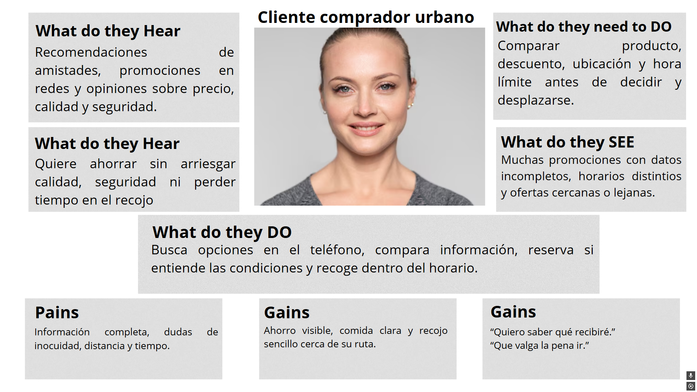
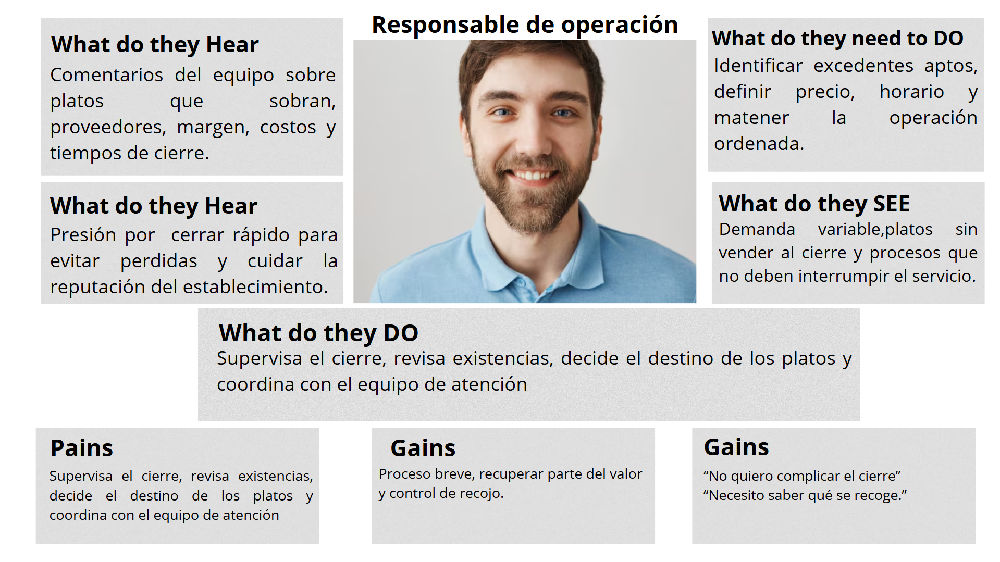
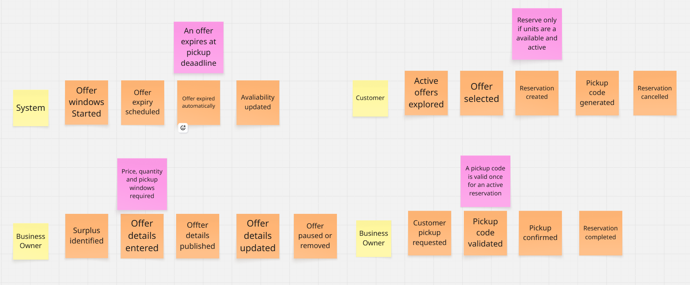

<!-- Carátula -->

    

 

<h1 style="text-align: center;">Universidad Peruana de Ciencias Aplicadas</h1>

<h3 style="text-align: center; font-weight: normal; font-size: 22px; margin-top: 0;">
Faculta de Ingeniería
</h3>

 

<strong>Carreras:</strong> INGENIERÍA DE SOFTWARE

<strong>Ciclo:</strong> 2026-20

1ASI0729 - Desarrollo de Aplicaciones Open Source

<strong>NRC:</strong> 7747

<strong>Docente:</strong>  Robles Fernández, Ivan

 

## "Informe del trabajo final"

**Startup:**  
 

**Producto:**  
 

## Relación de integrantes

<table style="margin: 0 auto; border-collapse: collapse;" border="1">
<tr>
<th>Código</th>
<th>Integrantes</th>
</tr>
<tr>
<td>U202326295</td>
<td>Huayra Moreyra José Maria</td>
</tr>
<tr>
<td>U202321590</td>
<td>Xin Yu Shi Lin</td>
</tr>
<tr>
<td>U20221e121</td>
<td>Giuliano Angel Peláez Vargas</td>
</tr>
<tr>
<td>U202316246</td>
<td>Martínez Ramos Bryan Felix</td>
</tr>
<tr>
<td>U202213185</td>
<td>Medina Merma, Ingrid Melani</td>
</tr>
</table>

Agosto 2026

<!-- Salto de Pagina -->

## Registro de Versiones del Informe

| Versión | Fecha    | Autor       | Descripción de Modificación            |
| ------- | -------- | ----------- | -------------------------------------- |
| 1.0     | // |  | Desarrollo de la Estructura del informe |

<!-- Salto de Pagina -->

## Project Report Collaboration Insights

<!-- Salto de Pagina -->

# Tabla de Contenidos

- [Capítulo I: Introducción](./Capitulo_1.md)
  - [1.1. Startup Profile](./Capitulo_1.md#11-startup-profile)
    - [1.1.1. Descripción de la Startup](./Capitulo_1.md#111-descripción-de-la-startup)
    - [1.1.2. Perfiles de integrantes del equipo](./Capitulo_1.md#112-perfiles-de-integrantes-del-equipo)
  - [1.2. Solution Profile](./Capitulo_1.md#12-solution-profile)
    - [1.2.1. Antecedentes y problemática](./Capitulo_1.md#121-antecedentes-y-problemática)
    - [1.2.2. Lean UX Process](./Capitulo_1.md#122-lean-ux-process)
      - [1.2.2.1. Lean UX Problem Statements](./Capitulo_1.md#1221-lean-ux-problem-statements)
      - [1.2.2.2. Lean UX Assumptions](./Capitulo_1.md#1222-lean-ux-assumptions)
      - [1.2.2.3. Lean UX Hypothesis Statements](./Capitulo_1.md#1223-lean-ux-hypothesis-statements)
      - [1.2.2.4. Lean UX Canvas](./Capitulo_1.md#1224-lean-ux-canvas)
  - [1.3. Segmentos objetivo](./Capitulo_1.md#13-segmentos-objetivo)

- [Capítulo II: Requirements Elicitation & Analysis](./Capitulo_2.md)
  - [2.1. Competidores](./Capitulo_2.md#21-competidores)
    - [2.1.1. Análisis competitivo](./Capitulo_2.md#211-análisis-competitivo)
    - [2.1.2. Estrategias y tácticas frente a competidores](./Capitulo_2.md#212-estrategias-y-tácticas-frente-a-competidores)
  - [2.2. Entrevistas](./Capitulo_2.md#22-entrevistas)
    - [2.2.1. Diseño de entrevistas](./Capitulo_2.md#221-diseño-de-entrevistas)
    - [2.2.2. Registro de entrevistas](./Capitulo_2.md#222-registro-de-entrevistas)
    - [2.2.3. Análisis de entrevistas](./Capitulo_2.md#223-análisis-de-entrevistas)
  - [2.3. Needfinding](./Capitulo_2.md#23-needfinding)
    - [2.3.1. User Personas](./Capitulo_2.md#231-user-personas)
    - [2.3.2. User Task Matrix](./Capitulo_2.md#232-user-task-matrix)
    - [2.3.3. User Journey Mapping](./Capitulo_2.md#233-user-journey-mapping)
    - [2.3.4. Empathy Mapping](./Capitulo_2.md#234-empathy-mapping)
  - [2.4. Big Picture Event Storming](./Capitulo_2.md#24-big-picture-event-storming)
  - [2.5. Ubiquitous Language](./Capitulo_2.md#25-ubiquitous-language)

- [Capítulo III: Requirements Specification](./Capitulo_3.md)
  - [3.1. User Stories](./Capitulo_3.md#31-user-stories)
  - [3.2. Impact Mapping](./Capitulo_3.md#32-impact-mapping)
  - [3.3. Product Backlog](./Capitulo_3.md#33-product-backlog)

- [Capítulo IV: Product Design](./Capitulo_4.md)
  - [4.1. Style Guidelines](./Capitulo_4.md#41-style-guidelines)
    - [4.1.1. General Style Guidelines](./Capitulo_4.md#411-general-style-guidelines)
    - [4.1.2. Web Style Guidelines](./Capitulo_4.md#412-web-style-guidelines)
  - [4.2. Information Architecture](./Capitulo_4.md#42-information-architecture)
    - [4.2.1. Organization Systems](./Capitulo_4.md#421-organization-systems)
    - [4.2.2. Labeling Systems](./Capitulo_4.md#422-labeling-systems)
    - [4.2.3. SEO Tags and Meta Tags](./Capitulo_4.md#423-seo-tags-and-meta-tags)
    - [4.2.4. Searching Systems](./Capitulo_4.md#424-searching-systems)
    - [4.2.5. Navigation Systems](./Capitulo_4.md#425-navigation-systems)
  - [4.3. Landing Page UI Design](./Capitulo_4.md#43-landing-page-ui-design)
    - [4.3.1. Landing Page Wireframe](./Capitulo_4.md#431-landing-page-wireframe)
    - [4.3.2. Landing Page Mock-up](./Capitulo_4.md#432-landing-page-mock-up)
  - [4.4. Web Applications UX/UI Design](./Capitulo_4.md#44-web-applications-uxui-design)
    - [4.4.1. Web Applications Wireframes](./Capitulo_4.md#441-web-applications-wireframes)
    - [4.4.2. Web Applications Wireflow Diagrams](./Capitulo_4.md#442-web-applications-wireflow-diagrams)
    - [4.4.2. Web Applications Mock-ups](./Capitulo_4.md#442-web-applications-mock-ups)
    - [4.4.3. Web Applications User Flow Diagrams](./Capitulo_4.md#443-web-applications-user-flow-diagrams)
  - [4.5. Web Applications Prototyping](./Capitulo_4.md#45-web-applications-prototyping)
  - [4.6. Domain-Driven Software Architecture](./Capitulo_4.md#46-domain-driven-software-architecture)
    - [4.6.1. Design-Level Event Storming](./Capitulo_4.md#461-design-level-event-storming)
    - [4.6.2. Software Architecture Context Diagram](./Capitulo_4.md#462-software-architecture-context-diagram)
    - [4.6.3. Software Architecture Container Diagrams](./Capitulo_4.md#463-software-architecture-container-diagrams)
    - [4.6.4. Software Architecture Components Diagrams](./Capitulo_4.md#464-software-architecture-components-diagrams)
  - [4.7. Software Object-Oriented Design](./Capitulo_4.md#47-software-object-oriented-design)
    - [4.7.1. Class Diagrams](./Capitulo_4.md#471-class-diagrams)
  - [4.8. Database Design](./Capitulo_4.md#48-database-design)
    - [4.8.1. Database Diagrams](./Capitulo_4.md#481-database-diagrams)

- [Capítulo V: Product Implementation, Validation & Deployment](./Capitulo_5.md)
  - [5.1. Software Configuration Management](./Capitulo_5.md#51-software-configuration-management)
    - [5.1.1. Software Development Environment Configuration](./Capitulo_5.md#511-software-development-environment-configuration)
    - [5.1.2. Source Code Management](./Capitulo_5.md#512-source-code-management)
    - [5.1.3. Source Code Style Guide & Conventions](./Capitulo_5.md#513-source-code-style-guide--conventions)
    - [5.1.4. Software Deployment Configuration](./Capitulo_5.md#514-software-deployment-configuration)
  - [5.2. Landing Page, Services & Applications Implementation](./Capitulo_5.md#52-landing-page-services--applications-implementation)
    - [5.2.X. Sprint n](./Capitulo_5.md#52x-sprint-n)
      - [5.2.X.1. Sprint Planning n](./Capitulo_5.md#52x1-sprint-planning-n)
      - [5.2.X.2. Aspect Leaders and Collaborators](./Capitulo_5.md#52x2-aspect-leaders-and-collaborators)
      - [5.2.X.3. Sprint Backlog n](./Capitulo_5.md#52x3-sprint-backlog-n)
      - [5.2.X.4. Development Evidence for Sprint Review](./Capitulo_5.md#52x4-development-evidence-for-sprint-review)
      - [5.2.X.5. Execution Evidence for Sprint Review](./Capitulo_5.md#52x5-execution-evidence-for-sprint-review)
      - [5.2.X.6. Services Documentation Evidence for Sprint Review](./Capitulo_5.md#52x6-services-documentation-evidence-for-sprint-review)
      - [5.2.X.7. Software Deployment Evidence for Sprint Review](./Capitulo_5.md#52x7-software-deployment-evidence-for-sprint-review)
      - [5.2.X.8. Team Collaboration Insights during Sprint](./Capitulo_5.md#52x8-team-collaboration-insights-during-sprint)
  - [5.3. Validation Interviews](./Capitulo_5.md#53-validation-interviews)
    - [5.3.1. Diseño de Entrevistas](./Capitulo_5.md#531-diseño-de-entrevistas)
    - [5.3.2. Registro de Entrevistas](./Capitulo_5.md#532-registro-de-entrevistas)
    - [5.3.3. Evaluaciones según heurísticas](./Capitulo_5.md#533-evaluaciones-según-heurísticas)
  - [5.4. Video About-the-Product](./Capitulo_5.md#54-video-about-the-product)

- [Anexos](./Anexos.md)
- [Conclusiones y Bibliografía](./Conclusiones-Bibliografia.md)

<!-- Salto de Pagina -->

## Student Outcome
| Criterio específico | Acciones realizadas | Conclusiones |
|---|---|---|
| Trabaja en equipo para proporcionar liderazgo en forma conjunta |*AV1*    |    |
| Crea un entorno colaborativo e inclusivo, establece metas, planifica tareas y cumple objetivos. | *AV1*  |  |

# Capítulo I: Introducción
 
## 1.1. Startup Profile

### 1.1.1. Descripción de la Startup

### 1.1.2. Perfiles de integrantes del equipo

## 1.2. Solution Profile

### 1.2.1. Antecedentes y problemática

### 1.2.2. Lean UX Process

#### 1.2.2.1. Lean UX Problem Statements

#### 1.2.2.2. Lean UX Assumptions

#### 1.2.2.3. Lean UX Hypothesis Statements

#### 1.2.2.4. Lean UX Canvas

## 1.3. Segmentos objetivo

# Capítulo II: Requirements Elicitation & Analysis

## 2.1. Competidores

FoodSave analiza a Cirkula como competidor directo peruano, Too Good To Go como referente internacional de marketplace de excedentes y Sinba como competidor indirecto de gestión y valorización de residuos.

### 2.1.1. Análisis competitivo
 **¿Por qué llevar a cabo este análisis?**

Para identificar cómo FoodSave puede diferenciar su propuesta de publicación y reserva transparente de excedentes frente a alternativas existentes, sin asumir que el modelo es inexistente en Perú.

| Perfil | Criterio | FoodSave | Cirkula | Too Good To Go | Sinba |
|---|---|---|---|---|---|
| Overview | Tipo de solución | Marketplace propuesto para excedentes aptos para consumo. | Marketplace peruano de excedentes de alimentos. | Marketplace internacional de alimentos no vendidos. | Gestión y valorización de residuos. |
| Perfil de Marketing | Ventaja competitiva: ¿Qué valor ofrece a los clientes? | Transparencia de producto, ingredientes/alérgenos, precio original, unidades y horario; código de recojo. | Descuentos en excedentes de establecimientos de comida. | Reserva y recojo de excedentes a precio reducido; bolsas sorpresa como formato frecuente. | Segregación, recolección y transformación de residuos. |
| Perfil de Marketing | Mercado objetivo | Restaurantes A1 de Lima Metropolitana y clientes cercanos. | Negocios de comida y usuarios que adquieren ofertas en Lima. | Negocios de comida, panaderías, tiendas y usuarios de los países donde opera. | Empresas, restaurantes, hogares y organizaciones que gestionan residuos. |
| Perfil de Marketing | Estrategias de marketing |  | Comunica el beneficio “come, ahorra, ayuda”, para negocios promueve recuperar costos, captar tráfico y reducir desperdicio. | Promueve las **Surprise Bags**, el descubrimiento en el mapa/app y la captación de nuevos clientes para negocios asociados. | Ofrece educación y soluciones circulares para que empresas y restaurantes gestionen residuos de forma más sostenible. |
| Perfil de Producto | Productos y servicios |  | Aplicación/plataforma de ofertas de comida con descuento. | Aplicación/plataforma de reservas y recojo de excedentes. | Servicios de gestión y valorización de residuos. |
| Perfil de Producto | Precios y costos |  | Publicita descuentos de al menos 40 % para usuarios, la tarifa al negocio no se publica en la fuente consultada. | El usuario paga aproximadamente un tercio del precio regular, sus términos para negocios mencionan una **Partnership Fee** y una **Reservation Fee**, sin un monto único aplicable a todos los mercados. | La tarifa se cotiza según el servicio o solución circular; no se publica una lista de precios en la fuente consultada. |
| Perfil de Producto | Canales de distribución (Web y/o Móvil) | | Sitio web y aplicación disponible en Google Play y App Store. | Aplicación y sitio web del marketplace; descubrimiento, reserva y recojo se gestionan en la app. | Web, consultoría, capacitación y operación física de reaprovechamiento de residuos; no es un marketplace de compra y recojo. |
| Análisis SWOT | Fortalezas |  | Marca local con marketplace operativo, descuentos y una propuesta clara para comercios y usuarios. | Escala del marketplace, red internacional y proceso formal de publicación, reserva y recojo | Especialización en sostenibilidad y manejo de residuos del sector gastronómico. |
| Análisis SWOT | Debilidades | Marca nueva, sin red de comercios ni evidencia propia de demanda al inicio. | La información pública consultada no detalla la tarifa del negocio ni el control operativo por cada establecimiento. | Su formato de **Surprise Bag** reduce la certeza sobre el contenido antes del recojo; esto abre espacio para que FoodSave pruebe ofertas detalladas. | No resuelve la venta o reserva de alimentos aptos para consumo antes de que se conviertan en residuo. |
| Análisis SWOT | Oportunidades | Crear alianzas con restaurantes de clase media y alta y validar si la información de ingredientes, alérgenos y condiciones impulsa la reserva. | Ampliar negocios, productos y cobertura aprovechando el interés por ahorro y reducción de desperdicio. | Aplicar su experiencia de marketplace a nuevos mercados, categorías y soluciones de gestión de excedentes. | Complementar una plataforma de prevención: los residuos no aptos para consumo pueden derivarse a valorización. |
| Análisis SWOT | Amenazas | Competidores establecidos, baja oferta inicial, reservas no recogidas y obligaciones sanitarias de cada negocio. | La entrada de nuevos marketplaces o cambios en la disponibilidad de comercios pueden afectar su diferenciación local. | La expansión y escala de un referente internacional elevan la expectativa de usuarios y negocios sobre el servicio. | Puede competir por el presupuesto de sostenibilidad de restaurantes, aunque también puede convertirse en aliado para residuos no comercializables. |

### 2.1.2. Estrategias y tácticas frente a competidores

| Hallazgo competitivo | Estrategia preliminar de FoodSave | Táctica verificable |
|---|---|---|
| Existen marketplaces de excedentes. | Diferenciarse por transparencia y control operativo, no por afirmar exclusividad. | Exigir producto, ingredientes/alérgenos cuando correspondan, precios, unidades y hora límite al publicar. |
| La reserva no garantiza el recojo. | Hacer visible el compromiso y el límite de recojo. | Generar código único y mostrar la hora límite en reserva y catálogo. |
| La oferta inicial es crítica para el marketplace. | Iniciar con un segmento y zona acotados. | Medir negocios contactados, ofertas publicadas, reservas, cancelaciones y recojos. |
| Los residuos son una alternativa posterior a la prevención. | Priorizar venta de alimentos aptos antes de su disposición. | Comunicar la responsabilidad sanitaria del establecimiento y no prometer garantías que FoodSave no puede verificar. |

## 2.2. Entrevistas

### 2.2.1. Diseño de entrevistas

User: Restaurantes de clase media y alta

1.- ¿Qué suelen hacer con los alimentos o platos preparados que no logran vender al finalizar el día?
2.- ¿Con qué frecuencia suelen tener alimentos preparados que no llegan a venderse durante la jornada?
3.- ¿Cuáles considera que son las principales razones por las que se generan estos excedentes?
4.- ¿Qué impacto económico representa para el restaurante tener productos preparados que finalmente no se venden?
5.- ¿Actualmente utilizan alguna estrategia para aprovechar o vender los alimentos que podrían quedar al finalizar el día?
6.- ¿Estarían dispuestos a ofrecer estos alimentos a un precio reducido antes del cierre? ¿Por qué?
7.- ¿Qué factores tomarían en cuenta para determinar el descuento de estos productos?
8.- ¿Qué tan útil sería contar con una plataforma que les permita publicar ofertas de estos alimentos y llegar a consumidores interesados?
9.- ¿Preferirían que los clientes recojan el pedido para llevar o permitirían también su consumo dentro del establecimiento? ¿Por qué?
10 ¿Qué aspectos o condiciones considerarían importantes antes de utilizar una plataforma de este tipo?

User: Personas que consumen en restaurantes con frecuencia y buscan opciones de calidad a precios accesibles

1.- ¿Con qué frecuencia consumes alimentos en restaurantes durante la semana?
2.- ¿Qué factores consideras más importantes al momento de elegir un restaurante o un plato?
3.- ¿Qué tanto influye el precio en tu decisión de consumir en un determinado restaurante?
4.- ¿Sueles buscar promociones o descuentos cuando decides comer en un restaurante? ¿De qué manera los encuentras?
5.- ¿Estarías dispuesto a comprar a un precio reducido un plato preparado durante el mismo día que no llegó a venderse? ¿Por qué?
6.- ¿Qué información necesitarías conocer sobre un plato antes de decidir comprarlo bajo esta modalidad?
7.- ¿Qué nivel de descuento considerarías atractivo para decidir comprar este tipo de oferta?
8.- ¿Estarías dispuesto a acudir a un restaurante dentro de un horario determinado para aprovechar una oferta disponible?
9.- ¿Preferirías recoger el pedido para llevar o consumirlo directamente en el restaurante? ¿Por qué?
10.- ¿Qué aspecto te generaría mayor preocupación o desconfianza al adquirir alimentos mediante este tipo de ofertas?

### 2.2.2. Registro de entrevistas

### 2.2.3. Análisis de entrevistas

## 2.3. Needfinding

### 2.3.1. User Personas

### 2.3.2. User Task Matrix

### 2.3.3. User Journey Mapping

### 2.3.4. Empathy Mapping

#### Empathy Mapping - Segmento 1 (Cliente)

#### Empathy Mapping - Segmento 2 (Negocios)

## 2.4. Big Picture Event Storming

## 2.5. Ubiquitous Language

Para esta sección se planteó un diccionario de términos técnicos que son aplicados en el dominio de nuestro proyecto.

| Término | Definición |
|---|---|
| Offer (Oferta) | Publicación temporal de un producto con precio reducido, unidades disponibles y hora límite de recojo. |
| Surplus (Excedente) | Unidad de alimento apta para consumo que el negocio estima que no venderá al precio regular durante la jornada. |
| Reservation (Reserva) | Compromiso de compra de una oferta dentro de su ventana de recojo. |
| Pickup (Recojo) | Entrega de una reserva al cliente en el establecimiento y horario definidos. |
| Pickup Code (Código de recojo) | Código que permite al negocio validar una reserva activa al momento de la entrega. |
| Pickup Window (Ventana de recojo) | Intervalo dentro del cual el cliente puede recoger una reserva. |
| Expired Offer (Oferta vencida) | Oferta cuya hora límite pasó y ya no acepta nuevas reservas. |

# Capítulo III: Requirements Specification

## 3.1. User Stories

## 3.2. Impact Mapping

## 3.3. Product Backlog

# Capítulo IV: Product Design

## 4.1. Style Guidelines

### 4.1.1. General Style Guidelines

### 4.1.2. Web Style Guidelines

## 4.2. Information Architecture

### 4.2.1. Organization Systems

### 4.2.2. Labeling Systems

### 4.2.3. SEO Tags and Meta Tags

### 4.2.4. Searching Systems

### 4.2.5. Navigation Systems

## 4.3. Landing Page UI Design

### 4.3.1. Landing Page Wireframe

### 4.3.2. Landing Page Mock-up

## 4.4. Web Applications UX/UI Design

### 4.4.1. Web Applications Wireframes

### 4.4.2. Web Applications Wireflow Diagrams

### 4.4.2. Web Applications Mock-ups

### 4.4.3. Web Applications User Flow Diagrams

## 4.5. Web Applications Prototyping

## 4.6. Domain-Driven Software Architecture

### 4.6.1. Design-Level Event Storming

### 4.6.2. Software Architecture Context Diagram

### 4.6.3. Software Architecture Container Diagrams

### 4.6.4. Software Architecture Components Diagrams

## 4.7. Software Object-Oriented Design

### 4.7.1. Class Diagrams

## 4.8. Database Design

### 4.8.1. Database Diagrams

# Capítulo V: Product Implementation, Validation & Deployment

## 5.1. Software Configuration Management

### 5.1.1. Software Development Environment Configuration

### 5.1.2. Source Code Management

### 5.1.3. Source Code Style Guide & Conventions

### 5.1.4. Software Deployment Configuration

## 5.2. Landing Page, Services & Applications Implementation

### 5.2.X. Sprint n

#### 5.2.X.1. Sprint Planning n

#### 5.2.X.2. Aspect Leaders and Collaborators

#### 5.2.X.3. Sprint Backlog n

#### 5.2.X.4. Development Evidence for Sprint Review

#### 5.2.X.5. Execution Evidence for Sprint Review

#### 5.2.X.6. Services Documentation Evidence for Sprint Review

#### 5.2.X.7. Software Deployment Evidence for Sprint Review

#### 5.2.X.8. Team Collaboration Insights during Sprint

## 5.3. Validation Interviews

### 5.3.1. Diseño de Entrevistas

### 5.3.2. Registro de Entrevistas

### 5.3.3. Evaluaciones según heurísticas

## 5.4. Video About-the-Product

## Conclusiones

### Conclusiones y recomendaciones.

#### Conclusiones

#### Recomendaciones

## Bibliografía

## Anexos

### Anexo A. Contenido con Videos

<!-- Salto de Pagina -->

### Anexo B. 
