<!-- Carátula -->
<div align="center">
    
</div>

<div align="center">
<br>

<h1 style="text-align: center;">Universidad Peruana de Ciencias Aplicadas</h1>

<h3 style="text-align: center; font-weight: normal; font-size: 22px; margin-top: 0;">
Faculta de Ingeniería
</h3>

<br>
<p align="center"><strong>Carreras:</strong> INGENIERÍA DE SOFTWARE</p>
<p align="center"><strong>Ciclo:</strong> 2026-20</p>
<p align="center">1ASI0729 - Desarrollo de Aplicaciones Open Source</p>
<p align="center"><strong>NRC:</strong> 7747</p>
<p align="center"><strong>Docente:</strong>  Robles Fernández, Ivan</p>
<br>

## "Informe del trabajo final"

**Startup:**  
<br>Smiling Food

**Producto:**  
<br>FoodSave

## Relación de integrantes

<table style="margin: 0 auto; border-collapse: collapse;" border="1">
<tr>
<th>Código</th>
<th>Integrantes</th>
</tr>
<tr>
<td>U202326295</td>
<td>Huayra Moreyra José Maria</td>
</tr>
<tr>
<td>U20221e121</td>
<td>Giuliano Angel Peláez Vargas</td>
</tr>
<tr>
<td>U202316246</td>
<td>Martínez Ramos Bryan Felix</td>
</tr>
<tr>
<td>U202213185</td>
<td>Medina Merma, Ingrid Melani</td>
</tr>
</table>

<div style="font-weight: bold;">Agosto 2026</div>

</div>


<!-- Salto de Pagina -->
<div style="page-break-after: always;"></div>

## Registro de Versiones del Informe

| Versión | Fecha    | Autor       | Descripción de Modificación            |
| ------- | -------- | ----------- | -------------------------------------- |
| 1.0     | 17.09.2026 | Martínez Ramos Bryan Felix, Giuliano Angel Peláez Vargas, Medina Merma, Ingrid Melani, Huayra Moreyra José Maria | Desarrollo inicial del proyecto. Incluye desarrollo del perfil de la Startup y proceso Lean UX; además, se analizaron los competidores y se definieron los Segmentos Objetivos para, posteriormente, elaborar las entrevistas. Luego, se desarrolló  el Event Storming y se definió el Lenguaje Ubicuo. Después se realizó la especificación de requerimientos con las User Stories, Product Backlog e Impact Mapping. Seguidamente se prototipó y desarrolló la Landing Page para el proyecto. Finalmente, se desarrolló el Sprint Planning 1 del proyecto. |
| 2.0     | 06.09.2026 | Martínez Ramos Bryan Felix, Giuliano Angel Peláez Vargas, Medina Merma, Ingrid Melani, Huayra Moreyra José Maria | Se añadieron los apartados correspondientes al Sprint 2, incluyendo Sprint Planning, Aspect Leaders and Collaborators, Sprint Backlog, evidencias de desarrollo, ejecución, documentación de servicios y despliegue, así como los insights de colaboración del equipo. Además, se avanzó con las Conclusiones, Bibliografía y Anexos.|

>>>>>>> dd8823a27ac0bb87ad9e16d275032f0881535549

<!-- Salto de Pagina -->
<div style="page-break-after: always;"></div>

## Project Report Collaboration Insights
Para el desarrollo del **Project Report**, se utilizó un repositorio dentro de la organización del equipo en GitHub. A continuación, se presenta la evidencia de colaboración correspondiente, en coherencia con el Registro de Versiones del Informe

## AV1 - Informe inicial


## TB1 - Actualización del Informe
A continuación se presentan los gráficos de colaboración de los integrantes del equipo en el repositorio de nuestro segundo sprint. Estos gráficos ofrecen una representación visual de la cantidad de contribuciones realizadas por cada miembro del equipo, junto con la fecha en que se llevaron a cabo. Además, se presenta información sobre la cantidad de líneas de código que se han modificado en cada uno de los commits.

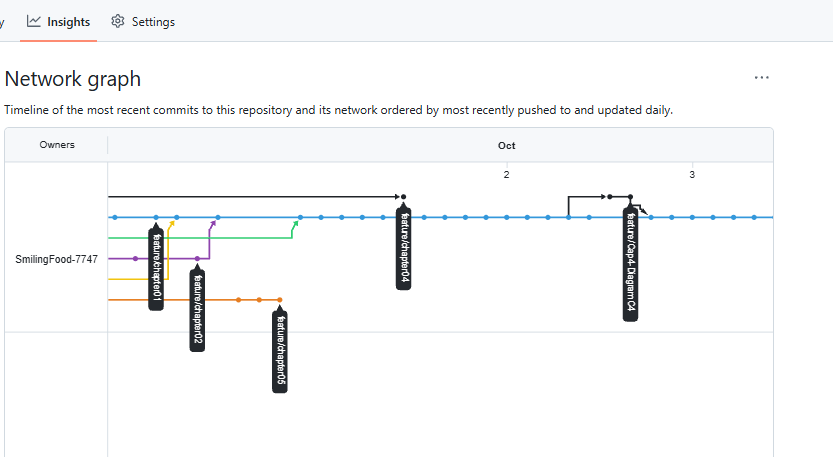

<!-- Salto de Pagina -->
<div style="page-break-after: always;"></div>

# Tabla de Contenidos

- [Capítulo I: Introducción](#capítulo-i-introducción)
  - [1.1. Startup Profile](#11-startup-profile)
    - [1.1.1. Descripción de la Startup](#111-descripción-de-la-startup)
    - [1.1.2. Perfiles de integrantes del equipo](#112-perfiles-de-integrantes-del-equipo)
  - [1.2. Solution Profile](#12-solution-profile)
    - [1.2.1. Antecedentes y problemática](#121-antecedentes-y-problemática)
    - [1.2.2. Lean UX Process](#122-lean-ux-process)
      - [1.2.2.1. Lean UX Problem Statements](#1221-lean-ux-problem-statements)
      - [1.2.2.2. Lean UX Assumptions](#1222-lean-ux-assumptions)
      - [1.2.2.3. Lean UX Hypothesis Statements](#1223-lean-ux-hypothesis-statements)
      - [1.2.2.4. Lean UX Canvas](#1224-lean-ux-canvas)
  - [1.3. Segmentos objetivo](#13-segmentos-objetivo)

- [Capítulo II: Requirements Elicitation & Analysis](#capítulo-ii-requirements-elicitation--analysis)
  - [2.1. Competidores](#21-competidores)
    - [2.1.1. Análisis competitivo](#211-análisis-competitivo)
    - [2.1.2. Estrategias y tácticas frente a competidores](#212-estrategias-y-tácticas-frente-a-competidores)
  - [2.2. Entrevistas](#22-entrevistas)
    - [2.2.1. Diseño de entrevistas](#221-diseño-de-entrevistas)
    - [2.2.2. Registro de entrevistas](#222-registro-de-entrevistas)
    - [2.2.3. Análisis de entrevistas](#223-análisis-de-entrevistas)
  - [2.3. Needfinding](#23-needfinding)
    - [2.3.1. User Personas](#231-user-personas)
    - [2.3.2. User Task Matrix](#232-user-task-matrix)
    - [2.3.3. User Journey Mapping](#233-user-journey-mapping)
    - [2.3.4. Empathy Mapping](#234-empathy-mapping)
  - [2.4. Big Picture Event Storming](#24-big-picture-event-storming)
  - [2.5. Ubiquitous Language](#25-ubiquitous-language)

- [Capítulo III: Requirements Specification](#capítulo-iii-requirements-specification)
  - [3.1. User Stories](#31-user-stories)
  - [3.2. Impact Mapping](#32-impact-mapping)
  - [3.3. Product Backlog](#33-product-backlog)

- [Capítulo IV: Product Design](#capítulo-iv-product-design)
  - [4.1. Style Guidelines](#41-style-guidelines)
    - [4.1.1. General Style Guidelines](#411-general-style-guidelines)
    - [4.1.2. Web Style Guidelines](#412-web-style-guidelines)
  - [4.2. Information Architecture](#42-information-architecture)
    - [4.2.1. Organization Systems](#421-organization-systems)
    - [4.2.2. Labeling Systems](#422-labeling-systems)
    - [4.2.3. SEO Tags and Meta Tags](#423-seo-tags-and-meta-tags)
    - [4.2.4. Searching Systems](#424-searching-systems)
    - [4.2.5. Navigation Systems](#425-navigation-systems)
  - [4.3. Landing Page UI Design](#43-landing-page-ui-design)
    - [4.3.1. Landing Page Wireframe](#431-landing-page-wireframe)
    - [4.3.2. Landing Page Mock-up](#432-landing-page-mock-up)
  - [4.4. Web Applications UX/UI Design](#44-web-applications-uxui-design)
    - [4.4.1. Web Applications Wireframes](#441-web-applications-wireframes)
    - [4.4.2. Web Applications Wireflow Diagrams](#442-web-applications-wireflow-diagrams)
    - [4.4.2. Web Applications Mock-ups](#442-web-applications-mock-ups)
    - [4.4.3. Web Applications User Flow Diagrams](#443-web-applications-user-flow-diagrams)
  - [4.5. Web Applications Prototyping](#45-web-applications-prototyping)
  - [4.6. Domain-Driven Software Architecture](#46-domain-driven-software-architecture)
    - [4.6.1. Design-Level Event Storming](#461-design-level-event-storming)
    - [4.6.2. Software Architecture Context Diagram](#462-software-architecture-context-diagram)
    - [4.6.3. Software Architecture Container Diagrams](#463-software-architecture-container-diagrams)
    - [4.6.4. Software Architecture Components Diagrams](#464-software-architecture-components-diagrams)
  - [4.7. Software Object-Oriented Design](#47-software-object-oriented-design)
    - [4.7.1. Class Diagrams](#471-class-diagrams)
  - [4.8. Database Design](#48-database-design)
    - [4.8.1. Database Diagrams](#481-database-diagrams)

- [Capítulo V: Product Implementation, Validation & Deployment](#capítulo-v-product-implementation-validation--deployment)
  - [5.1. Software Configuration Management](#51-software-configuration-management)
    - [5.1.1. Software Development Environment Configuration](#511-software-development-environment-configuration)
    - [5.1.2. Source Code Management](#512-source-code-management)
    - [5.1.3. Source Code Style Guide & Conventions](#513-source-code-style-guide--conventions)
    - [5.1.4. Software Deployment Configuration](#514-software-deployment-configuration)
  - [5.2. Landing Page, Services & Applications Implementation](#52-landing-page-services--applications-implementation)
    - [5.2.1. Sprint n](#521-sprint-1)
      - [5.2.1.1. Sprint Planning 1](#5211-sprint-planning-1)
      - [5.2.1.2. Aspect Leaders and Collaborators](#5212-aspect-leaders-and-collaborators)
      - [5.2.1.3. Sprint Backlog n](#5213-sprint-backlog-n)
      - [5.2.1.4. Development Evidence for Sprint Review](#52x4-development-evidence-for-sprint-review)
      - [5.2.1.5. Execution Evidence for Sprint Review](#5215-execution-evidence-for-sprint-review)
      - [5.2.1.6. Services Documentation Evidence for Sprint Review](#5216-services-documentation-evidence-for-sprint-review)
      - [5.2.1.7. Software Deployment Evidence for Sprint Review](#5217-software-deployment-evidence-for-sprint-review)
      - [5.2.1.8. Team Collaboration Insights during Sprint](#5218-team-collaboration-insights-during-sprint)


- [Conclusiones](#conclusiones)
  - [Conclusiones y recomendaciones](#conclusiones-y-recomendaciones)

- [Bibliografía](#bibliografía)

- [Anexos](#anexos)
  - [Anexo A. Contenido con Videos](#anexo-a-contenido-con-videos)

<!-- Salto de Pagina -->
<div style="page-break-after: always;"></div>

## Student Outcome

| Entregable | Criterio específico | Acciones realizadas | Conclusiones |
|---|---|---|---|
|*AV1*| Trabaja en equipo para proporcionar liderazgo en forma conjunta | - **Huayra José:**<br>- **Peláez Giuliano:**<br>- **Martínez Bryan:** AV1: Participé de manera activa en el desarrollo de FoodSave, aportando ideas y criterios para definir la problemática, los segmentos objetivos y la propuesta del proyecto junto con los demás integrantes. Contribuí en la elaboración de los Lean UX Problem Statements, Lean UX Assumptions y Lean UX Hypothesis Statements, así como en la preparación de las entrevistas y herramientas como User Personas, User Task Matrix y User Journey Mapping. Durante estas actividades compartí aportes con el equipo y participé en la toma conjunta de decisiones para mantener los entregables alineados con las necesidades identificadas en ambos segmentos.<br>**Medina Ingrid:** cree el repositorio original, di apoyo en el capitulo 2 en especial con las entrevistas, en capitulo 5 con la parte de Software Configuration Management | Durante el desarrollo de las entregas, el equipo fortaleció progresivamente su capacidad para ejercer un liderazgo compartido, coordinando responsabilidades, tomando decisiones de manera conjunta y apoyándose mutuamente para cumplir los objetivos planteados en cada etapa del proyecto. |
|*AV1*| Crea un entorno colaborativo e inclusivo, establece metas, planifica tareas y cumple objetivos. | - **Huayra José:**<br>- **Xin Lin:**<br>- **Peláez Giuliano:**<br>- **Martínez Bryan:** Contribuí en la organización de las actividades asignadas para el desarrollo de FoodSave, planificando la elaboración y revisión de los entregables correspondientes dentro de los plazos establecidos. Realicé el seguimiento de mis tareas y mantuve actualizada la documentación del proyecto mediante GitHub, utilizando ramas y commits para registrar los avances y correcciones realizadas. Asimismo, apoyé en la incorporación y revisión de fuentes académicas utilizadas para sustentar la problemática, procurando que la información requerida estuviera correctamente documentada antes de cada entrega. De esta manera, mantuve una participación organizada y coordinada con el equipo para cumplir con los objetivos establecidos. <br>- **Medina Ingrid:** cree el repositorio original, di apoyo en el capitulo 2 en especial con las entrevistas, en capitulo 5 con la parte de Software Configuration Management | A lo largo de las entregas, el equipo fortaleció un entorno de trabajo colaborativo e inclusivo mediante la distribución equitativa de responsabilidades, la planificación conjunta de las actividades y el establecimiento de metas claras, logrando cumplir de manera organizada con los objetivos planteados en cada etapa del proyecto. |
|*TB1*| Trabaja en equipo para proporcionar liderazgo en forma conjunta | - **Huayra José:**<br>- **Peláez Giuliano:**<br>- **Martínez Bryan:** <br> **Medina Ingrid:** Ayude con correcciones y añadi diagramas faltantes de contexto, contenedores y componenetes.|  |
|*TB1*| Crea un entorno colaborativo e inclusivo, establece metas, planifica tareas y cumple objetivos. | - **Huayra José:**<br>- **Xin Lin:**<br>- **Peláez Giuliano:**<br>- **Martínez Bryan:**  <br>- **Medina Ingrid:**Ayude con correcciones y añadi diagramas faltantes de contexto, contenedores y componenetes. |  |

<!-- Salto de Pagina -->
<div style="page-break-after: always;"></div>

# Capítulo I: Introducción
 
## 1.1. Startup Profile
### 1.1.1. Descripción de la Startup

FoodSave es una startup peruana de tecnología orientada a la reducción del desperdicio de alimentos y al acceso a comida de calidad a precios accesibles. Nacemos frente a una problemática frecuente en el sector gastronómico: muchos restaurantes generan excedentes de alimentos preparados durante las últimas horas de atención que, pese a mantenerse aptos para el consumo, terminan siendo desechados debido a la demanda impredecible.

Nuestra propuesta tecnológica es FoodSave, una plataforma móvil que conecta restaurantes con consumidores para dar una segunda oportunidad a estos excedentes mediante ofertas de último horario, generando beneficios tanto económicos como sociales.

La aplicación se basa en tres funcionalidades principales:

* Publicación de platos disponibles con descuentos durante las últimas horas de atención.
* Reserva y compra de alimentos desde la aplicación para recoger en el local o consumir en el restaurante.
* Notificaciones en tiempo real sobre nuevas ofertas cercanas según la ubicación del usuario.

MISIÓN: Reducir el desperdicio de alimentos mediante una plataforma digital que conecte restaurantes con consumidores, promoviendo una alimentación más accesible, sostenible y económicamente beneficiosa para ambas partes.

VISIÓN: Convertirnos en la plataforma líder en aprovechamiento de excedentes gastronómicos en Latinoamérica, impulsando una cultura de consumo responsable y ayudando a los restaurantes a transformar el desperdicio en oportunidades.
 
### 1.1.2. Perfiles de integrantes del equipo


|                     Foto de perfil                      | Nombre Completo                      | Carrera                | Descripción                                                                                                         |
| :-----------------------------------------------------: | :----------------------------------- | :--------------------- | :------------------------------------------------------------------------------------------------------------------ |
|    | Giuliano Angel Peláez Vargas | Ingeniería de Software | Soy estudiante de la carrera de Ingeniería de Software. Tengo conocimientos técnicos en programación en lenguajes como C++, Python, C# y Java. Tengo experiencia en desarrollo de aplicaciones Web según distintos enfoques y herramientas, me considero una persona responsable con sus trabajos, si el equipo necesita de mi ayuda estaré más que dispuesto a ayudar para que el trabajo logre completarse. |
|   | Bryan Félix Martínez Ramos | Ingeneria de software | Soy Bryan Martinez, actualmente estudio la carrera de ingeniera de software en la universidad peruana de ciencias aplicadas, me encuentro a mitad de carrera. Tengo conocimientos de diferentes lenguajes de programación aprendidos durante la carrera como SQL,C++,C# Python y otros, ademas de otros habilidades como Excel, ingles y otros. Soy alguien que siempre trata de apoyar y resolver lo mas que pueda en los trabajos grupales, no me gusta que mis compañeros tengan que cargar con mis actividades y siempre estoy dispuesto a apoyar lo mas que puedo Me entusiasma el aprendizaje que obtendré con el curso de Appweb y las nuevas habilidades que aprenderé con este trabajo grupal |
|  | Ingrid Melani Medina Merma | Ingenieria de Software | Soy estudiante de la carrera de Ingeniería de Software. Poseo conocimiento en programas de edición y lenguajes como el c++, un poco de python y typescript, tengo una buena adaptabilidad y un gusto por aprender y ayudar en lo que pueda|
|  | Jose Maria Huayra Moreyra | Ingenieria de Software | Soy Jose Maria Huayra Moreyra, actualmente estudio la carrera de Ingenieria de Software, cursando el 6to ciclo. Tengo conocimientos basicos y medios en lenguaje C++, basico en python y un poco el javascript. Me considero una persona respetuosa, empática, amable y social con el grupo que trengo, a parte de ser responsable en el trabajo que tenemos en nuestro proyecto. |
| Foto5  |  |  |                       
---
 
## 1.2. Solution Profile
 
### 1.2.1. Antecedentes y problemática

Para comprender las necesidades de nuestros usuarios, aplicamos la metodología 5W's & 2H's, una herramienta que permite analizar el problema desde siete perspectivas clave: qué sucede, cuándo ocurre, dónde se presenta, quiénes son los afectados, por qué ocurre, cómo impacta y qué evidencia respalda la problemática.

**What (Qué) — ¿Cuál es el problema?**

En el Perú, muchos restaurantes generan excedentes de alimentos preparados que permanecen aptos para el consumo, pero que no logran venderse durante las últimas horas de atención. Como consecuencia, estos platos terminan siendo desperdiciados, representando una pérdida económica para el restaurante y una oportunidad desaprovechada para los consumidores.

**When (Cuándo) — ¿Cuándo sucede el problema?**

La situación ocurre principalmente durante las últimas horas antes del cierre, cuando los restaurantes pueden estimar qué platos preparados no serán vendidos.

**¿Cuándo utilizará el cliente el producto?**

Los restaurantes publicarán sus ofertas al finalizar la jornada comercial, mientras que los usuarios utilizarán la aplicación para descubrir, reservar y adquirir platos disponibles ese mismo día.

**Where (Dónde) — ¿Dónde está el cliente cuando usa el producto?**

La solución está dirigida inicialmente a restaurantes ubicados en distritos urbanos de Lima, especialmente en zonas con una amplia oferta gastronómica. Los consumidores utilizarán la aplicación desde cualquier lugar cercano para encontrar ofertas disponibles en establecimientos próximos.

**Who (Quién) — ¿A quiénes les sucede el problema?**

El problema afecta principalmente a restaurantes de clase media y alta, que buscan reducir pérdidas por alimentos no vendidos, y a personas de ingresos medios interesadas en acceder a comida de calidad a un precio más accesible.

**Why (Por qué) — ¿Cuál es la causa del problema?**

La principal causa es la demanda impredecible en los restaurantes. Aunque los establecimientos preparan alimentos para garantizar disponibilidad durante el servicio, no siempre logran vender toda su producción antes del cierre.

**How (Cómo) — ¿Cómo afecta este problema?**

El desperdicio de alimentos genera pérdidas económicas para los restaurantes, incrementa el impacto ambiental asociado a los residuos alimentarios y limita el acceso de los consumidores a opciones gastronómicas de calidad a precios más asequibles.

**How Much (Cuánto) — ¿Qué datos respaldan la problemática?**

Según un estudio publicado en 2022 en la revista científica Sustainability, realizado por investigadores de la Universidad Privada del Norte (UPN), la Universidad Nacional Jorge Basadre Grohmann (UNJBG) y otras instituciones, se analizó la gestión de residuos y excedentes alimentarios en establecimientos de Lima y Tacna. En la sección 3.3. Organic Waste Reduction, el estudio señala que el 58,2 % entregaba al personal los excedentes de comida preparada, mientras que el 28,4 % los eliminaba mediante rellenos sanitarios y el 20,9 % los destinaba a recicladores vinculados a criaderos de cerdos. Asimismo, algunos responsables reconocieron no saber cómo aprovechar o donar estos excedentes. Estos resultados muestran que parte de los alimentos preparados que no llegan a comercializarse puede terminar siendo destinada a otros usos o descartada, evidenciando una oportunidad para propuestas como FoodSave, que busca facilitar el aprovechamiento de estos alimentos mediante su oferta a consumidores mientras mantengan condiciones adecuadas para el consumo.
 
### 1.2.2. Lean UX Process
 
#### 1.2.2.1. Lean UX Problem Statements

**Problem Statement 1:** Los restaurantes generan excedentes de alimentos preparados que no siempre logran vender antes del cierre. Actualmente, existen pocas alternativas para ofrecer estos productos a consumidores durante las últimas horas de atención, por lo que una parte de estos alimentos termina siendo desperdiciada a pesar de mantenerse apta para el consumo.

**Problem Statement 2:** Los restaurantes tienen dificultades para recuperar parte del valor económico de los alimentos que no logran vender durante su jornada. La falta de un canal que permita ofrecer estos productos de manera rápida y dirigida a consumidores cercanos limita las posibilidades de reducir las pérdidas asociadas a los excedentes.

**Problem Statement 3:** Los consumidores de ingresos medios tienen un acceso limitado a determinados restaurantes debido al precio habitual de sus productos. A pesar de ello, existe una oportunidad de acceder a alimentos de estos establecimientos a precios más accesibles cuando existen excedentes disponibles al final de la jornada.
 
#### 1.2.2.2. Lean UX Assumptions

**Business Assumptions:**

* Creemos que los restaurantes estarán interesados en utilizar un canal digital que les permita vender alimentos excedentes antes de que sean desperdiciados.
* Suponemos que los restaurantes estarán dispuestos a ofrecer descuentos sobre sus excedentes si esto les permite recuperar parte del valor de productos que no fueron vendidos.
* Consideramos que los consumidores estarán interesados en adquirir alimentos de restaurantes de mayor nivel cuando estos se encuentren disponibles a precios significativamente más accesibles.
* Creemos que una plataforma que conecte la oferta de excedentes con consumidores cercanos puede generar beneficios tanto económicos para los restaurantes como de accesibilidad para los usuarios.

**Business Outcomes:**

* Reducir la cantidad de alimentos preparados que terminan siendo desperdiciados en los restaurantes afiliados.
* Permitir que los restaurantes recuperen parte del valor económico de sus excedentes.
* Incrementar la participación de restaurantes en la comercialización de alimentos de última oportunidad.
* Generar una nueva alternativa de acceso a comida de calidad a precios más accesibles.

**User Benefits:**

* Los restaurantes podrán obtener ingresos adicionales por alimentos que de otra manera podrían ser desperdiciados.
* Los restaurantes contarán con un canal adicional para dar salida a sus excedentes durante las últimas horas de atención.
* Los consumidores podrán acceder a platos de restaurantes de mayor nivel a precios reducidos.
* Los consumidores podrán encontrar ofertas de alimentos disponibles cerca de su ubicación.
 
#### 1.2.2.3. Lean UX Hypothesis Statements

**Hipótesis 1 (Basada en el Módulo de publicación de excedentes)**
*Creemos que lograremos* un aumento sostenido en la cantidad de excedentes publicados durante las últimas horas de atención *si* los restaurantes *logran* ofrecer de manera rápida sus excedentes a consumidores interesados *con* el Módulo de publicación de excedentes.


**Hipótesis 2 (Basada en el Motor de descuentos dinámicos)**
*Creemos que lograremos* un aumento en la tasa de conversión de compra en la plataforma *si* los consumidores *logran* adquirir platos de restaurantes de mayor nivel a precios significativamente inferiores a los habituales *con* el Motor de descuentos dinámicos.

**Hipótesis 3 (Basada en el Buscador de ofertas por geolocalización)**
*Creemos que lograremos* un aumento en la tasa de reservas completadas dentro de la app *si* los consumidores *logran* encontrar y aprovechar con mayor facilidad los excedentes disponibles cerca de ellos *con* el Buscador de ofertas por geolocalización. 

#### 1.2.2.4. Lean UX Canvas

| 1. BUSINESS PROBLEM | 5. SOLUTIONS | 2. BUSINESS OUTCOMES |
| :--- | :--- | :--- |
| **Restaurantes:** Generan excedentes de alimentos preparados que no siempre logran vender antes del cierre, ocasionando desperdicio y pérdida del valor de esos productos.<br><br>**Consumidores:** Las personas que consumen frecuentemente en restaurantes buscan opciones de calidad, pero el precio puede limitar las alternativas disponibles. | • **Publicación de excedentes:** Los restaurantes podrán ofrecer platos disponibles a precios reducidos antes del cierre.<br><br>• **Ofertas cercanas:** Los consumidores podrán encontrar establecimientos con platos disponibles y conocer sus descuentos.<br><br>• **Reserva de platos:** Los usuarios podrán reservar las ofertas disponibles para recogerlas o consumirlas en el establecimiento, según las condiciones del restaurante. | • Reducir el desperdicio de alimentos preparados en los restaurantes participantes.<br><br>• Permitir que los restaurantes recuperen parte del valor económico de productos que no lograron vender.<br><br>• Incrementar las oportunidades de venta durante las últimas horas de atención.<br><br>• Facilitar el acceso de los consumidores a comida de calidad a precios más accesibles. |
| **3. USERS & CUSTOMERS** | **6. HYPOTHESES** | **4. USER BENEFITS** |
| • **Restaurantes de clase media y alta:** Buscan reducir el desperdicio y recuperar parte del valor de los alimentos preparados que no lograron vender.<br><br>• **Personas que consumen en restaurantes con frecuencia y buscan opciones de calidad a precios accesibles:** Buscan aprovechar ofertas y descuentos en establecimientos de su interés. | • **H1:** Los restaurantes estarán dispuestos a publicar sus excedentes a precios reducidos antes del cierre.<br><br>• **H2:** Los consumidores mostrarán interés en adquirir platos preparados durante el mismo día cuando se ofrezcan a precios más accesibles.<br><br>• **H3:** Los consumidores estarán dispuestos a acudir al establecimiento dentro de un horario determinado para aprovechar las ofertas disponibles. | • Acceso a platos de calidad a precios más accesibles.<br><br>• Posibilidad de encontrar y aprovechar ofertas de restaurantes cercanos.<br><br>• Los restaurantes podrán generar ingresos por productos que podrían terminar siendo desperdiciados.<br><br>• Contribución a la reducción del desperdicio de alimentos. |
| **7. MOST IMPORTANT LEARNING (SUPUESTOS)** | | **8. MVP & EXPERIMENTS** |
| • ¿Los restaurantes están dispuestos a vender sus excedentes a precios reducidos en lugar de desecharlos?<br><br>• ¿Los consumidores confiarían en adquirir alimentos preparados durante el mismo día que no llegaron a venderse?<br><br>• ¿El descuento ofrecido es suficiente para motivar al consumidor a acudir al restaurante dentro del horario disponible? | | • **Prototipo de publicación:** Evaluar si los restaurantes pueden publicar fácilmente un plato, su precio reducido y disponibilidad.<br><br>• **Prototipo de búsqueda y reserva:** Evaluar si los consumidores pueden encontrar una oferta cercana, comprender sus condiciones y reservarla.<br><br>• **Entrevistas de validación:** Determinar el interés de restaurantes y consumidores en utilizar la propuesta. |
---

 
## 1.3. Segmentos objetivo

| Segmento objetivo | Características demográficas | Información estadística de sustento |
|-------------------|------------------------------|--------------------------------------|
| Negocio | Tipo de negocio: Restaurantes con servicio presencial. Nivel: Establecimientos de clase media y alta. Ubicación: Principalmente zonas urbanas de Lima Metropolitana. Interés: Reducir el desperdicio de alimentos y recuperar parte del valor de productos no vendidos. | Un estudio publicado en 2022 en la revista científica Sustainability, encontró que en Lima y Tacna el 56,7 % no medía la cantidad de residuos orgánicos generados, mientras que el 28,4 % enviaba los excedentes de comida preparada a rellenos sanitarios. |
| Clientes | Edad: Jóvenes y adultos. Ubicación: Lima Metropolitana, principalmente zonas cercanas a establecimientos afiliados. Comportamiento: Consumo frecuente de comida en restaurantes. Interés: Encontrar platos de calidad a precios reducidos y aprovechar ofertas disponibles. |Según el Instituto Peruano de Economía (IPE, 2024), las dificultades económicas han afectado la capacidad de los hogares peruanos para cubrir adecuadamente sus necesidades alimentarias, evidenciando la importancia de contar con alternativas de alimentación más accesibles. |


# Capítulo II: Requirements Elicitation & Analysis

## 2.1. Competidores

FoodSave analiza a Cirkula como competidor directo peruano, Too Good To Go como referente internacional de marketplace de excedentes y Sinba como competidor indirecto de gestión y valorización de residuos.

### 2.1.1. Análisis competitivo
 **¿Por qué llevar a cabo este análisis?**

Para identificar cómo FoodSave puede diferenciar su propuesta de publicación y reserva transparente de excedentes frente a alternativas existentes, sin asumir que el modelo es inexistente en Perú.

<table style="width:100%; border-collapse:collapse; table-layout:fixed;" border="1" align="center">
  <!-- Título principal -->
  <tr>
    <th colspan="6" align="center">Competitive Analysis Landscape</th>
  </tr>
  <!-- Justificación -->
  <tr>
    <td rowspan="2" align="center"><b>¿Por qué llevar a cabo este análisis?</b></td>
    <td colspan="5" align="center">
      Identificar fortalezas, debilidades y brechas de los competidores directos e indirectos de FoodSave. 
    </td>
  </tr>
  <tr>
    <td colspan="5">
      <b>Objetivo:</b> Identificar el posicionamiento, la propuesta de valor y el modelo operativo de los actores que ya atienden el problema del desperdicio de alimentos, para definir en qué se diferencia FoodSave y validar los supuestos de su modelo antes de escalar. <br> 
    </td>
  </tr>
  <!-- Encabezados con logos -->
  <tr>
    <th colspan="2" style="width:20%">Competidores</th>
    <th style="width:20%">
      
    </th>
    <th style="width:20%">
      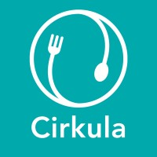
    </th>
    <th style="width:20%">
      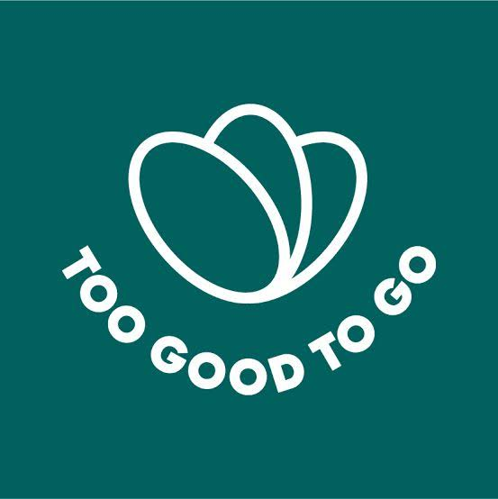
    </th>   
    <th style="width:20%">
      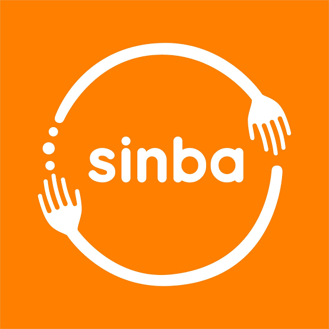
    </th>
  </tr>
  <!-- PERFIL -->
  <tr>
    <td rowspan="2" align="center"><b>Perfil</b></td>
    <td><b>Overview</b></td>
    <td>Marketplace propuesto para excedentes aptos para consumo.</td>
    <td>Marketplace peruano de excedentes de alimentos.</td>
    <td>Marketplace internacional de alimentos no vendidos.</td>
    <td>Gestión y valorización de residuos.</td>
  </tr>
  <tr>
    <td><b>Ventaja competitiva:<br>¿Qué valor ofrece a los clientes?</b></td>
    <td>Transparencia de producto, ingredientes/alérgenos, precio original, unidades y horario; código de recojo.</td>
    <td>Descuentos en excedentes de establecimientos de comida.</td>
    <td>Reserva y recojo de excedentes a precio reducido; bolsas sorpresa como formato frecuente.</td>
    <td>Segregación, recolección y transformación de residuos.</td>
  </tr>
  <!-- PERFIL DE MARKETING -->
  <tr>
    <td rowspan="2" align="center"><b>Perfil de Marketing</b></td>
    <td><b>Mercado objetivo</b></td>
    <td>Restaurantes A1 de Lima Metropolitana y clientes cercanos.</td>
    <td>Negocios de comida y usuarios que adquieren ofertas en Lima.</td>
    <td>Negocios de comida, panaderías, tiendas y usuarios de los países donde opera.</td>
    <td>Empresas, restaurantes, hogares y organizaciones que gestionan residuos.</td>
  </tr>
  <tr>
    <td><b>Estrategias de marketing</b></td>
    <td>Comunicar ahorro económico y reducción de desperdicio, con notificaciones geolocalizadas de ofertas cercanas.</td>
    <td>Comunica el beneficio “come, ahorra, ayuda”, para negocios promueve recuperar costos, captar tráfico y reducir desperdicio.</td>
    <td>Promueve las <b>Surprise Bags</b>, el descubrimiento en el mapa/app y la captación de nuevos clientes para negocios asociados.</td>
    <td>Ofrece educación y soluciones circulares para que empresas y restaurantes gestionen residuos de forma más sostenible.</td>
  </tr>
  <!-- PERFIL DE PRODUCTO -->
  <tr>
    <td rowspan="3" align="center"><b>Perfil de Producto</b></td>
    <td><b>Productos & Servicios</b></td>
    <td>App con publicación de platos con descuento, reserva/compra y notificaciones en tiempo real por ubicación.</td>
    <td>Aplicación/plataforma de ofertas de comida con descuento.</td>
    <td>Aplicación/plataforma de reservas y recojo de excedentes.</td>
    <td>Servicios de gestión y valorización de residuos.</td>
  </tr>
  <tr>
    <td><b>Precios & Costos</b></td>
    <td>Comisión por transacción al restaurante; usuario paga precio reducido. Pendiente de validar.</td>
    <td>Publicita descuentos de al menos 40 % para usuarios, la tarifa al negocio no se publica en la fuente consultada.</td>
    <td>El usuario paga aproximadamente un tercio del precio regular, sus términos para negocios mencionan una <b>Partnership Fee</b> y una <b>Reservation Fee</b>, sin un monto único aplicable a todos los mercados.</td>
    <td>La tarifa se cotiza según el servicio o solución circular; no se publica una lista de precios en la fuente consultada.</td>
  </tr>
  <tr>
    <td><b>Canales de distribución<br>(Web y/o Móvil)</b></td>
    <td>Aplicación desarrollada en Angular, con enfoque web y potencial de extensión a app móvil(disponible para Android/iOS).</td>
    <td>Sitio web y aplicación disponible en Google Play y App Store.</td>
    <td>Aplicación y sitio web del marketplace; descubrimiento, reserva y recojo se gestionan en la app.</td>
    <td>Web, consultoría, capacitación y operación física de reaprovechamiento de residuos; no es un marketplace de compra y recojo.</td>
  </tr>
  <!-- SWOT -->
  <tr>
    <td rowspan="4" align="center"><b>Análisis SWOT</b></td>
    <td><b>Fortalezas</b></td>
    <td>Transparencia de producto y trazabilidad (ingredientes, precio, horario) como diferenciador frente a bolsas sorpresa.</td>
    <td>Marca local con marketplace operativo, descuentos y una propuesta clara para comercios y usuarios.</td>
    <td>Escala del marketplace, red internacional y proceso formal de publicación, reserva y recojo</td>
    <td>Especialización en sostenibilidad y manejo de residuos del sector gastronómico.</td>
  </tr>
  <tr>
    <td><b>Debilidades</b></td>
    <td>Marca nueva, sin red de comercios ni evidencia propia de demanda al inicio.</td>
    <td>La información pública consultada no detalla la tarifa del negocio ni el control operativo por cada establecimiento.</td>
    <td>Su formato de <b>Surprise Bag</b> reduce la certeza sobre el contenido antes del recojo; esto abre espacio para que FoodSave pruebe ofertas detalladas.</td>
    <td>No resuelve la venta o reserva de alimentos aptos para consumo antes de que se conviertan en residuo.</td>
  </tr>
  <tr>
    <td><b>Oportunidades</b></td>
    <td>Crear alianzas con restaurantes de clase media y alta y validar si la información de ingredientes, alérgenos y condiciones impulsa la reserva.</td>
    <td>Ampliar negocios, productos y cobertura aprovechando el interés por ahorro y reducción de desperdicio.</td>
    <td>Aplicar su experiencia de marketplace a nuevos mercados, categorías y soluciones de gestión de excedentes.</td>
    <td>Complementar una plataforma de prevención: los residuos no aptos para consumo pueden derivarse a valorización.</td>
  </tr>
  <tr>
    <td><b>Amenazas</b></td>
    <td>Competidores establecidos, baja oferta inicial, reservas no recogidas y obligaciones sanitarias de cada negocio.</td>
    <td>La entrada de nuevos marketplaces o cambios en la disponibilidad de comercios pueden afectar su diferenciación local.</td>
    <td>La expansión y escala de un referente internacional elevan la expectativa de usuarios y negocios sobre el servicio.</td>
    <td>Puede competir por el presupuesto de sostenibilidad de restaurantes, aunque también puede convertirse en aliado para residuos no comercializables.</td>
  </tr>
</table>

### 2.1.2. Estrategias y tácticas frente a competidores
| Hallazgo competitivo | Estrategia preliminar de FoodSave | Táctica verificable |
|---|---|---|
| Existen marketplaces de excedentes. | Diferenciarse por transparencia y control operativo, no por afirmar exclusividad. | Exigir producto, ingredientes/alérgenos cuando correspondan, precios, unidades y hora límite al publicar. |
| La reserva no garantiza el recojo. | Hacer visible el compromiso y el límite de recojo. | Generar código único y mostrar la hora límite en reserva y catálogo. |
| La oferta inicial es crítica para el marketplace. | Iniciar con un segmento y zona acotados. | Medir negocios contactados, ofertas publicadas, reservas, cancelaciones y recojos. |
| Los residuos son una alternativa posterior a la prevención. | Priorizar venta de alimentos aptos antes de su disposición. | Comunicar la responsabilidad sanitaria del establecimiento y no prometer garantías que FoodSave no puede verificar. |


## 2.2. Entrevistas

### 2.2.1. Diseño de entrevistas

**User: Restaurantes de clase media y alta**

1. ¿Qué suelen hacer con los alimentos o platos preparados que no logran vender al finalizar el día?
2. ¿Con qué frecuencia suelen tener alimentos preparados que no llegan a venderse durante la jornada?
3. ¿Cuáles considera que son las principales razones por las que se generan estos excedentes?
4. ¿Qué impacto económico representa para el restaurante tener productos preparados que finalmente no se venden?
5. ¿Actualmente utilizan alguna estrategia para aprovechar o vender los alimentos que podrían quedar al finalizar el día?
6. ¿Estarían dispuestos a ofrecer estos alimentos a un precio reducido antes del cierre? ¿Por qué?
7. ¿Qué factores tomarían en cuenta para determinar el descuento de estos productos?
8. ¿Qué tan útil sería contar con una plataforma que les permita publicar ofertas de estos alimentos y llegar a consumidores interesados?
9. ¿Preferirían que los clientes recojan el pedido para llevar o permitirían también su consumo dentro del establecimiento? ¿Por qué?
10. ¿Qué aspectos o condiciones considerarían importantes antes de utilizar una plataforma de este tipo?

**User: Personas que consumen en restaurantes con frecuencia y buscan opciones de calidad a precios accesibles**

1. ¿Con qué frecuencia consumes alimentos en restaurantes durante la semana?
2. ¿Qué factores consideras más importantes al momento de elegir un restaurante o un plato?
3. ¿Qué tanto influye el precio en tu decisión de consumir en un determinado restaurante?
4. ¿Sueles buscar promociones o descuentos cuando decides comer en un restaurante? ¿De qué manera los encuentras?
5. ¿Estarías dispuesto a comprar a un precio reducido un plato preparado durante el mismo día que no llegó a venderse? ¿Por qué?
6. ¿Qué información necesitarías conocer sobre un plato antes de decidir comprarlo bajo esta modalidad?
7. ¿Qué nivel de descuento considerarías atractivo para decidir comprar este tipo de oferta?
8. ¿Estarías dispuesto a acudir a un restaurante dentro de un horario determinado para aprovechar una oferta disponible?
9. ¿Preferirías recoger el pedido para llevar o consumirlo directamente en el restaurante? ¿Por qué?
10. ¿Qué aspecto te generaría mayor preocupación o desconfianza al adquirir alimentos mediante este tipo de ofertas?

### 2.2.2. Registro de entrevistas

**User: Restaurantes de clase media y alta**
  <!-- Primera Entrevista -->
<table style="width:100%; border-collapse:collapse" border="1" align="center">
  <tr>
    <td style="background-color:#e3e3e3">Entrevistador</td>
    <td>Ingrid Medina</td>
  </tr>
  <tr>
    <td style="background-color:#e3e3e3">Entrevistado</td>
    <td>Flor Edith Pacheco</td>
  </tr>
  <tr>
    <td style="background-color:#e3e3e3">Edad</td>
    <td>21</td>
  </tr>
  <tr>
    <td style="background-color:#e3e3e3">Distrito</td>
    <td>Urbanización La Encantada, en Chorrillos, Lima</td>
  </tr>
  <tr>
    <td style="background-color:#e3e3e3">Evidencia</td>
    <td>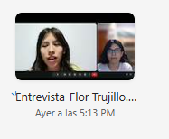</td>
  </tr>
  <tr>
    <td style="background-color:#e3e3e3">Comienzo de Evidencia</td>
    <td>1:04</td>
  </tr>
  <tr>
    <td style="background-color:#e3e3e3">Resumen</td>
    <td>Flor Edith Pacheco, de 21 años, residente en Chorrillos, Lima, se encuentra vinculada a la gestión de una cebichería. El restaurante procura controlar las cantidades preparadas para evitar excedentes; sin embargo, debido a la dificultad de predecir la demanda, suelen generarse alimentos no vendidos algunas veces por semana. Los productos que aún se encuentran en buenas condiciones pueden conservarse para el día siguiente, mientras que los que no cumplen con las condiciones adecuadas son desechados.

La entrevistada reconoce que estos excedentes representan una pérdida económica debido a los costos de ingredientes, preparación y personal. Actualmente, utilizan el control de cantidades y promociones durante el horario de atención, pero no cuentan con una plataforma específica para vender los excedentes de último momento.

Flor muestra interés en utilizar una plataforma que permita ofrecer estos alimentos a precios reducidos, ya que podría ayudar a recuperar parte de la inversión y reducir el desperdicio. Considera importante que permita llegar a consumidores cercanos, controlar productos, cantidades y horarios, además de contar con pagos seguros y una comisión razonable. Prefiere principalmente el recojo para llevar, porque considera que afectaría menos la atención habitual del restaurante.
  </tr>
</table>

<br>
<!-- Segunda Entrevista -->

<table style="width:100%; border-collapse:collapse" border="1" align="center">
  <tr>
    <td style="background-color:#e3e3e3">Entrevistador</td>
    <td>Bryan Martinez</td>
  </tr>
  <tr>
    <td style="background-color:#e3e3e3">Entrevistado</td>
    <td>Janet Gomez</td>
  </tr>
  <tr>
    <td style="background-color:#e3e3e3">Edad</td>
    <td>52</td>
  </tr>
  <tr>
    <td style="background-color:#e3e3e3">Distrito</td>
    <td>Villa el salvador, Lima</td>
  </tr>
  <tr>
    <td style="background-color:#e3e3e3">Evidencia</td>
    <td>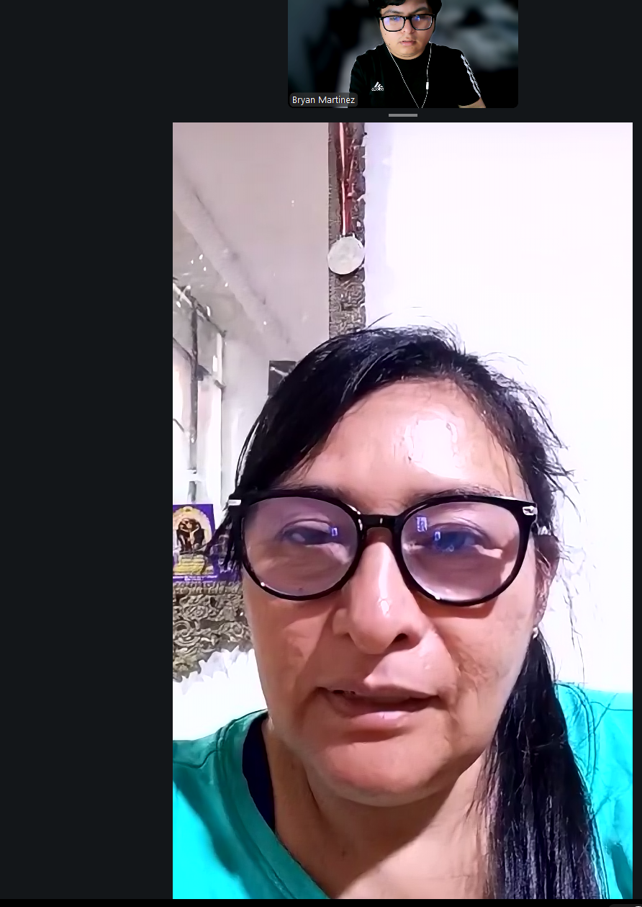</td>
  </tr>
  <tr>
    <td style="background-color:#e3e3e3">Comienzo de Evidencia</td>
    <td>0:10</td>
  </tr>
  <tr>
    <td style="background-color:#e3e3e3">Resumen</td>
    <td>.Janet Linda Gomez, tiene 52 años, vive en villa el salvador, Lima, se encarga en la gestion de un restaurante, se encarga de la gestion y organizacion de los platos preparados, ella comentan que si bien se ha tratado de reducir la perdida es muy dificil predecir y evitar perdidas por desechar alimentos, ya que muchas veces la gente no es recurrente con su consumo

La entrevistada reconoce que estos excedentes representan una pérdida económica debido a los costos de ingredientes, preparación y personal. Actualmente, utilizan el control de cantidades y promociones durante el horario de atención, pero no cuentan con una plataforma específica para vender los excedentes de último momento.

Janet confirma y admite que esta perdida existe y aunque se ha realizado diferentes métodos para evitar la perdida de capital, no se a logrado por completo, usan su experiencia en la preparación de comida, pero no es suficiente para reducir la perdida por completo

Janet muestra interés y le parece muy interesante la idea de un sistema que le permita poder vender estos productos a un precio mucho menor, cree que es una buena idea ya que sus metodos no han logrado un efecto visible y se animaria a probar este sistema
  </tr>
</table>

<br>

**User: Personas que consumen en restaurantes con frecuencia y buscan opciones de calidad a precios accesibles**
  <!-- Primera Entrevista -->

<table style="width:100%; border-collapse:collapse;" border="1" align="center">
  <tr>
    <td style="background-color:#e3e3e3">Entrevistador</td>
    <td>Ingrid Medina</td>
  </tr>
  <tr>
    <td style="background-color:#e3e3e3">Entrevistado</td>
    <td>Mayra Calderón Mosqueira</td>
  </tr>
  <tr>
    <td style="background-color:#e3e3e3">Edad</td>
    <td>21</td>
  </tr>
  <tr>
    <td style="background-color:#e3e3e3">Distrito</td>
    <td>San Miguel</td>
  </tr>
  <tr>
    <td style="background-color:#e3e3e3">Evidencia</td>
    <td></td>
  </tr>
    <tr>
    <td style="background-color:#e3e3e3">Comienzo de Evidencia</td>
    <td>0:46</td>
  </tr>
  <tr>
    <td style="background-color:#e3e3e3">Resumen</td>
    <td>Mayra Calderón Mosqueira, de 21 años, residente en San Miguel, Lima, consume alimentos fuera de casa aproximadamente cinco días a la semana, principalmente menús, debido a que es foránea y dispone de poco tiempo para cocinar. Al elegir un restaurante, considera principalmente el precio, la cercanía y la variedad del menú, mientras que para elegir un plato busca opciones que considere nutritivas, como ensaladas.

El precio influye considerablemente en sus decisiones de consumo, por lo que suele buscar promociones y descuentos mediante plataformas y redes sociales de restaurantes. Muestra disposición a comprar alimentos preparados no vendidos a un precio reducido, tanto por evitar el desperdicio de comida como por obtener una opción que se ajuste a su presupuesto. Considera atractivo un ahorro aproximado de 6 a 8 soles, ya que consume fuera de casa con frecuencia.

Para utilizar este tipo de ofertas, considera importante conocer la antigüedad del alimento y cuánto dinero estaría ahorrando. También estaría dispuesta a acudir a un restaurante dentro de un horario determinado, siempre que este se encuentre cerca de su trabajo, debido a su poco tiempo disponible. No presenta una preferencia entre recoger el pedido o consumirlo en el establecimiento. Finalmente, su principal preocupación es la seguridad y frescura de los alimentos, especialmente cuando se trata de productos perecibles como ensaladas, por lo que evitaría consumirlos si percibe que están en mal estado.</td>
  </tr>
</table>

<br>

<!-- Segunda Entrevista -->
<table style="width:100%; border-collapse:collapse;" border="1" align="center">
  <tr>
    <td style="background-color:#e3e3e3">Entrevistador</td>
    <td>Bryan Martinez</td>
  </tr>
  <tr>
    <td style="background-color:#e3e3e3">Entrevistado</td>
    <td>Victor Cuya</td>
  </tr>
  <tr>
    <td style="background-color:#e3e3e3">Edad</td>
    <td>18</td>
  </tr>
  <tr>
    <td style="background-color:#e3e3e3">Distrito</td>
    <td>Villa el salvador, Lima</td>
  </tr>
  <tr>
    <td style="background-color:#e3e3e3">Evidencia</td>
    <td></td>
  </tr>
    <tr>
    <td style="background-color:#e3e3e3">Comienzo de Evidencia</td>
    <td>0:08</td>
  </tr>
  <tr>
    <td style="background-color:#e3e3e3">Resumen</td>
    <td>Victor Cuya de 18 años vive en villa el salvador, consume en restaurantes diaraimente entre 5-6 dias por semana en restaurantes, ya que su tiempo no le permite almorzar en casa, el cuenta que le importa mucho tanto la presentancion como el precio al momento de elegir un restuarante

El precio tambien es un punto fundamental ya que a el le gusta mucho aprovechar las promociones, suele buscar mucho descuentos y promociones presencialmente y por redes sociales, aunque no tiene como tal una aplicacion que le permita ver, asi se ahorra dinero a la semana

Considera importante tener que saber el estado del producto porque aunque sea barato no comería algo malo, a su vez si estaría conforme de comer algo que vaya a ser desechado siempre y cuando este en buenas condiciones, ademas de que no le incomoda tener que ir a un horario exacto o en un rango siempre y cuando pueda aprovechar buenos descuentos .</td>
  </tr>
</table>

<br>

### 2.2.3. Análisis de entrevistas

Segmento 1:

Las entrevistas evidencian que uno de los principales problemas en los restaurantes es la dificultad para predecir la demanda diaria, lo que provoca la generación de alimentos excedentes y pérdidas económicas.

Aunque se aplican métodos como el control de cantidades, la experiencia del personal y promociones, estas estrategias no permiten eliminar completamente el desperdicio. Además, actualmente no se cuenta con una herramienta específica para vender los productos no vendidos al final del día.

Existe interés en utilizar una plataforma que permita ofrecer estos alimentos a precios reducidos, principalmente para recuperar parte de la inversión, disminuir las pérdidas y reducir el desperdicio. También se considera importante contar con control de cantidades, horarios, pagos seguros y una modalidad de recojo que no interfiera con la atención habitual del restaurante.

Segmento 2:

Las entrevistas muestran que el precio es uno de los principales factores al momento de elegir dónde comer, especialmente en personas que consumen frecuentemente en restaurantes y buscan reducir sus gastos mediante promociones y descuentos.

También existe disposición a comprar alimentos preparados que no hayan sido vendidos, siempre que se encuentren en buenas condiciones y se pueda conocer información sobre su frescura, antigüedad y ahorro obtenido. La seguridad del alimento es un aspecto fundamental, incluso cuando el precio sea bajo.

Además, se observa que los consumidores aceptarían horarios específicos de recojo o consumo si la oferta representa un ahorro atractivo y el establecimiento se encuentra en una ubicación conveniente. Esto demuestra interés en una plataforma que reúna descuentos de alimentos en buen estado, con información clara sobre el producto y condiciones de compra.

## 2.3. Needfinding

Vamos a identificar a nuestros usuarios por lo recopilamos lo mas importante 

### 2.3.1. User Personas

Segmento 1: Negocios de clase alta

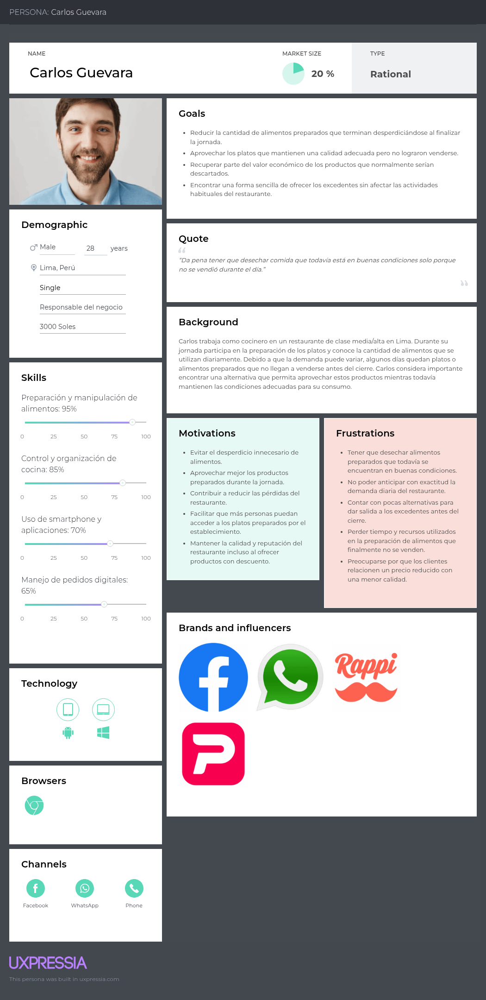

Segmento 2: Cliente frencuente de restaurantes

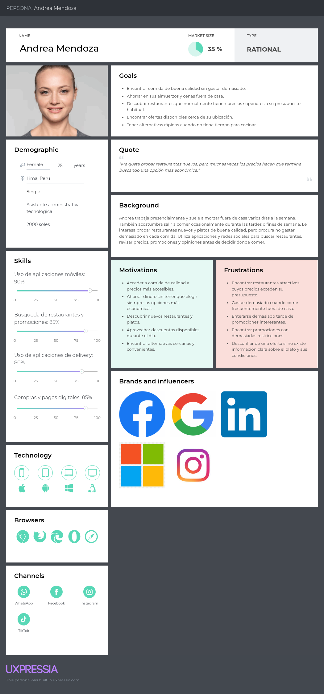


### 2.3.2. User Task Matrix

El presente User Task Matrix identifica las principales actividades realizadas por los dos segmentos objetivos definidos para FoodSave. Las tareas se analizan de manera independiente debido a que cada segmento presenta necesidades y comportamientos diferentes. Por un lado, Carlos Guevara representa a los restaurantes de clase media y alta desde su rol como cocinero; por otro lado, Andrea Mendoza representa a las personas que consumen frecuentemente en restaurantes y buscan opciones de calidad a precios accesibles.

### Segmento objetivo #1: Carlos Guevara (Negocios)

Carlos representa al dueño de restaurantes de clase media y alta involucrado en la preparación y utilizacion de los alimentos. Sus actividades se encuentran relacionadas con la preparación diaria, la demanda de los clientes y los alimentos que permanecen disponibles al acercarse el cierre.

| **User Task (Tarea del usuario)** | **Frecuencia** | **Importancia** |
| :--- | :--- | :--- |
| Organizacion los alimentos y platos correspondientes a la jornada | Alta (diaria) | Crítica |
| Revisar la cantidad de alimentos preparados disponibles durante el servicio | Alta (diaria) | Alta |
| Identificar platos preparados que podrían quedar sin vender | Alta (diaria) | Crítica |
| Determinar si los alimentos no vendidos mantienen condiciones adecuadas para su consumo | Alta (diaria) | Crítica |
| Informar sobre los platos que permanecen disponibles cerca del cierre | Media | Alta |
| Evaluar alternativas para aprovechar los alimentos preparados que no fueron vendidos | Media | Alta |
| Ofrecer promociones o descuentos sobre determinados platos antes del cierre | Baja | Alta |
| Coordinar la entrega de platos vendidos durante las últimas horas de atención | Media | Media |
| Separar los alimentos que todavía pueden ser aprovechados de aquellos que deben descartarse | Alta (diaria) | Crítica |
| Desechar alimentos preparados que ya no pueden ser aprovechados | Media | Alta |

### Segmento objetivo #2: Andrea Mendoza (Consumidora)

Andrea representa a las personas que consumen frecuentemente en restaurantes y buscan opciones gastronómicas de calidad a precios accesibles. Sus actividades están relacionadas con la búsqueda, comparación y elección de alternativas para almorzar o cenar.

| **User Task (Tarea del usuario)** | **Frecuencia** | **Importancia** |
| :--- | :--- | :--- |
| Buscar opciones de restaurantes para almorzar o cenar | Alta | Alta |
| Consultar los precios de los platos antes de elegir un restaurante | Alta | Alta |
| Comparar alternativas según su relación entre precio y calidad | Alta | Crítica |
| Buscar promociones o descuentos disponibles en restaurantes | Media | Alta |
| Revisar qué platos se encuentran disponibles antes de acudir al establecimiento | Media | Alta |
| Consultar información y opiniones sobre restaurantes que no conoce | Media | Media |
| Evaluar si un descuento justifica trasladarse hasta el restaurante | Media | Alta |
| Elegir entre consumir el plato en el establecimiento o pedirlo para llevar | Media | Media |
| Comprar platos con descuento cuando encuentra una oferta conveniente | Media | Alta |
| Probar restaurantes que normalmente tienen precios superiores a su presupuesto habitual | Baja | Media |

**Análisis del User Task Matrix**

El análisis de ambos segmentos permite identificar una relación entre las actividades que realizan Carlos y Andrea. Carlos trabaja diariamente con alimentos preparados cuya demanda puede variar durante la jornada, generando situaciones en las que determinados platos permanecen disponibles al acercarse el cierre. Andrea, por su parte, busca regularmente alternativas para almorzar o cenar y considera factores como el precio, la calidad y las promociones antes de tomar una decisión.

En el primer segmento, las tareas de mayor importancia están relacionadas con la preparación de los alimentos, la identificación de platos que podrían quedar sin vender y la verificación de que estos mantengan condiciones adecuadas para su consumo. También existe la necesidad de encontrar alternativas que permitan aprovechar estos alimentos antes de que deban ser descartados.

En el segundo segmento, las actividades de mayor relevancia se concentran en buscar restaurantes, comparar precios y evaluar la relación entre calidad y costo. Las promociones y descuentos representan una oportunidad para que Andrea pueda acceder a establecimientos que normalmente podrían encontrarse fuera de su presupuesto habitual.

Finalmente, ambas matrices muestran una oportunidad de conexión entre los segmentos: mientras el restaurante necesita encontrar una alternativa para aprovechar alimentos preparados que permanecen disponibles, el consumidor busca acceder a comida de calidad a precios más convenientes. FoodSave busca conectar ambas necesidades facilitando que los excedentes aptos para el consumo puedan ser ofrecidos a consumidores interesados antes de ser desperdiciados.

### 2.3.3. User Journey Mapping

#Segmento objetivo 1:

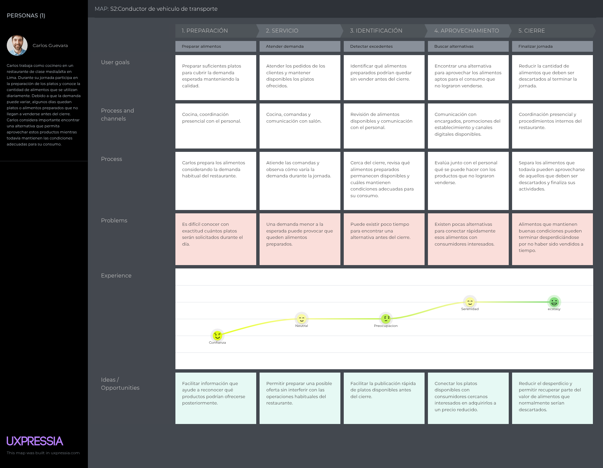

#Segmento objetivo 2:

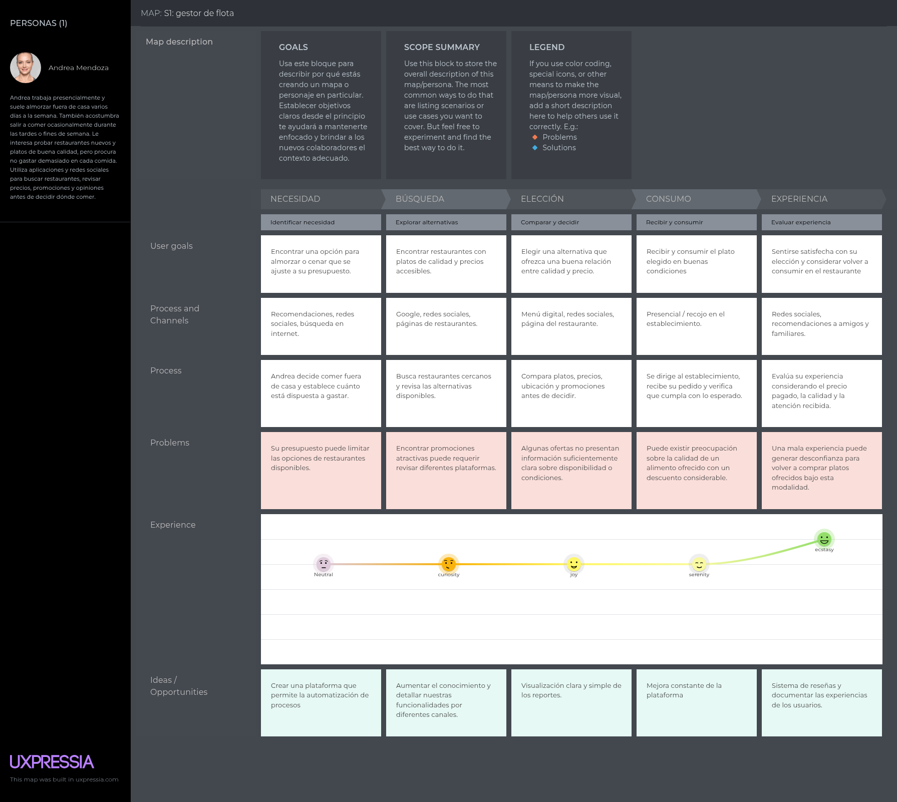

### 2.3.4. Empathy Mapping

#### Empathy Mapping - Segmento 1 (Negocios)

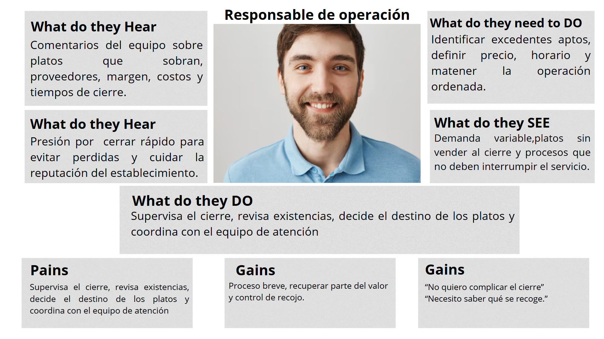

#### Empathy Mapping - Segmento 2 (Cliente)

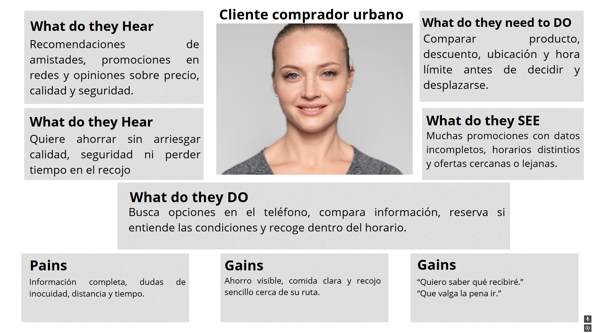


## 2.4. Big Picture Event Storming

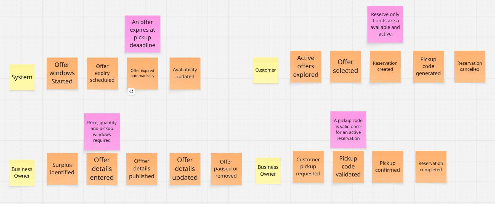

## 2.5. Ubiquitous Language

Para esta sección se planteó un diccionario de términos técnicos que son aplicados en el dominio de nuestro proyecto.

| Término | Definición |
|---|---|
| Offer (Oferta) | Publicación temporal de un producto con precio reducido, unidades disponibles y hora límite de recojo. |
| Surplus (Excedente) | Unidad de alimento apta para consumo que el negocio estima que no venderá al precio regular durante la jornada. |
| Reservation (Reserva) | Compromiso de compra de una oferta dentro de su ventana de recojo. |
| Pickup (Recojo) | Entrega de una reserva al cliente en el establecimiento y horario definidos. |
| Pickup Code (Código de recojo) | Código que permite al negocio validar una reserva activa al momento de la entrega. |
| Pickup Window (Ventana de recojo) | Intervalo dentro del cual el cliente puede recoger una reserva. |
| Expired Offer (Oferta vencida) | Oferta cuya hora límite pasó y ya no acepta nuevas reservas. |

# Capítulo III: Requirements Specification

## 3.1. User Stories

### Epic 1 – Landing Page

| Epic / Story ID | Título | Descripción | Criterios de aceptación | Relacionado con (Epic ID) |
|---|---|---|---|---|
| US01 | Conocer el modelo FoodSave | Como visitante, quiero conocer cómo funciona FoodSave para decidir si la propuesta es pertinente para mí. | **Escenario 1: Comprensión de FoodSave**<br>**Dado que** el visitante abre la Landing Page<br>**Cuando** revisa el contenido<br>**Entonces** identifica el problema, beneficios, proceso y llamados a la acción para cada segmento. | EP01 |
| US02 | Acceder a ofertas | Como visitante, quiero acceder al catálogo de ofertas para explorar opciones disponibles. | **Escenario 1: Acceso al catálogo**<br>**Dado que** el visitante se encuentra en la Landing Page<br>**Cuando** selecciona “Explorar ofertas”<br>**Entonces** la aplicación muestra el catálogo de ofertas activas. | EP01 |
| US03 | Explorar ofertas activas | Como cliente comprador, quiero explorar ofertas activas para descubrir opciones disponibles. | **Escenario 1: Visualización de ofertas activas**<br>**Dado que** existen ofertas vigentes<br>**Cuando** el cliente consulta el catálogo<br>**Entonces** cada oferta muestra negocio, producto, precios, unidades, ubicación y hora límite.<br><br>**Escenario 2: Oferta vencida**<br>**Dado que** una oferta venció<br>**Cuando** el catálogo se actualiza<br>**Entonces** no la presenta como reservable. | EP01 |
| US04 | Filtrar ofertas | Como cliente comprador, quiero filtrar ofertas por distancia, categoría y horario para encontrar una opción pertinente. | **Escenario 1: Aplicación de filtros**<br>**Dado que** el cliente aplica un filtro<br>**Cuando** la búsqueda se ejecuta<br>**Entonces** el catálogo muestra solo resultados que cumplen el criterio.<br><br>**Escenario 2: Sin resultados**<br>**Dado que** no hay resultados<br>**Cuando** termina la búsqueda<br>**Entonces** se informa un estado vacío y una acción alternativa. | EP01 |
| US05 | Consultar detalle | Como cliente comprador, quiero consultar el detalle de una oferta para tomar una decisión informada. | **Escenario 1: Consulta de una oferta**<br>**Dado que** el cliente abre una oferta activa<br>**Cuando** revisa el detalle<br>**Entonces** visualiza condiciones, ingredientes o alérgenos cuando correspondan, dirección, mapa, precios y horario de recojo. | EP01 |
| US06 | Consultar términos y privacidad | Como visitante, quiero acceder a los términos y la política de privacidad para comprender las condiciones de uso de FoodSave. | **Escenario 1: Acceso a documentos legales**<br>**Dado que** el visitante abre el pie de página<br>**Cuando** selecciona términos o privacidad<br>**Entonces** el sistema muestra el documento correspondiente. | EP01 |
| US07 | Elegir idioma de la interfaz | Como visitante, quiero cambiar entre inglés y español latinoamericano para comprender la información de la plataforma. | **Escenario 1: Cambio de idioma**<br>**Dado que** el visitante selecciona un idioma<br>**Cuando** confirma el cambio<br>**Entonces** la interfaz actualiza el contenido y conserva la preferencia durante su navegación. | EP01 |

### Epic 2 – Gestión de ofertas

| Epic / Story ID | Título | Descripción | Criterios de aceptación | Relacionado con (Epic ID) |
|---|---|---|---|---|
| US08 | Registrar negocio | Como responsable de negocio, quiero registrar mi establecimiento para publicar ofertas a nombre de mi local. | **Escenario 1: Datos incompletos**<br>**Dado que** faltan campos obligatorios<br>**Cuando** el responsable envía el registro<br>**Entonces** el sistema informa los campos que debe completar.<br><br>**Escenario 2: Registro exitoso**<br>**Dado que** los datos son válidos<br>**Cuando** confirma el registro<br>**Entonces** se crea el establecimiento. | EP02 |
| US09 | Publicar una oferta | Como responsable de negocio, quiero publicar una oferta con información clara para vender un excedente. | **Escenario 1: Datos de oferta inválidos**<br>**Dado que** el responsable ingresa una oferta<br>**Cuando** el precio de oferta no es menor al precio original o las unidades no son positivas<br>**Entonces** el sistema rechaza el registro e informa la regla.<br><br>**Escenario 2: Publicación válida**<br>**Dado que** los datos son válidos<br>**Cuando** publica la oferta<br>**Entonces** la oferta queda disponible hasta su hora límite. | EP02 |
| US10 | Reservar oferta | Como cliente comprador, quiero reservar una oferta para asegurar una unidad antes de llegar al negocio. | **Escenario 1: Reserva disponible**<br>**Dado que** la oferta tiene unidades y está vigente<br>**Cuando** el cliente confirma la reserva<br>**Entonces** el sistema crea una reserva con código y horario de recojo.<br><br>**Escenario 2: Oferta sin unidades**<br>**Dado que** no hay unidades disponibles<br>**Cuando** el cliente intenta reservar<br>**Entonces** el sistema no crea la reserva. | EP02 |
| US11 | Confirmar recojo | Como responsable de negocio, quiero confirmar el recojo mediante un código para cerrar la reserva correctamente. | **Escenario 1: Código válido**<br>**Dado que** el código corresponde a una reserva activa<br>**Cuando** el responsable lo valida<br>**Entonces** la reserva pasa a recogida.<br><br>**Escenario 2: Código usado previamente**<br>**Dado que** la reserva ya fue recogida<br>**Cuando** se intenta validarla otra vez<br>**Entonces** el sistema no duplica la operación. | EP02 |
| US12 | Gestionar reserva | Como cliente comprador, quiero revisar y cancelar una reserva dentro de las condiciones permitidas para gestionar mi pedido. | **Escenario 1: Consulta de reserva**<br>**Dado que** existe una reserva del cliente<br>**Cuando** la consulta<br>**Entonces** visualiza estado, código y condiciones.<br><br>**Escenario 2: Cancelación permitida**<br>**Dado que** la política permite cancelar<br>**Cuando** confirma la cancelación<br>**Entonces** se actualiza la disponibilidad. | EP02 |

### Epic 3 – Gestión de usuarios

| Epic / Story ID | Título | Descripción | Criterios de aceptación | Relacionado con (Epic ID) |
|---|---|---|---|---|
| US13 | Registrarse como cliente | Como cliente comprador, quiero crear una cuenta para guardar y gestionar mis reservas. | **Escenario 1: Registro exitoso**<br>**Dado que** el cliente completa los datos obligatorios<br>**Cuando** envía el formulario válido<br>**Entonces** el sistema crea su cuenta.<br><br>**Escenario 2: Correo existente**<br>**Dado que** el correo ya está registrado<br>**Cuando** intenta crear otra cuenta<br>**Entonces** el sistema informa la situación sin crear un duplicado. | EP03 |
| US14 | Iniciar sesión | Como usuario registrado, quiero iniciar sesión para acceder a las funciones asociadas a mi cuenta. | **Escenario 1: Credenciales válidas**<br>**Dado que** existen credenciales válidas<br>**Cuando** el usuario inicia sesión<br>**Entonces** el sistema muestra el área correspondiente a su rol.<br><br>**Escenario 2: Credenciales inválidas**<br>**Dado que** existen credenciales inválidas<br>**Cuando** las envía<br>**Entonces** el sistema muestra un mensaje claro sin revelar información sensible. | EP03 |
| US15 | Gestionar perfil de cliente | Como cliente comprador, quiero actualizar mis datos básicos para mantener mi cuenta vigente. | **Escenario 1: Actualización de perfil**<br>**Dado que** el cliente abre su perfil<br>**Cuando** modifica datos permitidos y guarda cambios válidos<br>**Entonces** el sistema actualiza su información. | EP03 |
| US16 | Gestionar perfil del negocio | Como responsable de negocio, quiero mantener el nombre, dirección y condiciones de mi establecimiento para publicar ofertas correctas. | **Escenario 1: Actualización del negocio**<br>**Dado que** el responsable edita el perfil del negocio<br>**Cuando** completa los campos requeridos y guarda<br>**Entonces** el sistema actualiza los datos públicos del establecimiento. | EP03 |
| US17 | Consultar perfil público del negocio | Como cliente comprador, quiero revisar la información del restaurante para decidir si la oferta me resulta conveniente. | **Escenario 1: Consulta del establecimiento**<br>**Dado que** el cliente abre el detalle de una oferta<br>**Cuando** consulta el negocio<br>**Entonces** visualiza nombre, dirección, condiciones de recojo y datos disponibles del establecimiento. | EP03 |

### Epic 4 – Operación del negocio

| Epic / Story ID | Título | Descripción | Criterios de aceptación | Relacionado con (Epic ID) |
|---|---|---|---|---|
| US18 | Editar una oferta activa | Como responsable de negocio, quiero actualizar una oferta antes de que sea reservada para corregir información o ajustar sus condiciones. | **Escenario 1: Edición permitida**<br>**Dado que** la oferta sigue activa<br>**Cuando** el responsable modifica campos permitidos y guarda<br>**Entonces** el sistema muestra la información actualizada.<br><br>**Escenario 2: Cambio con reserva existente**<br>**Dado que** el cambio afecta una reserva existente<br>**Cuando** intenta guardarlo<br>**Entonces** el sistema aplica la política definida e informa el resultado. | EP04 |
| US19 | Pausar una oferta | Como responsable de negocio, quiero pausar una oferta para impedir nuevas reservas cuando ya no pueda atenderlas. | **Escenario 1: Pausa de oferta**<br>**Dado que** una oferta está activa<br>**Cuando** el responsable la pausa<br>**Entonces** el sistema deja de mostrarla como reservable y conserva las reservas existentes según la política. | EP04 |
| US20 | Consultar reservas del negocio | Como responsable de negocio, quiero ver las reservas activas de mis ofertas para preparar los pedidos y atender los recojos. | **Escenario 1: Consulta de reservas activas**<br>**Dado que** el responsable consulta sus reservas<br>**Cuando** existen registros activos<br>**Entonces** el sistema muestra oferta, cantidad, estado, hora límite y código asociado. | EP04 |
| US21 | Recibir aviso de nueva reserva | Como responsable de negocio, quiero recibir una notificación cuando un cliente reserva una oferta para preparar el recojo oportunamente. | **Escenario 1: Notificación de reserva**<br>**Dado que** una reserva se crea correctamente<br>**Cuando** el negocio tiene notificaciones habilitadas<br>**Entonces** el sistema comunica la nueva reserva con los datos necesarios. | EP04 |
| US22 | Consultar historial de recojos | Como responsable de negocio, quiero revisar las reservas recogidas, canceladas o vencidas para comprender lo ocurrido en mi operación. | **Escenario 1: Consulta por período**<br>**Dado que** el responsable consulta el historial<br>**Cuando** selecciona un período<br>**Entonces** el sistema muestra las reservas con su estado final. | EP04 |

### Epic 5 – Comunicación y confianza

| Epic / Story ID | Título | Descripción | Criterios de aceptación | Relacionado con (Epic ID) |
|---|---|---|---|---|
| US23 | Recibir confirmación de reserva | Como cliente comprador, quiero recibir una confirmación después de reservar para tener certeza de mi pedido y código de recojo. | **Escenario 1: Confirmación exitosa**<br>**Dado que** la reserva se crea<br>**Cuando** el proceso termina correctamente<br>**Entonces** el sistema muestra y envía la confirmación con negocio, oferta, código y hora límite. | EP05 |
| US24 | Recibir recordatorio de recojo | Como cliente comprador, quiero recibir un recordatorio antes de la hora límite para recoger mi pedido a tiempo. | **Escenario 1: Recordatorio programado**<br>**Dado que** existe una reserva activa próxima a vencer<br>**Cuando** llega el momento configurado para el recordatorio<br>**Entonces** el sistema comunica la hora y dirección de recojo. | EP05 |
| US25 | Conocer cambios de una oferta reservada | Como cliente comprador, quiero ser informado si una oferta reservada cambia o se cancela para tomar una decisión oportuna. | **Escenario 1: Cambio comunicado**<br>**Dado que** el negocio modifica o pausa una oferta con reserva<br>**Cuando** la política permite el cambio<br>**Entonces** el sistema notifica al cliente y muestra las opciones disponibles. | EP05 |
| US26 | Identificar una oferta vencida | Como cliente comprador, quiero reconocer cuando una oferta ya venció para no intentar reservarla. | **Escenario 1: Visualización de vencimiento**<br>**Dado que** la hora límite de una oferta pasó<br>**Cuando** el cliente la visualiza<br>**Entonces** el sistema la marca como vencida y deshabilita la reserva. | EP05 |
| US27 | Recibir alternativas sin resultados | Como cliente comprador, quiero recibir opciones cuando mi búsqueda no tiene resultados para poder continuar explorando. | **Escenario 1: Estado vacío**<br>**Dado que** los filtros no devuelven ofertas activas<br>**Cuando** el catálogo muestra el estado vacío<br>**Entonces** propone limpiar filtros, cambiar distrito u horario. | EP05 |

### Epic 6 – Soporte y mejora continua

| Epic / Story ID | Título | Descripción | Criterios de aceptación | Relacionado con (Epic ID) |
|---|---|---|---|---|
| US28 | Solicitar ayuda | Como usuario, quiero acceder a ayuda o contacto para resolver dudas sobre ofertas, reservas o recojos. | **Escenario 1: Acceso a soporte**<br>**Dado que** el usuario necesita apoyo<br>**Cuando** abre la opción de contacto<br>**Entonces** el sistema le muestra el canal disponible y el contexto de la solicitud. | EP06 |
| US29 | Calificar la experiencia de recojo | Como cliente comprador, quiero calificar mi experiencia después de un recojo confirmado para compartir retroalimentación útil. | **Escenario 1: Calificación posterior al recojo**<br>**Dado que** una reserva fue marcada como recogida<br>**Cuando** el cliente registra una calificación válida<br>**Entonces** el sistema la asocia a la experiencia sin alterar el estado de la reserva. | EP06 |
| US30 | Consultar resultados del negocio | Como responsable de negocio, quiero visualizar un resumen de ofertas, reservas y recojos para evaluar el aprovechamiento de excedentes. | **Escenario 1: Consulta de resultados**<br>**Dado que** el negocio tiene actividad registrada<br>**Cuando** abre su resumen<br>**Entonces** el sistema muestra métricas del período seleccionado con sus definiciones visibles. | EP06 |

### Epic 7 – Servicios y seguridad

| Epic / Story ID | Título | Descripción | Criterios de aceptación | Relacionado con (Epic ID) |
|---|---|---|---|---|
| US31 | Consultar ofertas mediante API | Como Developer, quiero consultar ofertas activas mediante la API para implementar experiencias cliente consistentes. | **Escenario 1: Consulta válida de ofertas**<br>**Dado que** existe una solicitud `GET /api/v1/offers` válida<br>**Cuando** el servicio la procesa<br>**Entonces** responde con ofertas activas y el código HTTP correspondiente. | EP07 |
| US32 | Crear reserva mediante API | Como Developer, quiero crear reservas mediante la API para mantener la disponibilidad consistente. | **Escenario 1: Reserva disponible mediante API**<br>**Dado que** existe una solicitud válida para una oferta disponible<br>**Cuando** se procesa una reserva<br>**Entonces** el servicio persiste la reserva, descuenta disponibilidad y devuelve el código de recojo. | EP07 |

## 3.2. Impact Mapping

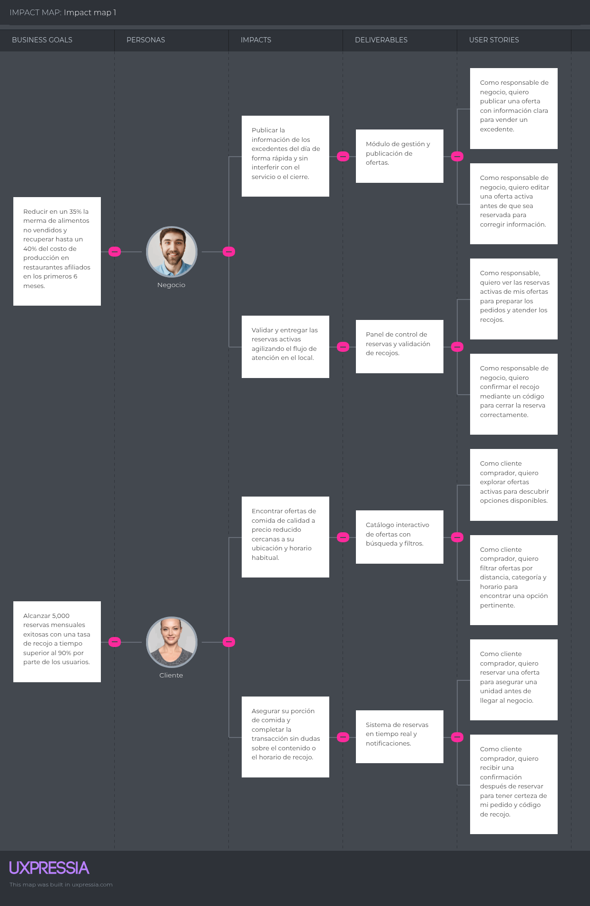

## 3.3. Product Backlog

| # Orden | User Story ID | Título | Descripción | Story Points (1 / 2 / 3 / 5 / 8) |
|---:|---|---|---|---:|
| 1 | US01 | Conocer el modelo FoodSave | Landing Page con propuesta de valor y beneficios. | 3 |
| 2 | US02 | Acceder a ofertas | Llamado a la acción que dirige al catálogo. | 2 |
| 3 | US03 | Explorar ofertas activas | Catálogo de ofertas vigentes. | 5 |
| 4 | US04 | Filtrar ofertas | Distancia, categoría, horario y estado vacío. | 3 |
| 5 | US05 | Consultar detalle | Información completa de una oferta. | 3 |
| 6 | US06 | Consultar términos y privacidad | Condiciones de uso disponibles. | 2 |
| 7 | US07 | Elegir idioma de la interfaz | Inglés o español latinoamericano. | 2 |
| 8 | US08 | Registrar negocio | Registro de establecimientos. | 5 |
| 9 | US09 | Publicar una oferta | Creación y validación de ofertas. | 5 |
| 10 | US10 | Reservar oferta | Creación de reservas y código de recojo. | 8 |
| 11 | US11 | Confirmar recojo | Validación de código y estado de reserva. | 3 |
| 12 | US12 | Gestionar reserva | Consulta y cancelación según política. | 5 |
| 13 | US13 | Registrarse como cliente | Crear cuenta para gestionar reservas. | 5 |
| 14 | US14 | Iniciar sesión | Acceso seguro según el rol. | 3 |
| 15 | US15 | Gestionar perfil de cliente | Actualizar datos básicos. | 2 |
| 16 | US16 | Gestionar perfil del negocio | Dirección y condiciones públicas del negocio. | 3 |
| 17 | US17 | Consultar perfil público del negocio | Ubicación y condiciones de recojo. | 2 |
| 18 | US18 | Editar una oferta activa | Corrección de información permitida. | 5 |
| 19 | US19 | Pausar una oferta | Impedir nuevas reservas. | 3 |
| 20 | US20 | Consultar reservas del negocio | Panel de reservas activas. | 3 |
| 21 | US21 | Recibir aviso de nueva reserva | Notificación operativa al negocio. | 3 |
| 22 | US22 | Consultar historial de recojos | Estados finales por período. | 3 |
| 23 | US23 | Recibir confirmación de reserva | Datos de pedido, código y hora límite. | 3 |
| 24 | US24 | Recibir recordatorio de recojo | Aviso antes de la hora límite. | 3 |
| 25 | US25 | Conocer cambios de una oferta reservada | Avisos por cambios o pausa. | 3 |
| 26 | US26 | Identificar una oferta vencida | Estado no reservable visible. | 2 |
| 27 | US27 | Recibir alternativas sin resultados | Estado vacío con acciones útiles. | 3 |
| 28 | US28 | Solicitar ayuda | Canal y contexto de soporte. | 2 |
| 29 | US29 | Calificar la experiencia de recojo | Retroalimentación posterior al recojo. | 2 |
| 30 | US30 | Consultar resultados del negocio | Resumen de ofertas, reservas y recojos. | 5 |

# Capítulo IV: Product Design

## 4.1. Style Guidelines

### 4.1.1. General Style Guidelines

FoodSave es una marca digital enfocada en reducir el desperdicio de alimentos mediante una experiencia clara, útil y accesible. Su identidad visual busca comunicar sostenibilidad, alimentación, comunidad y simplicidad, evitando una estética rígida o excesivamente corporativa.

#### 1. Brand Overview

La marca transmite principalmente:

- ♻️ Sostenibilidad: reducir el desperdicio y aprovechar mejor los recursos.
- 🍎 Alimentación: está directamente relacionada con productos, restaurantes y consumo cotidiano.
- 💚 Accesibilidad: la solución debe sentirse simple y cercana para cualquier persona.
- 🤝 Comunidad: conecta negocios y consumidores alrededor de una misma intención.
- ⚡ Simplicidad: el usuario debe entender rápidamente qué ofrece la plataforma y qué beneficio obtiene.

Visualmente, FoodSave se apoya en una estética fresca, amigable, moderna y ecofriendly, con una sensación de bienestar y utilidad.

#### 2. Brand Name

**FoodSave** combina los conceptos de “Food” y “Save”. Esto comunica tanto la alimentación como la acción de preservar o reutilizar alimentos que de otra manera se desperdiciarían. El nombre es directo, memorable y fácil de pronunciar, reforzando una propuesta de valor clara y accesible.

Recomendaciones:

- Mantener el nombre como una sola palabra: **FoodSave**.
- Usar mayúsculas y minúsculas consistentes en todos los canales.
- Evitar abreviaturas o variantes ambiguas.
- Mantener el uso uniforme en la landing, redes y materiales institucionales.

#### 3. Typography

La tipografía debe mantener un estilo moderno, limpio y amigable. Se recomienda utilizar fuentes sans-serif con proporciones equilibradas y alta legibilidad.

**Headings**

- H1: 48–64 px, bold / semibold
- H2: 36–48 px, bold
- H3: 24–32 px, semibold

En versión mobile:

- H1: 36–44 px
- H2: 28–36 px
- H3: 22–26 px

**Body text**

- Body large: 18–20 px
- Body: 16–18 px
- Small: 14 px
- Line-height sugerido: 1.4–1.6

Principio general:

- Títulos = personalidad y jerarquía visual.
- Texto de contenido = claridad y legibilidad.

#### 4. Content and Tone

El contenido de FoodSave debe ser simple, directo y orientado a beneficios. El mensaje ideal responde a la secuencia:

**Problema → solución → beneficio → acción**

Ejemplo conceptual:

> Hay comida que todavía puede aprovecharse. FoodSave ayuda a rescatarla y aprovecharla.

Se recomienda:

- Mensajes cortos y claros.
- Lenguaje cercano, positivo y humano.
- Enfoque en la acción y el impacto positivo.
- Evitar textos demasiado técnicos o corporativos.

#### 5. Color Palette

La identidad visual se basa en verdes frescos y neutros claros, reforzando la percepción de sostenibilidad y salud.

**Primary / Brand Green**

- Verde principal: `#2E7D32`
- Uso: logo, CTA, iconos, botones, links, elementos destacados.

**Secondary / Light Green**

- Verde claro: `#E8F5E9`
- Uso: fondos de tarjetas, secciones de apoyo, ilustraciones, badges.

**Background**

- Blanco: `#FFFFFF`
- Off-white cálido: `#F8FAF6`

**Text**

- Dark: `#1F2933`
- Muted Gray: `#667085`

La lógica del color es directa:

- Verde = sostenibilidad, acción y marca.
- Blanco = limpieza, aire y claridad.
- Dark = información y contenido.
- Verde claro = espacio visual complementario.

#### 6. Spacing

El sistema de espaciado debe seguir una lógica basada en múltiplos de 8 px para mantener orden visual y legibilidad.

- 4 px: micro spacing
- 8 px: spacing pequeño
- 16 px: estándar
- 24 px: medio
- 32 px: grande
- 48 px: contenido de sección
- 64 px: separación importante
- 80–120 px: separación de secciones grandes

Se recomienda mantener amplia separación entre bloques para que cada sección se sienta ordenada y moderna.

#### 7. Buttons and Calls to Action

Los botones deben sentirse accionables, amigables y claros. El diseño debe priorizar la comprensión y la urgencia de la acción.

**CTA principal**

- Color: verde de marca
- Texto: blanco
- Forma: redondeada / estilo pill
- Radio aproximado: 8–16 px
- Padding generoso
- Hover: más oscuro que el estado base

Ejemplos de textos sugeridos:

- Get Started
- Discover
- Save food
- Join
- Find food
- Rescue food

Se recomienda evitar CTAs genéricos como “Submit” o “Click here” cuando es posible usar verbos más concretos.

#### 8. Border Radius

La interfaz debe sentirse suave, moderna y amigable. Se recomienda:

- Botones: 8–16 px
- Tarjetas: 16–24 px
- Imágenes: 16–24 px
- Contenedores: 20–32 px

Esto ayuda a transmitir un estilo más cálido y approachable.

#### 9. Iconography and Illustration

Los íconos deben ser simples, redondeados, legibles y consistentes.

Temas visuales recomendados:

- 🍎 comida
- ♻️ sostenibilidad
- 💰 ahorro
- 📍 ubicación
- 🛍️ tiendas
- ❤️ comunidad

Se debe evitar iconografía demasiado técnica, rígida o excesivamente detallada.

#### 10. Tone of Communication

El tono de FoodSave debe ser:

- Friendly: cercano y humano
- Optimistic: enfocado en la solución y no en la culpa
- Simple: fácil de entender
- Action-oriented: invita a participar
- Sustainable: promueve impacto positivo

La marca debe sentirse hecha para personas, no solo para “usuarios”.

#### 11. Language and Voice

La voz puede describirse como:

> Simple + Positive + Human + Sustainable

Ejemplos recomendados:

- Save food.
- Save money.
- Good food deserves another chance.
- Rescue more. Waste less.
- Discover food near you.

Se deben evitar mensajes alarmistas, científicos o demasiado formales.

#### 12. Brand Personality

Si FoodSave fuese una persona, su personalidad sería:

| Atributo | Nivel |
| --- | --- |
| Friendly | Alto |
| Modern | Alto |
| Sustainable | Alto |
| Accessible | Alto |
| Playful | Medio |
| Professional | Medio |
| Corporate | Bajo |
| Technical | Bajo |

En una frase: 

> FoodSave es una marca moderna, cercana y optimista que transforma el desperdicio de alimentos en una oportunidad para ahorrar, colaborar y generar impacto positivo.

#### 13. Quick Design System

**BRAND**

- Nombre: FoodSave

**PRIMARY**

- Green: `#2E7D32`
- Light Green: `#E8F5E9`

**NEUTRALS**

- White: `#FFFFFF`
- Off White: `#F8FAF6`
- Dark: `#1F2933`
- Gray: `#667085`

**TYPOGRAPHY**

- H1: 48–64 px / Bold
- H2: 36–48 px / Bold
- H3: 24–32 px / Semibold
- Body: 16–18 px / Regular
- Small: 14 px / Regular

**SPACING**

- 4 / 8 / 16 / 24 / 32 / 48 / 64 / 80 / 120 px

**RADIUS**

- Botones: 8–16 px
- Tarjetas: 16–24 px
- Imágenes: 16–24 px

**VOICE**

- Friendly
- Simple
- Positive
- Human
- Sustainable
- Action-oriented


### 4.1.2. Web Style Guidelines
FoodSave es una marca digital enfocada en reducir el desperdicio de alimentos mediante una experiencia clara, útil y accesible. Su identidad visual comunica sostenibilidad, alimentación, comunidad y simplicidad, con una estética fresca, amigable y moderna.

- **Paleta:** verde de marca `#2E7D32`, verde claro `#E8F5E9`, blanco `#FFFFFF`, off-white `#F8FAF6`, texto oscuro `#1F2933` y gris secundario `#667085`.
- **Tipografía:** sans-serif legible; H1 de 48–64 px, H2 de 36–48 px, H3 de 24–32 px y cuerpo de 16–18 px.
- **Espaciado:** sistema basado en múltiplos de 8 px.
- **Componentes:** botones y tarjetas con bordes redondeados, iconografía simple y tono cercano.
- **Voz:** simple, positiva, humana, sostenible y orientada a la acción.

La plataforma web de FoodSave se desarrollará bajo un enfoque **responsive**, adaptándose correctamente a computadoras, tablets y smartphones sin comprometer la estructura, legibilidad ni calidad visual del contenido. Se considerarán distintos tamaños de pantalla para asegurar que textos, imágenes, botones y demás elementos se distribuyan de manera adecuada y mantengan una navegación intuitiva.

La composición de las secciones principales empleará principalmente el **patrón Z**, ya que permite establecer un recorrido visual natural. En la parte superior izquierda se ubicará el logo de FoodSave como primer elemento de identificación de la marca. A continuación, el usuario podrá recorrer horizontalmente las opciones principales de navegación y, posteriormente, desplazarse verticalmente para descubrir la propuesta de valor, los beneficios y las funcionalidades de la plataforma.

La página estará organizada mediante **secciones claramente diferenciadas**, permitiendo que el usuario comprenda progresivamente el servicio. Se mantendrá una jerarquía visual consistente entre títulos, subtítulos, textos descriptivos y botones de acción. Esta organización facilitará la comprensión de la propuesta y orientará al usuario hacia acciones como descubrir alimentos disponibles, comenzar a utilizar la plataforma o conocer más sobre el servicio.

El diseño utilizará la paleta cromática definida para FoodSave, basada principalmente en tonos verdes y colores neutros. El verde de marca `#2E7D32` se empleará en el logo, botones CTA, enlaces, iconos y elementos interactivos. El verde claro `#E8F5E9` se utilizará en fondos de apoyo, tarjetas, badges o secciones relacionadas con sostenibilidad. Los fondos blanco `#FFFFFF` y off-white `#F8FAF6` permitirán crear una apariencia limpia y moderna, mientras que `#1F2933` y `#667085` facilitarán la lectura del contenido principal y secundario.

Asimismo, se utilizarán **espacios en blanco, sombras sutiles y bordes redondeados** para organizar el contenido y evitar una interfaz saturada. Las tarjetas, imágenes y elementos interactivos emplearán radios suaves, coherentes con la identidad amigable y accesible de FoodSave. Las sombras se aplicarán moderadamente, únicamente para generar profundidad y diferenciar elementos importantes del fondo.

La tipografía conservará una apariencia moderna, sencilla y legible. Los encabezados tendrán mayor tamaño y peso visual para establecer la jerarquía de la información, mientras que los textos descriptivos utilizarán tamaños y alturas de línea adecuados para favorecer una lectura cómoda en dispositivos móviles y pantallas de mayor tamaño. El contenido se presentará mediante mensajes breves, directos y orientados a beneficios.

Los elementos interactivos deberán mantener un comportamiento visual consistente en sus estados **normal, hover, focus, active y disabled**. Los botones principales utilizarán el verde de marca con texto blanco y bordes redondeados. En hover se aplicará una variación más oscura del verde; en focus se mostrará un indicador visual suficiente para facilitar la navegación con teclado; y los estados active y disabled comunicarán claramente si la acción está siendo ejecutada o no se encuentra disponible.

Se emplearán los siguientes elementos de interfaz:

- **Logo de FoodSave:** ubicado principalmente en la parte superior como elemento de identificación de la marca.
- **Barra de navegación:** permitirá acceder a las secciones principales y se transformará en un menú adaptable en pantallas pequeñas.
- **Botones CTA:** destacarán las acciones principales del usuario.
- **Cards:** presentarán beneficios, productos, alimentos disponibles o funcionalidades de forma organizada.
- **Iconografía:** representará alimentación, sostenibilidad, ahorro, ubicación y comunidad.
- **Imágenes e ilustraciones:** complementarán la información y reforzarán la propuesta de FoodSave.
- **Espacios en blanco:** separarán contenidos y mejorarán la legibilidad.
- **Sombras sutiles:** aportarán profundidad a tarjetas, botones y contenedores.
- **Bordes redondeados:** reforzarán una estética moderna, cálida y amigable.
- **Responsive design:** adaptará el contenido a computadoras, tablets y smartphones.
- **Footer:** incluirá información complementaria, redes sociales, medios de contacto y enlaces relevantes.

En conjunto, el **Web Style Guidelines de FoodSave** busca construir una experiencia digital limpia, moderna, amigable y sostenible, con navegación clara, componentes consistentes, tipografía legible y llamadas a la acción visibles.

## 4.2. Information Architecture

### 4.2.1. Organization Systems

FoodSave es principalmente una landing page informativa. Por ello, su organización se centra en presentar progresivamente la propuesta de valor, el funcionamiento, los beneficios y las formas de interacción con la plataforma. Se consideran los segmentos de consumidores y negocios proveedores de alimentos, además de los elementos comunes a ambos públicos.

### Segmento 1: Usuarios / Consumidores

#### Organización jerárquica

- **Hero / Presentación principal:** presenta el nombre de FoodSave, su propuesta de valor y el llamado a la acción principal.
- **Propuesta de valor:** explica cómo la plataforma ayuda a reducir el desperdicio y permite aprovechar alimentos disponibles.
- **How It Works:** muestra ordenadamente el recorrido desde el descubrimiento de una oportunidad hasta su aprovechamiento.
- **Beneficios de FoodSave:** organiza las ventajas relacionadas con ahorro, sostenibilidad y aprovechamiento de alimentos.
- **Call to Action:** se distribuye estratégicamente después de presentar información suficiente para orientar la interacción.
- **Contacto:** se ubica hacia el final para facilitar la comunicación con la marca.

#### Organización secuencial

- **Proceso de uso de FoodSave:** la sección *How It Works* presenta los pasos en el orden que debe seguir el usuario: encontrar una oportunidad, interactuar con ella y completar el proceso.
- **Recorrido de la landing page:** la información avanza de arriba hacia abajo, desde la presentación de FoodSave hasta la explicación de su funcionamiento, beneficios y acciones disponibles.

### Segmento 2: Negocios / Proveedores de alimentos

FoodSave también considera a los negocios con excedentes de alimentos, ya que constituyen una fuente importante de productos que pueden aprovecharse en lugar de convertirse en desperdicio.

#### Organización jerárquica

- **Propuesta para los negocios:** explica el problema del desperdicio y cómo FoodSave ayuda a aprovechar excedentes.
- **Beneficios para los negocios:** prioriza el aprovechamiento de excedentes, la reducción del desperdicio y la conexión con consumidores.
- **Proceso de participación:** presenta de forma ordenada cómo un negocio puede integrarse y poner sus excedentes a disposición.

### Elementos dirigidos a ambos segmentos

#### Organización jerárquica

- **Landing page:** primero muestra la propuesta de valor, luego el funcionamiento, los beneficios y finalmente los llamados a la acción.
- **Identidad de marca:** logo, nombre y elementos gráficos mantienen una posición y tratamiento visual consistentes.
- **Información sobre sostenibilidad:** forma parte del discurso principal para que consumidores y negocios comprendan el impacto de FoodSave.
- **Footer:** agrupa contacto, navegación adicional y redes sociales al final de la página, después del contenido prioritario.

#### Organización secuencial

- **How It Works:** cada etapa depende de la anterior y permite construir progresivamente el entendimiento del servicio.
- **Storytelling de la landing:** el recorrido parte del problema y la propuesta de FoodSave, continúa con su funcionamiento y beneficios, y finaliza con una invitación a interactuar.

#### Organización matricial

- **Menú de navegación:** agrupa opciones independientes que pueden seleccionarse sin seguir un orden obligatorio.
- **Beneficios y características:** se presentan mediante tarjetas o bloques independientes que pueden consultarse individualmente.
- **Redes sociales y medios de contacto:** se muestran como canales independientes dentro del footer, permitiendo elegir cualquiera según la preferencia del usuario.

### Organización general de la información

La landing page de FoodSave combina **organización jerárquica, secuencial y matricial**. La organización jerárquica destaca la propuesta de valor y los mensajes principales; la secuencial facilita la comprensión del funcionamiento; y la matricial permite consultar de manera independiente beneficios, características, opciones de navegación y canales de contacto.

De esta manera, la estructura permite que el usuario comprenda qué es FoodSave, identifique cómo funciona, reconozca sus beneficios y finalmente realice una acción, manteniendo un recorrido visual sencillo y evitando presentar demasiada información simultáneamente.

### 4.2.2. Labeling Systems
A continuación, se mostrará el sistema de etiquetado que permitirá a nuestros visitantes y/o usuarios recibir la información que nuestra Landing Page y Web Application de FoodSave ofrece a través del uso de la mínima cantidad de palabras posible.

Contamos con cinco "headings" con fuente Lato ubicadas en la parte superior de la Landing Page:
- **Home:** Sección seleccionada por defecto dónde los usuarios verán la información más relevante, la cual captará su atención.
- **How it works:** Sección dónde se detalla el paso a paso del funcionamiento de la plataforma y cómo aprovechar sus beneficios.
- **Benefits:** Sección dónde se exponen las ventajas clave orientadas al ahorro y la sostenibilidad alimentaria.
- **Impact:** Sección dónde se visualiza el impacto ambiental y métricas de reducción del desperdicio de alimentos.
- **Contact:** Sección dónde se detalla cuáles son nuestros canales de comunicación, redes y ubicación.

Asimismo, contamos con diez "headings" con fuente Lato ubicadas en la parte lateral izquierda de nuestra Web Application para la cuenta del consumidor:
- **Profile:** Sección dónde estará la información personal del usuario consumidor.
- **Saved Foods:** Sección dónde el consumidor podrá visualizar los alimentos y excedentes guardados o disponibles para reserva.
- **Orders:** Sección dónde los consumidores pueden visualizar el historial y estado de todos sus pedidos realizados.
- **Chats:** Sección dónde se encuentra la bitácora de todos los chats activos y pasados que ha tenido el consumidor con los establecimientos o repartidores.
- **Wallet:** Sección dónde el consumidor lleva el registro de todas las transacciones y métodos de pago registrados.
- **Addresses:** Sección dónde se almacenan todas las direcciones de entrega habituales del consumidor.
- **Favorites:** Sección dónde el usuario gestiona sus locales y tiendas de alimentos preferidas.
- **Coupons:** Sección dónde se publican los diversos descuentos y cupones que FoodSave está ofreciendo por campañas o temporadas.
- **Calculator:** Sección dónde el consumidor puede usar la herramienta de ahorro para calcular el dinero y alimentos salvados.
- **Support:** Sección destinada a resolver dudas frecuentes, reportar incidencias y contactar con el servicio de ayuda de FoodSave.

Asimismo, contamos con seis "headings" con fuente Lato ubicadas en la parte lateral izquierda de nuestra Web Application para la cuenta del establecimiento o socio estratégico:
- **Profile:** Sección dónde estará la información y detalles comerciales del establecimiento aliado.
- **Surplus Listings:** Sección dónde estarán publicadas todas las ofertas de excedentes alimentarios del negocio.
- **Wallet:** Sección dónde el establecimiento lleva el registro de los ingresos y transacciones recibidas.
- **Chats:** Sección dónde se encuentra la bitácora de comunicación directa con los consumidores interesados.
- **Active Orders:** Sección dónde estarán las órdenes en curso que deben ser preparadas para recojo o delivery.
- **Analytics:** Sección dónde el socio comercial registra métricas de ventas, impacto evitado y desempeño de sus excedentes.

### 4.2.3. SEO Tags and Meta Tags

El posicionamiento de FoodSave en los motores de búsqueda se apoyará en una estructura de etiquetas SEO clara y coherente con la propuesta de valor de la plataforma. El objetivo es facilitar que consumidores y negocios encuentren la solución cuando busquen alternativas para reducir el desperdicio de alimentos, ahorrar dinero y aprovechar excedentes alimentarios.

#### Palabras clave principales

Las palabras clave estarán relacionadas con la problemática, la solución y los beneficios ofrecidos por FoodSave:

- Reducción del desperdicio de alimentos.
- Rescate de alimentos.
- Aprovechamiento de excedentes alimentarios.
- Ahorro de dinero en alimentos.
- Consumo sostenible.
- Alimentos disponibles cerca.
- Plataforma contra el desperdicio de comida.
- Restaurantes con excedentes.
- Comida sostenible.
- FoodSave.

Estas palabras clave se utilizarán de forma natural en los títulos, subtítulos, descripciones, textos alternativos de imágenes y contenido general de la landing page. Se evitará la repetición excesiva para mantener una comunicación clara y una buena experiencia de usuario.

#### Title Tag

El título de la página debe ser breve, descriptivo y contener el nombre de la marca junto con su principal propuesta de valor.

<title>FoodSave | Rescata alimentos, ahorra dinero y reduce el desperdicio</title>

### 4.2.4. Searching Systems
A continuación, se mostrarán los sistemas de búsqueda implementados para ayudar a nuestros usuarios a encontrar la información que están buscando.

Para el Landing Page de FoodSave, los sistemas de búsqueda son principalmente estáticos, ya que la barra de navegación permite a los usuarios dirigirse directamente a las diferentes secciones de la página según la información que desean consultar. De esta manera, los usuarios podrán encontrar información relacionada con la propuesta de FoodSave, el funcionamiento de la solución, sus principales beneficios y la forma en la que pueden participar en el proceso de rescate de alimentos.

Asimismo, el contenido se encuentra organizado en diferentes secciones informativas, permitiendo que el usuario pueda identificar rápidamente los aspectos más importantes de la propuesta sin necesidad de realizar una búsqueda compleja dentro de la página.

Entre los principales contenidos que el usuario puede localizar se encuentran:

- **Propuesta de FoodSave:** El usuario podrá encontrar una descripción general de la solución y del problema que busca solucionar, principalmente relacionado con el desperdicio de alimentos.
- **How It Works:** El usuario podrá acceder a la explicación del funcionamiento de FoodSave y conocer de manera general cómo se desarrolla el proceso para rescatar alimentos.
- **Beneficios:** El usuario podrá encontrar información relacionada con los beneficios que genera la utilización de FoodSave, tanto para las personas que adquieren los alimentos como para los establecimientos que pueden aprovechar aquellos productos que no fueron vendidos.
- **Información sobre los alimentos:** El usuario podrá identificar información relacionada con los productos o alimentos que pueden ser aprovechados mediante la solución.
- **Contacto:** El usuario podrá localizar la información necesaria para comunicarse con FoodSave en caso de tener alguna consulta o requerir información adicional.

### 4.2.5. Navigation Systems
A continuación, se mostrarán los sistemas de navegación que le permitirán a nuestros usuarios moverse a través de las distintas piezas de contenido o información.

Para el Landing Page de FoodSave, se utiliza principalmente un sistema de navegación global ubicado en la parte superior de la página. Este menú permite que el usuario pueda desplazarse directamente hacia las diferentes secciones de la página sin tener que recorrer manualmente todo el contenido mediante la barra de desplazamiento vertical.

La información se encuentra dividida en diferentes secciones con la finalidad de presentar la propuesta de FoodSave de manera ordenada y facilitar que el usuario pueda acceder rápidamente al contenido que sea de su interés.

Entre las principales secciones de navegación se encuentran:

- **Home:** Es la sección inicial de la página. Presenta la propuesta principal de FoodSave y permite al usuario conocer rápidamente qué es la solución y cuál es su propósito.
- **How It Works:** Si el usuario desea conocer cómo funciona FoodSave, podrá ingresar a esta sección. Aquí se explica el proceso mediante el cual se busca facilitar el rescate y aprovechamiento de alimentos.
- **Benefits:** Si el usuario desea conocer las ventajas que ofrece FoodSave, podrá dirigirse a esta sección para identificar los principales beneficios de la solución.
- **Información de la solución:** El usuario podrá desplazarse hacia las secciones destinadas a explicar con mayor detalle la propuesta y el problema del desperdicio de alimentos que FoodSave busca abordar.
- **Contact:** Si el usuario desea comunicarse con FoodSave o solicitar información adicional, podrá dirigirse a esta sección para encontrar los medios de contacto disponibles.

La navegación del Landing Page funciona como una barra de navegación global, debido a que sus opciones se mantienen disponibles mientras el usuario recorre las diferentes secciones de la página. Esto permite que el usuario pueda regresar fácilmente a una sección anterior o saltar directamente hacia otra parte de la información.

Asimismo, dentro de las propias secciones pueden existir botones de acción que permiten dirigir al usuario hacia información específica o hacia el siguiente punto relevante de la propuesta. De esta manera, la navegación no depende únicamente del desplazamiento vertical, sino que también se utilizan enlaces y botones para guiar el recorrido del usuario.

En términos generales, el recorrido propuesto para el usuario comienza en Home, donde se presenta la propuesta de FoodSave; posteriormente puede dirigirse a How It Works para comprender el funcionamiento de la solución, revisar sus Benefits y finalmente acceder a Contact si desea obtener mayor información o comunicarse con el equipo.

## 4.3. Landing Page UI Design

### 4.3.1. Landing Page Wireframe

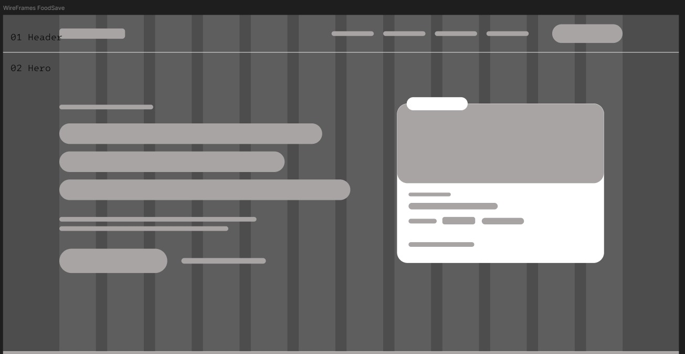

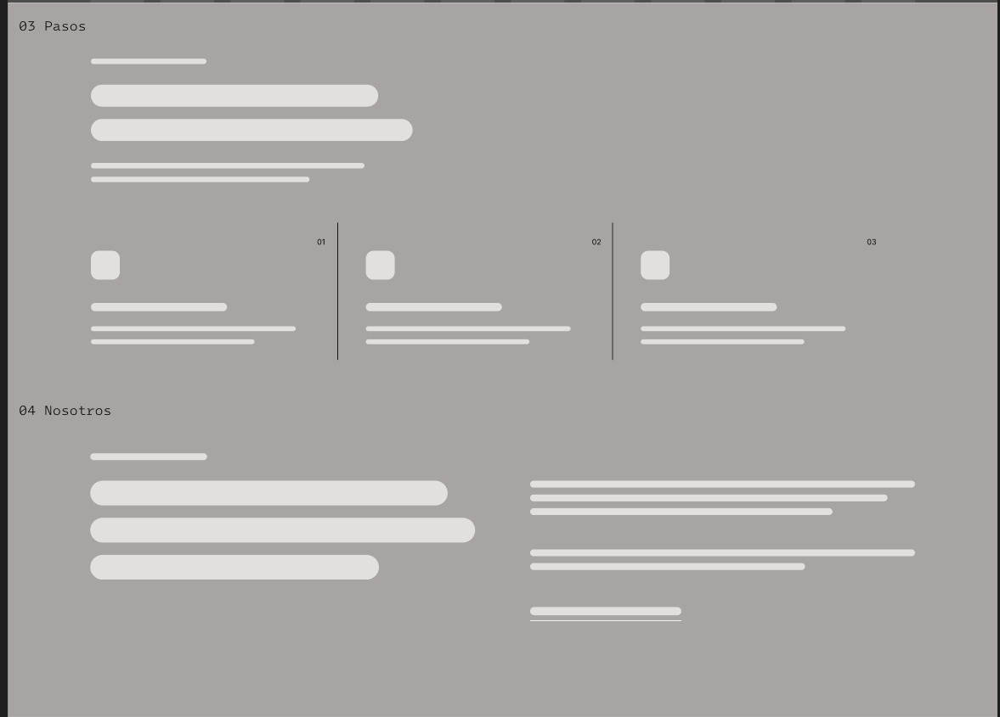

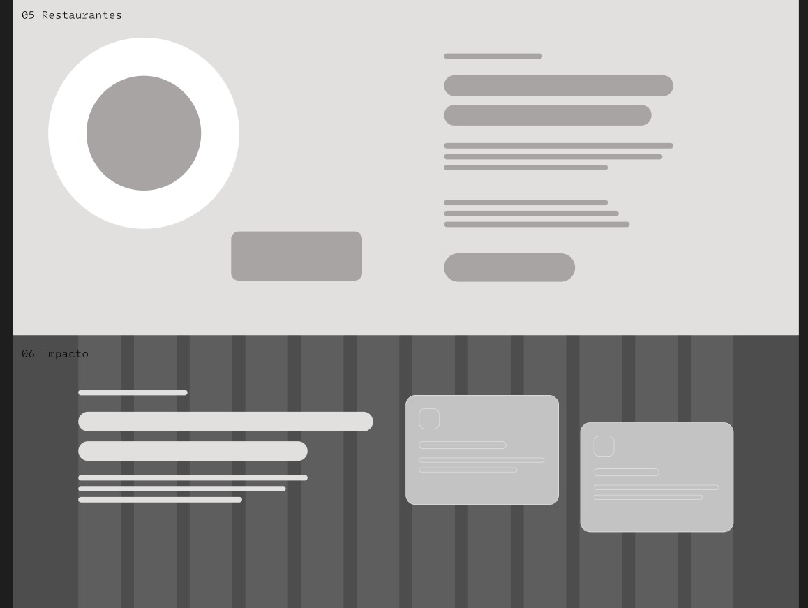

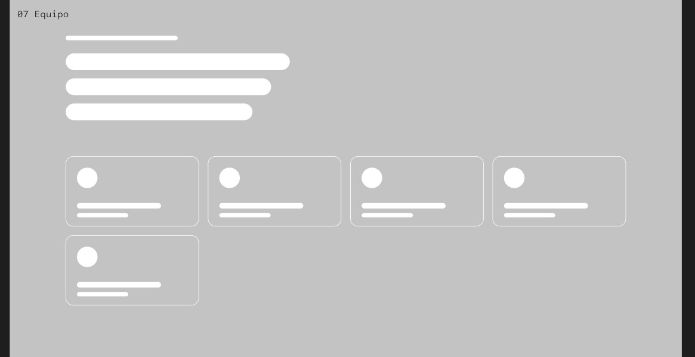

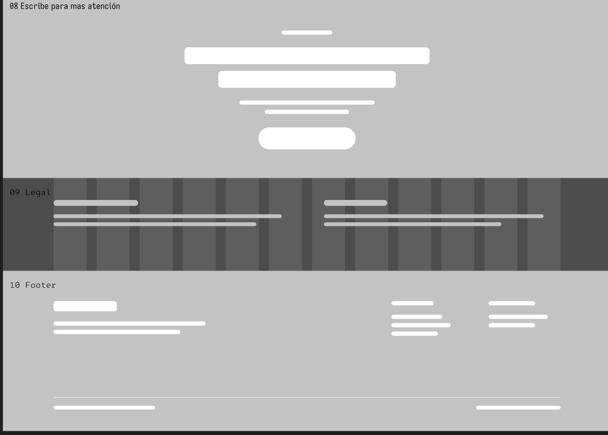


### 4.3.2. Landing Page Mock-up

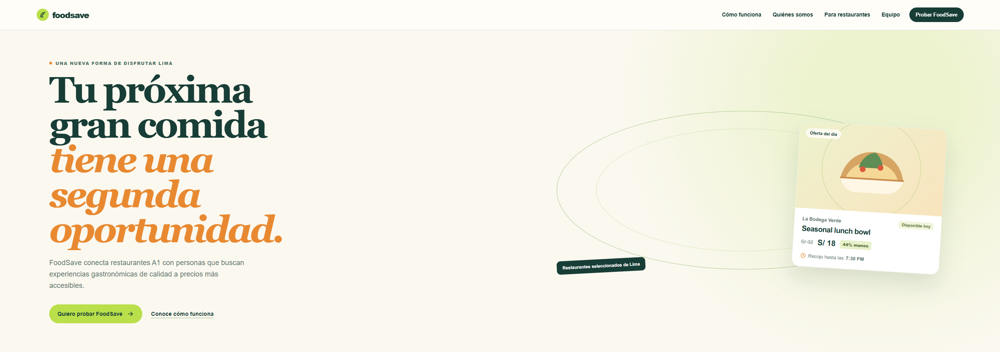

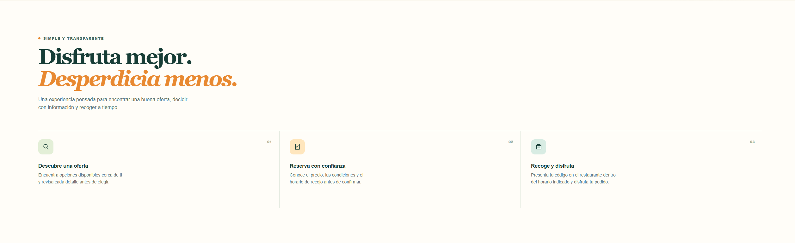

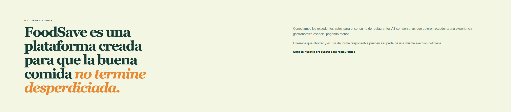


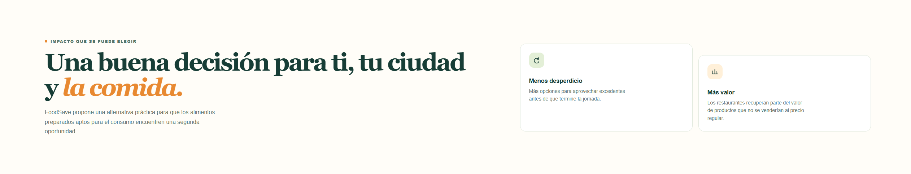

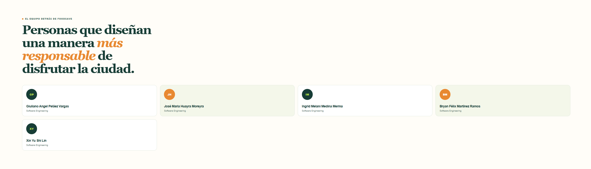


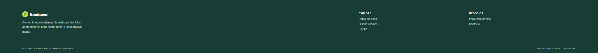

## 4.4. Web Applications UX/UI Design

### 4.4.1. Web Applications Wireframes


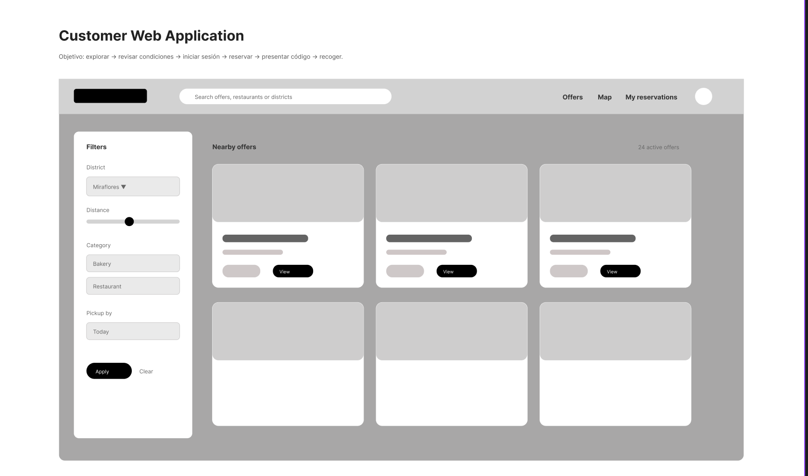

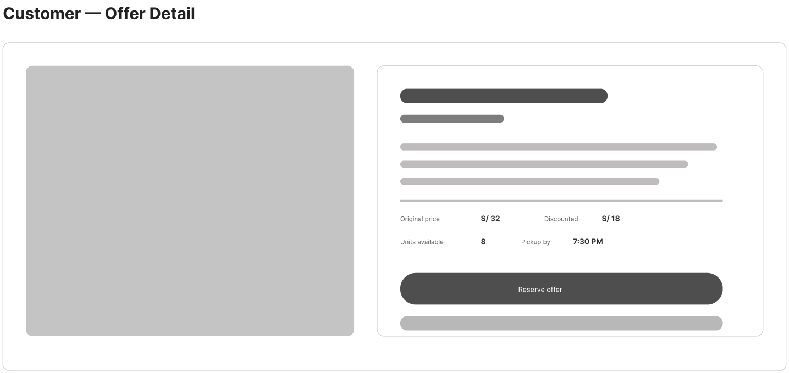

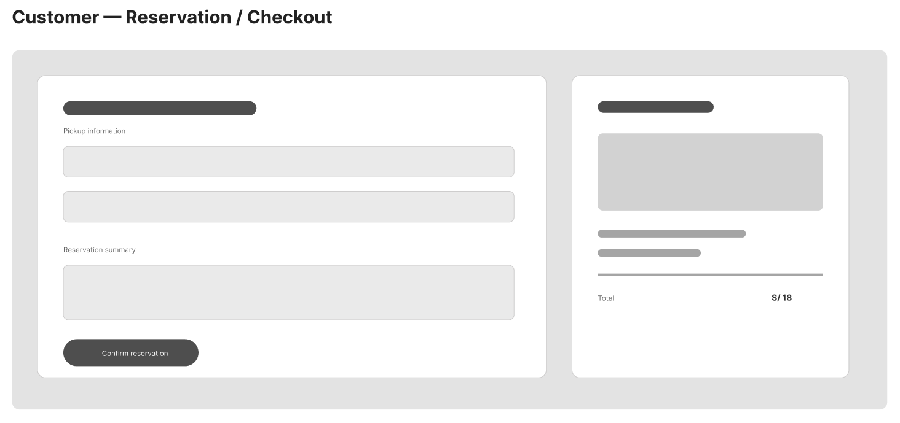

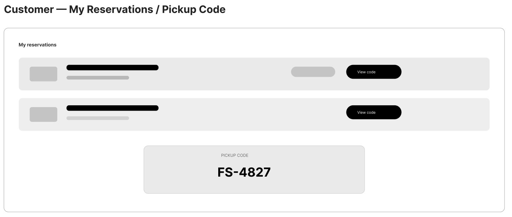

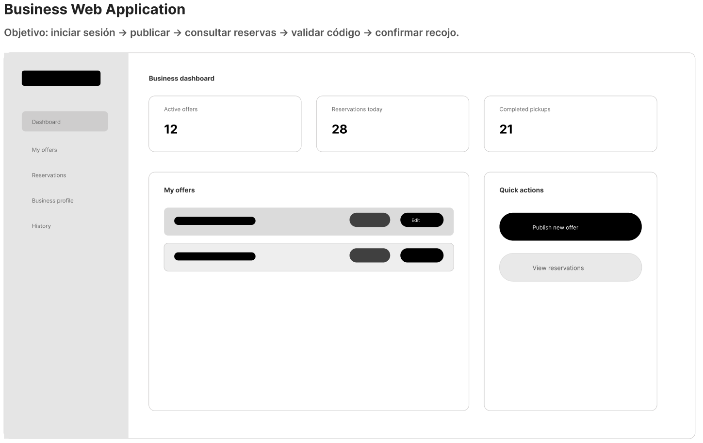

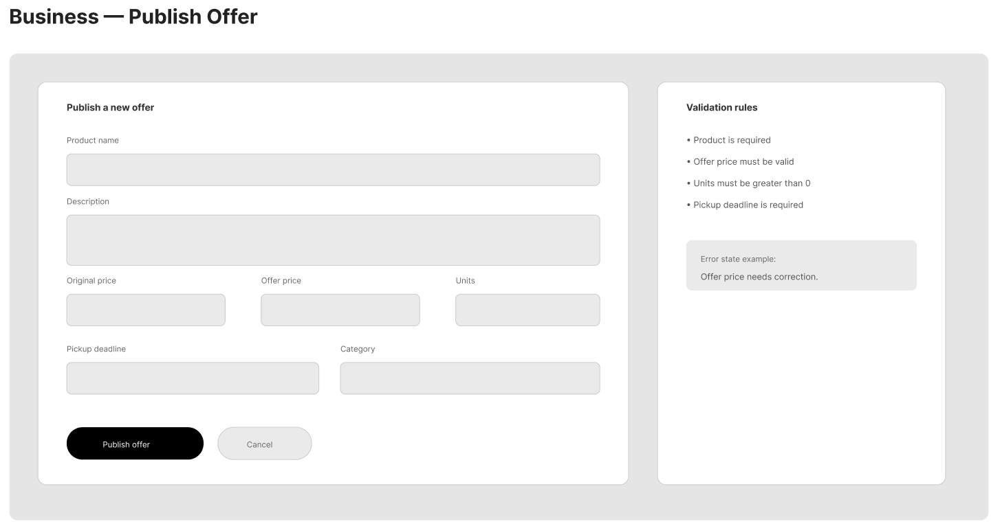

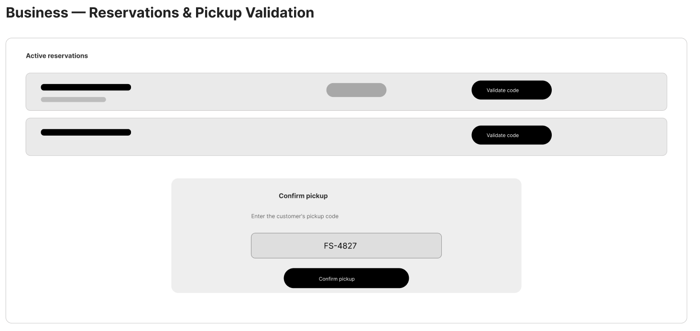

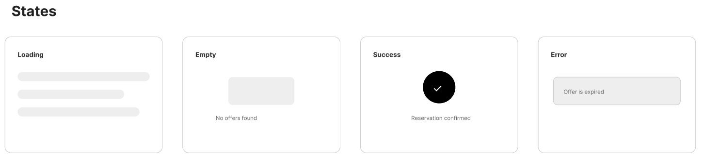

### 4.4.2. Web Applications Wireflow Diagrams

Presentaremos la propuesta de los Wireflows, elaborados usando las User Stories definidas para las aplicaciones del proyecto de FoodSave

Task Flow 1: Registro de cuenta de usuario
Objetivo del usuario: Permitir al usuario poder crear una cuenta para utilizar la aplicacion
Pasos del Task Flow:
1. Ingresar a la aplicacion.
2. Presionar el botón Sing in.
3. Elegir la opción:"Create account".
4. Completar los datos solicitados
5. Aceptar los terminos y condiciones.
6. Presionar el botón de crear cuenta
User Goal 1: Como cliente comprador, quiero crear una cuenta para guardar y gestionar mis reservas.” Incluye registro exitoso y el caso de correo ya registrado 
User Persona: Consumidor
Desde la sección de registro, el usuario puede completar sus datos para ingresar a la plataforma


Task Flow 2: Inicio de sesion
Objetivo del usuario: Permitir ingresar a la aplicacion una vez registrado
Pasos del Task Flow:
1. Ingresar a la aplicacion.
2. Presionar el botón Sing in.
3. Elegir la opción:"Create account".
4. Completar los datos solicitados
5. Aceptar los terminos y condiciones.
6. Presionar el botón de crear cuenta
User Goal 1: Como cliente comprador, quiero crear una cuenta para guardar y gestionar mis reservas.” Incluye registro exitoso y el caso de correo ya registrado 
User Persona: Consumidor
Desde la sección de registro, el usuario puede completar sus datos para ingresar a la plataforma


:
Task Flow 3: Exploración y selección de ofertas
Objetivo del usuario: Permitir al consumidor explorar las ofertas disponibles y consultar el detalle de una oferta.
Pasos del Task Flow:
1. Acceder a la sección de Ofertas.
2. Visualizar las ofertas disponibles.
3. Seleccionar una oferta.
4. Acceder al detalle de la oferta.
5. Revisar la información de la oferta.
6. Seleccionar la opción para reservar.
User Goal 1: Como consumidor, deseo explorar las ofertas disponibles, para encontrar una opción que se ajuste a mis necesidades.
User Persona: Consumidor
Desde Ofertas, el consumidor visualiza las ofertas disponibles y selecciona una para acceder al Detalle de ofertas, donde puede revisar su información y seleccionar "Reservar oferta".

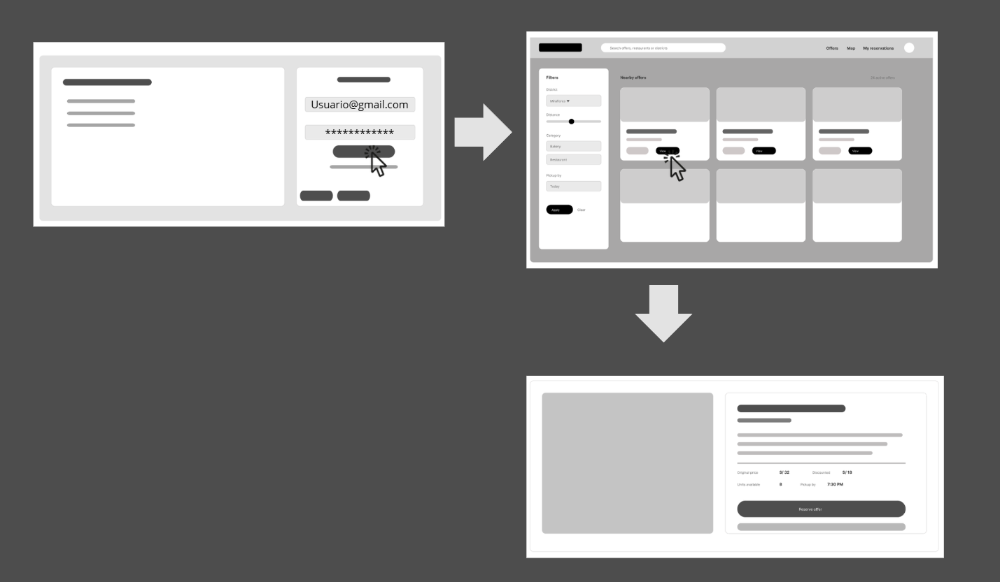


:
Task Flow 4: Reserva y confirmación de oferta
Objetivo del usuario: Permitir al cliente comprador reservar una oferta disponible y obtener su código de recojo.
Pasos del Task Flow:
1. Acceder al detalle de una oferta.
2. Seleccionar la opción para reservar.
3. Acceder a Reserva.
4. Confirmar la reserva.
5. Visualizar la confirmación.
6. Obtener el código de recojo.
User Goal 2: Como cliente comprador, quiero reservar una oferta para asegurar una unidad antes de llegar al negocio.
User Persona: Cliente comprador
Desde Detalle de ofertas, el cliente comprador selecciona "Reservar oferta" y accede a Reserva. Luego confirma la reserva y el sistema muestra la Confirmación de reserva con el código correspondiente.


Task Flow 5: Publicación de una nueva oferta
Objetivo del usuario: Permitir al responsable de negocio publicar una nueva oferta para vender un excedente.
Pasos del Task Flow:
1. Acceder al Business Dashboard.
2. Seleccionar la opción para publicar una nueva oferta.
3. Acceder a Create New Offer.
4. Completar la información de la oferta.
5. Publicar la nueva oferta.
User Goal 4: Como responsable de negocio, quiero publicar una oferta con información clara para vender un excedente.
User Persona: Responsable de negocio
Desde Business Dashboard, el responsable de negocio selecciona "Publicar nueva oferta" y accede a Create New Offer, donde completa la información correspondiente y publica la oferta.

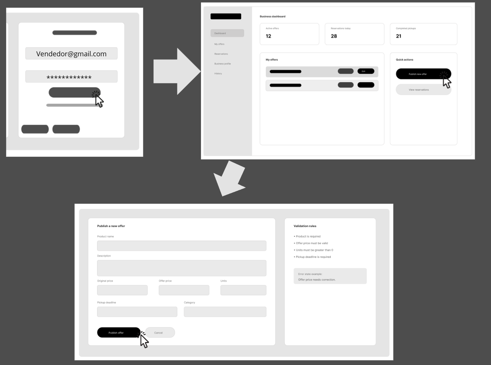


Task Flow 6: Consulta de reservas del negocio
Objetivo del usuario: Permitir al responsable de negocio consultar las reservas de sus ofertas para atender los recojos.
Pasos del Task Flow:
1. Acceder a Reservaciones.
2. Visualizar las reservas pendientes.
3. Consultar la información de las reservas.
4. Visualizar las reservas ya entregadas.
5. Consultar el código asociado.
User Goal 5: Como responsable de negocio, quiero ver las reservas activas de mis ofertas para preparar los pedidos y atender los recojos.
User Persona: Responsable de negocio
Desde Reservaciones, el responsable de negocio puede visualizar las reservas pendientes de entrega y aquellas que ya fueron entregadas, junto con la información y el código correspondiente.

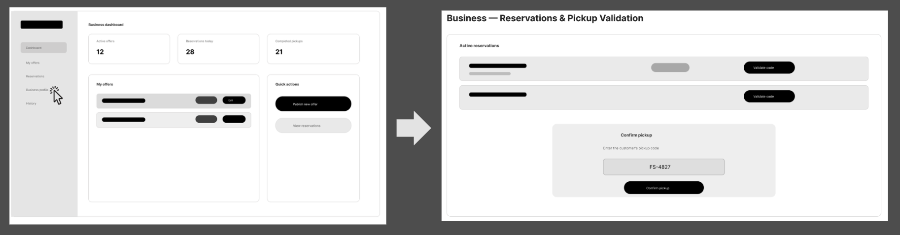


Task Flow 7: Confirmación de recojo mediante código
Objetivo del usuario: Permitir al responsable de negocio validar el código de una reserva para confirmar correctamente el recojo.
Pasos del Task Flow:
1. Acceder a Validación de código.
2. Ingresar el código de la reserva.
3. Validar el código.
4. Visualizar el resultado de la validación.
5. Confirmar el código válido.
User Goal 6: Como responsable de negocio, quiero confirmar el recojo mediante un código para cerrar la reserva correctamente.
User Persona: Responsable de negocio
Desde Validación de código, el responsable de negocio ingresa el código de la reserva. El sistema muestra el Resultado de la validación y, si el código corresponde a una reserva válida, permite confirmar el recojo.
Ahora sí queda alineado con las personas/roles y objetivos que realmente aparecen en tus User Stories, sin meter nombres como Andrea/Carlos ni cambiar la estructura de la plantilla.

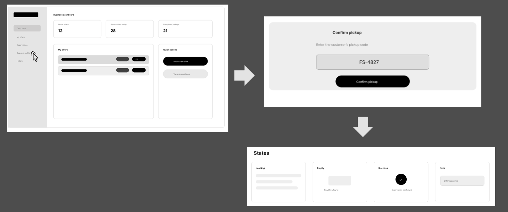


### 4.4.3. Web Applications Mock-ups

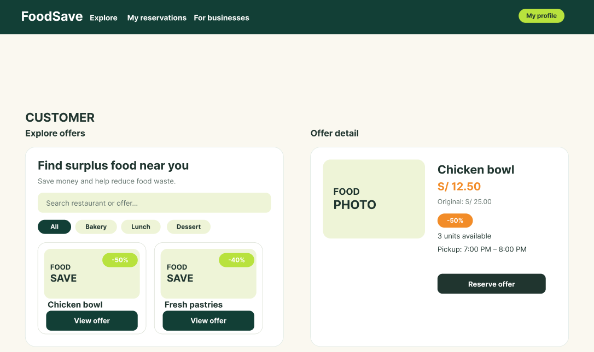

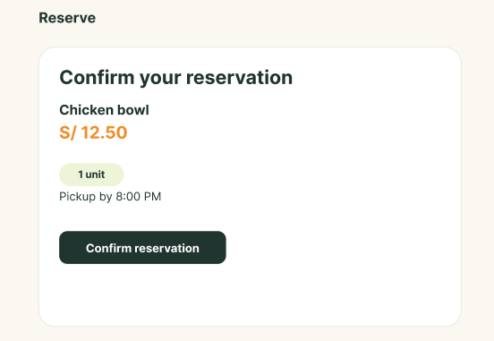

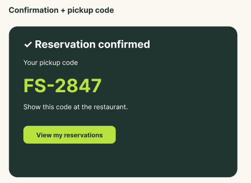

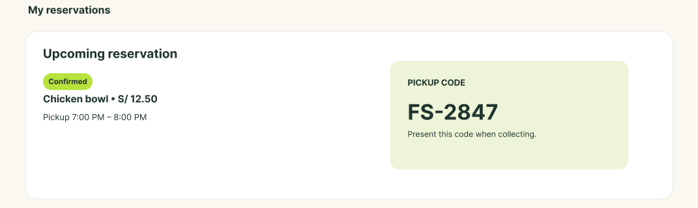

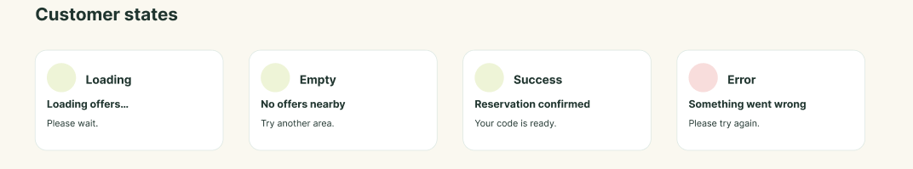

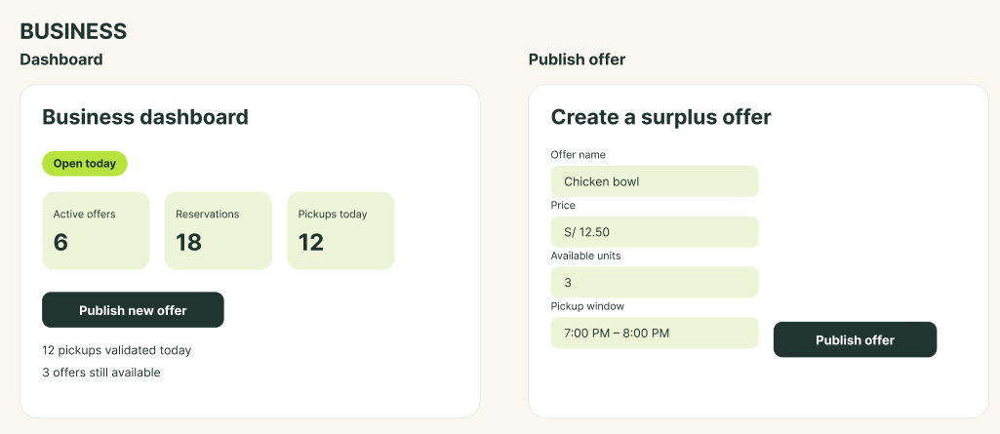

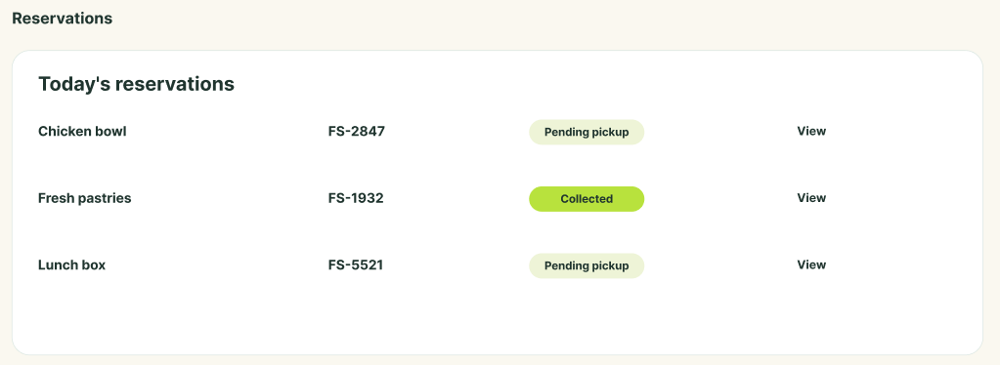

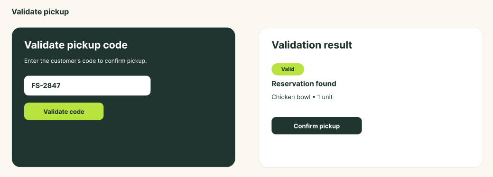

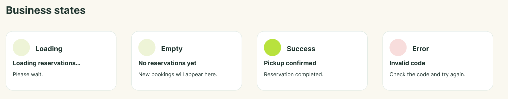

### 4.4.4. Web Applications User Flow Diagrams

Relacionado al User Goal 1: Como cliente comprador, quiero crear una cuenta para guardar y gestionar mis reservas. Desde la sección de registro, el cliente comprador completa los datos solicitados, acepta los términos y condiciones y selecciona la opción para crear su cuenta e ingresar a la plataforma.

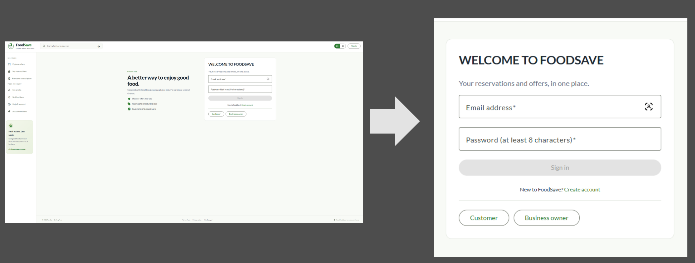

Relacionado al User Goal 2: Como usuario registrado, quiero iniciar sesión para acceder a las funciones asociadas a mi cuenta. Desde la sección de inicio de sesión, el usuario registrado ingresa sus credenciales y selecciona la opción para iniciar sesión. El sistema valida los datos y permite acceder al área correspondiente a su rol.

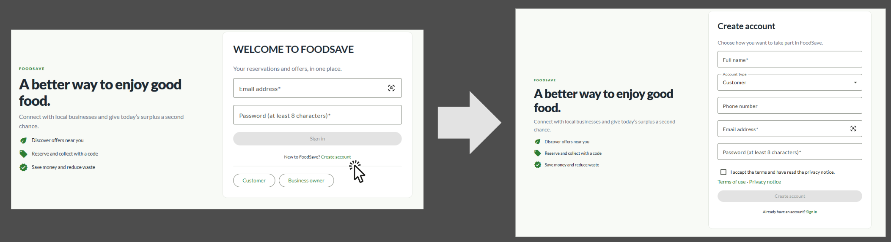


Relacionado al User Goal 3: Como cliente comprador, quiero explorar ofertas activas y consultar el detalle de una oferta para tomar una decisión informada. Desde Ofertas, el cliente comprador visualiza las ofertas activas y selecciona una de ellas para acceder al Detalle de ofertas, donde puede consultar la información disponible antes de realizar una reserva.

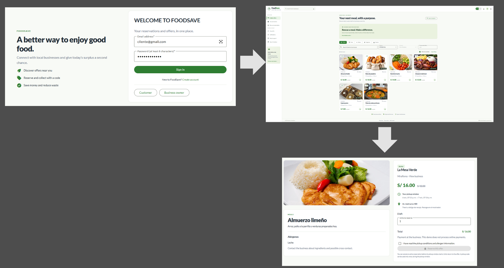

Relacionado al User Goal 4: Como cliente comprador, quiero reservar una oferta para asegurar una unidad antes de llegar al negocio. Desde Detalle de ofertas, el cliente comprador selecciona "Reservar oferta" y accede a Reserva. Luego confirma la reserva y el sistema muestra la Confirmación de reserva con el código correspondiente.

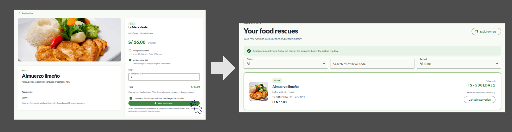

Relacionado al User Goal 5: Como responsable de negocio, quiero publicar una oferta con información clara para vender un excedente. Desde Business Dashboard, el responsable de negocio selecciona "Publicar nueva oferta" y accede a Create New Offer, donde completa la información correspondiente y publica la oferta.

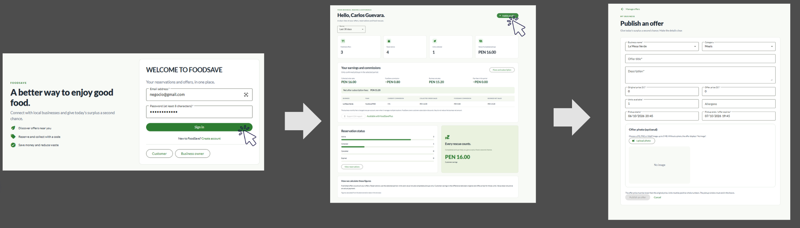

Relacionado al User Goal 6: Como responsable de negocio, quiero ver las reservas activas de mis ofertas para preparar los pedidos y atender los recojos. Desde Reservaciones, el responsable de negocio puede visualizar las reservas pendientes de entrega y aquellas que ya fueron entregadas, junto con la información y el código correspondiente.

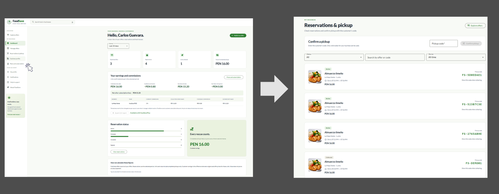

Relacionado al User Goal 7: Como responsable de negocio, quiero confirmar el recojo mediante un código para cerrar la reserva correctamente. Desde Validación de código, el responsable de negocio ingresa el código de la reserva. El sistema muestra el Resultado de la validación y, si el código corresponde a una reserva válida, permite confirmar el recojo.

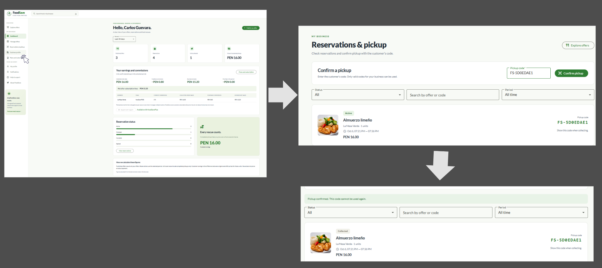


## 4.5. Web Applications Prototyping

En este punto realizamos la grabacion de la funcionalidad de nuestra aplicacion web, la cual se dejara como evidencia en el siguiente link

Evidencia: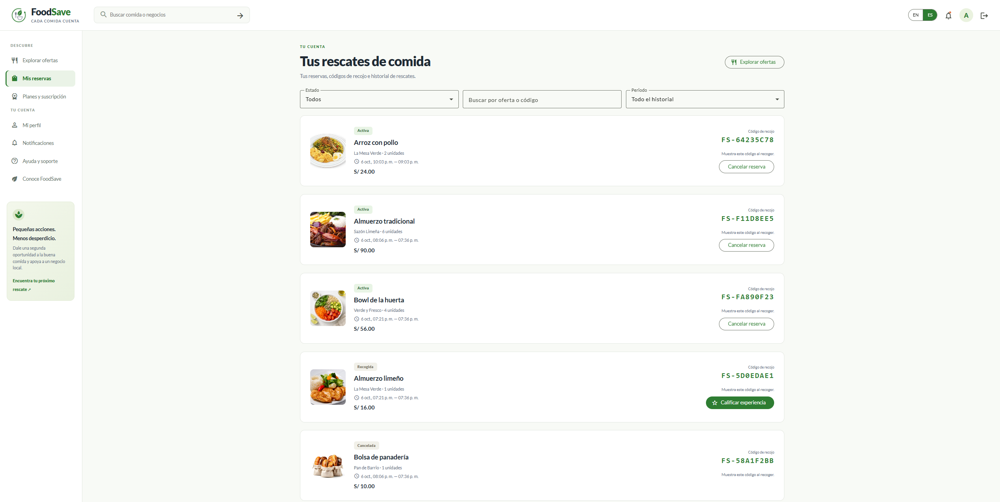

**URL:** https://acortar.link/vXBJIf

Video:Funcionalidad_Aplicacion.mp4

## 4.6. Domain-Driven Software Architecture

### 4.6.1. Design-Level Event Storming

En esta sección nos enfocamos en hacer un diseño más profundo del realizado en el Big Picture Event Storming. Nos enfocamos en diseñar las funcionalidades encontradas en las historias de usuario, como la publicación y gestión de ofertas, la reserva con código de recojo, las notificaciones y la calificación de la experiencia, así como en pulir los detalles de los flujos creados antes. Cabe mencionar que se agregaron para este modelo nuevos elementos en comparación con el visto en el Big Picture, estos son:

- **Comandos**: Representados con post-its azules y simbolizan las acciones que un actor solicita realizar sobre el dominio. Permiten identificar con mayor claridad quién es el que activa estos eventos.
- **Aggregates**: Representados con post-its de color amarillo claro. Agrupan el estado y las reglas de un concepto del dominio, y dan identidad a los eventos asociados, por ello, se ubican antes de dichos eventos. Este modelado ayuda a identificar los agregados y entidades que se deben considerar para nuestro producto.
- **Políticas**: Representados con post-its morados y expresan reglas de negocio que desencadenan o coordinan acciones. Por ello, antes del comando correspondiente se coloca una política que indique qué debe ocurrir.

A continuación mostraremos las capturas del Design Level Event Storming realizado, separándolos según el Bounded Context al que pertenezcan y comenzando con los Core del negocio:

**Bounded Context Offer Management:**

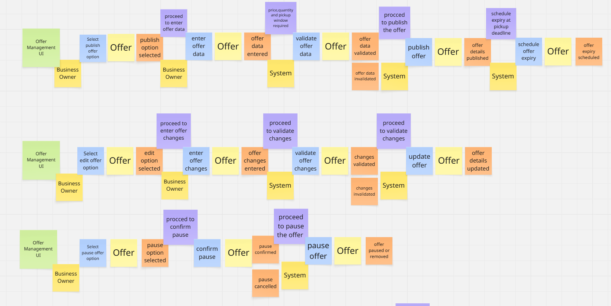 
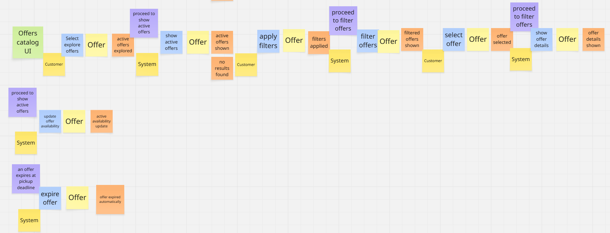 

**Bounded Context: Reservation & Pickup**

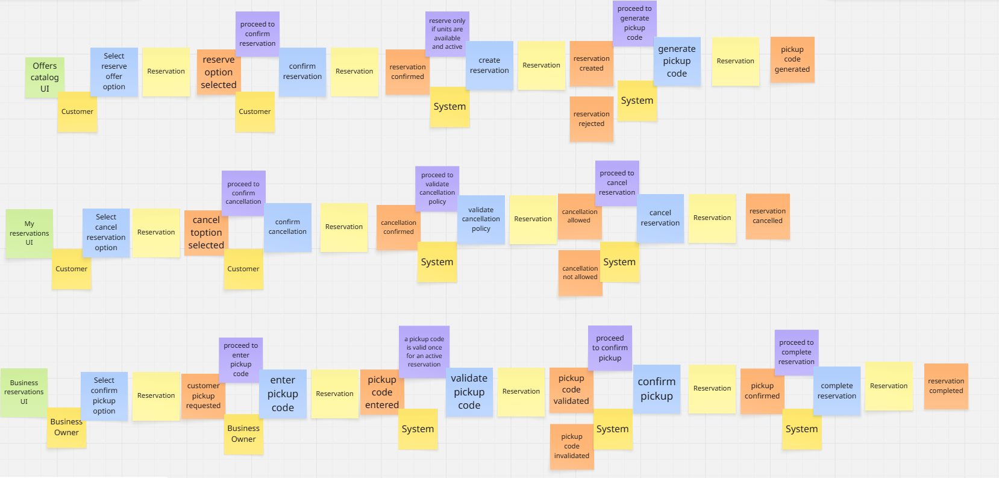 

**Bounded Context: Business Management**

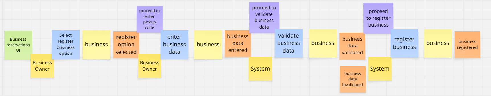 

**Bounded Context: Notifications**

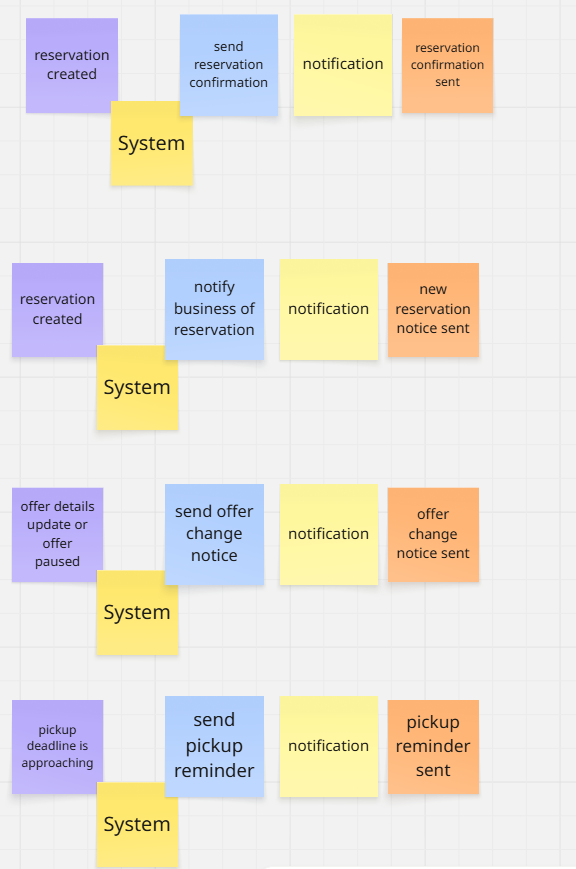 

**Bounded Context: Feedback**

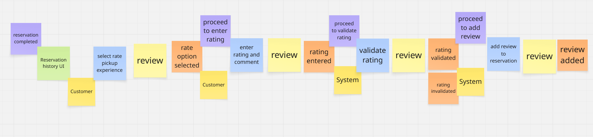 

### 4.6.2. Software Architecture Context Diagram
El diagrama de contexto presenta a FoodSave como una sola caja, sus usuarios (Customer, Business Owner y Developer) y los sistemas externos con los que se integra.
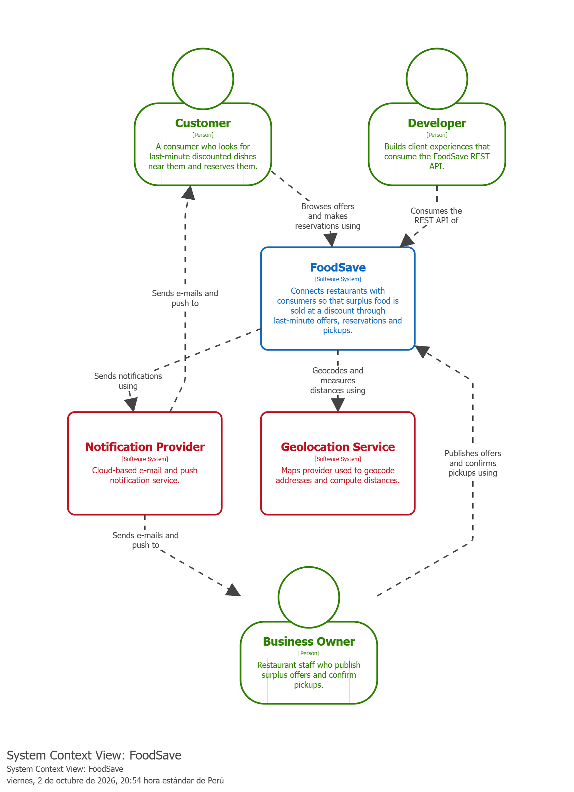

### 4.6.3. Software Architecture Container Diagrams
Este diagrama de contenedores muestra la estructura de alto nivel del sistema FoodSave: las aplicaciones y almacenes de datos que lo componen, la tecnología de cada uno y cómo se comunican entre sí y con los sistemas externos.
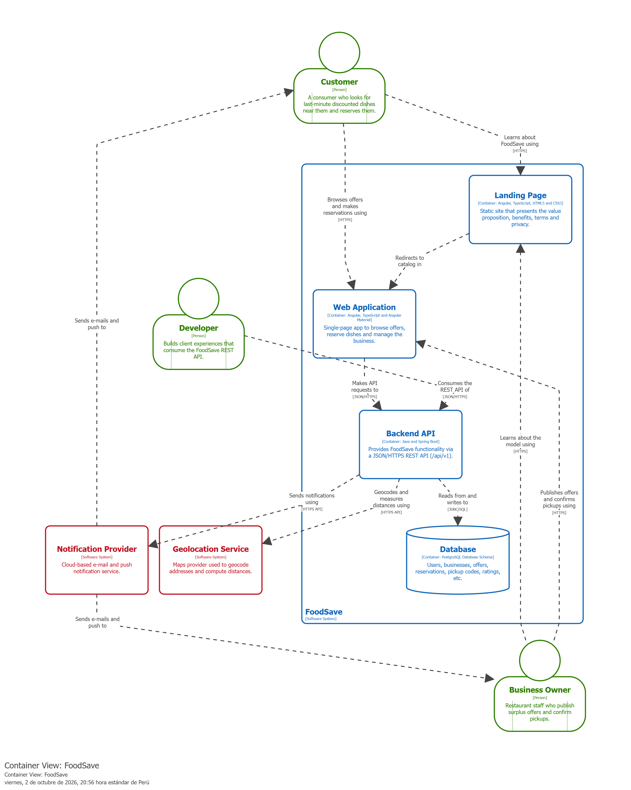
### 4.6.4. Software Architecture Components Diagrams
Los diagramas de componentes descomponen los contenedores principales de FoodSave. Se presenta el Backend API (organizado en capa de controladores REST y capa de servicios de aplicación) y el Web Application (módulos funcionales y servicios centrales de Angular). 

**Backend API Components Diagram**
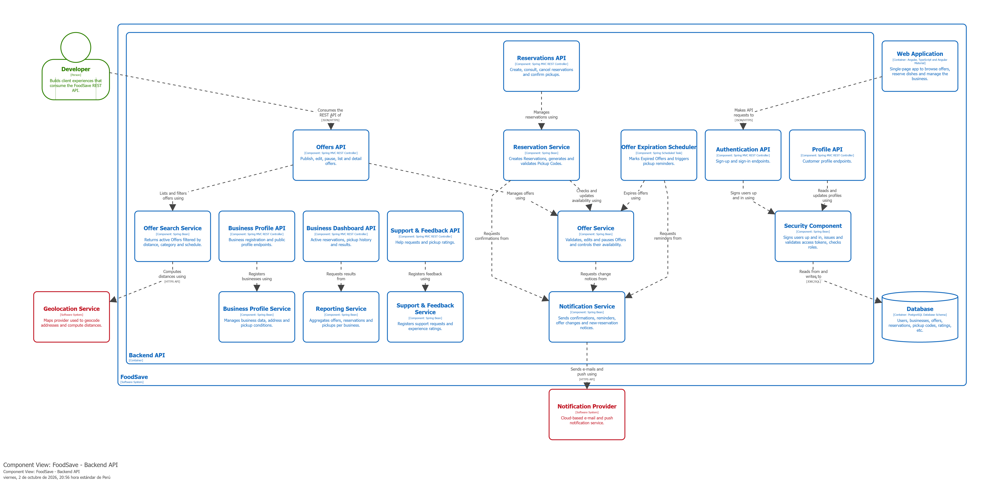

**Web Application Components Diagram**
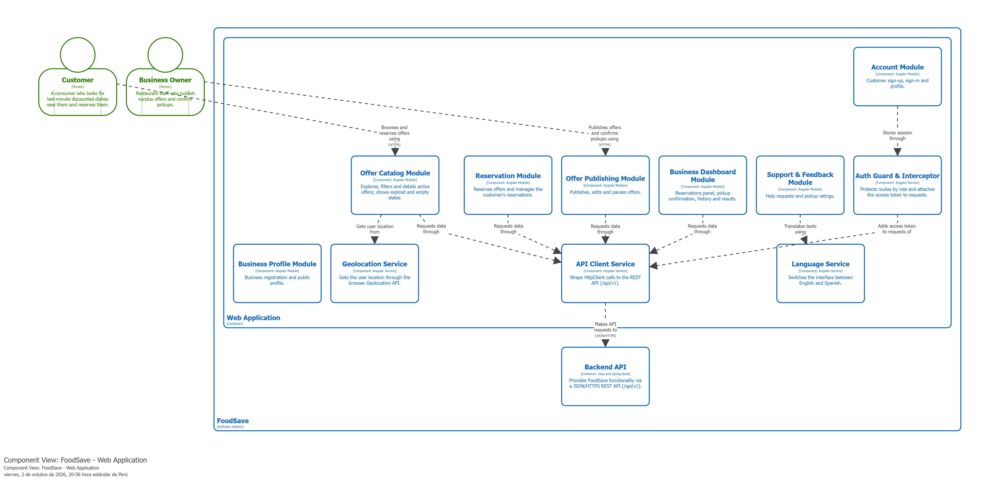
## 4.7. Software Object-Oriented Design

### 4.7.1. Class Diagrams

**Frontend Class Diagram:**
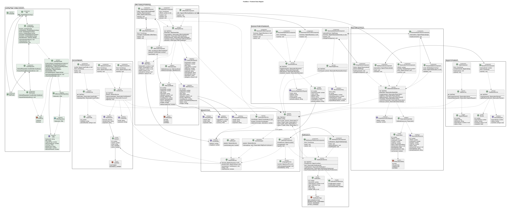

**Backend Shared Context Class Diagram:**

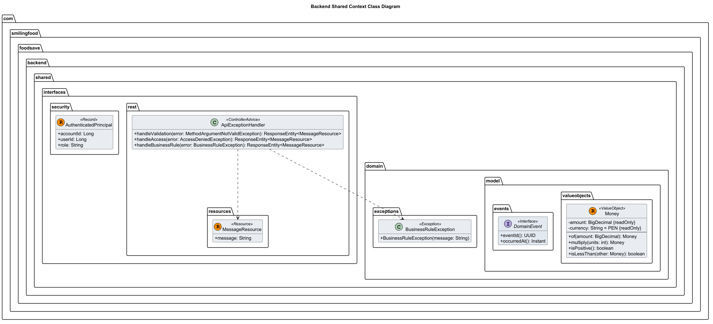

**Backend IAM Context Class Diagram:**


**Backend Offer Management Context Class Diagram:**

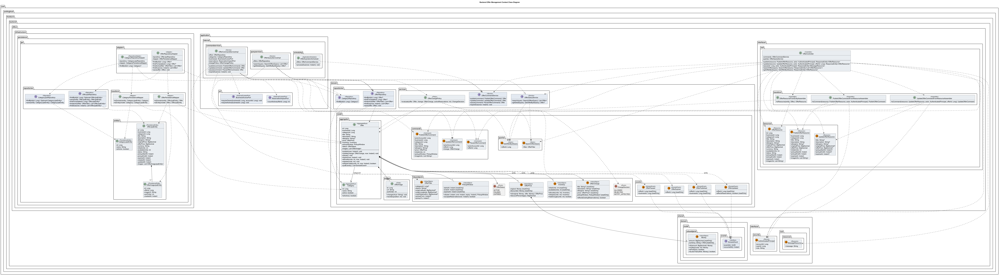

**Backend Reservation & Pickup Context Class Diagram:**

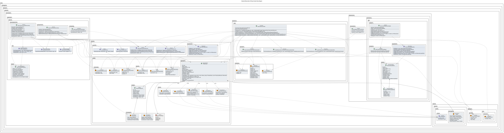

**Backend Business Management Context Class Diagram:**

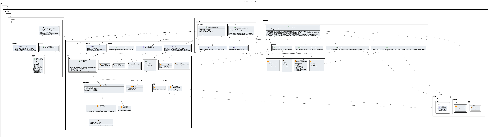

**Backend Notifications Context Class Diagram:**

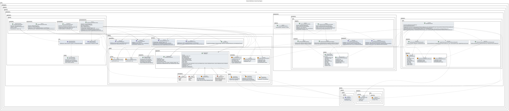

**Backend Feedback Context Class Diagram:**

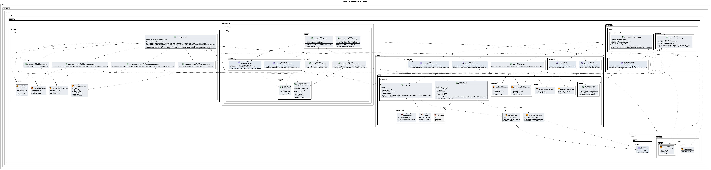

## 4.8. Database Design

### 4.8.1. Database Diagrams

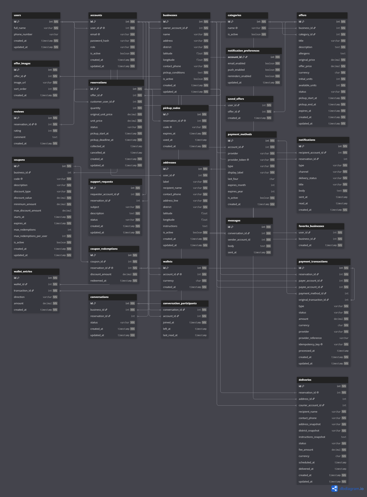

# Capítulo V: Product Implementation, Validation & Deployment

## 5.1. Software Configuration Management

### 5.1.1. Software Development Environment Configuration

| Actividad | Producto / herramienta | Propósito de uso | 
|---|---|---|
| Control de versiones | Git y GitHub | Colaboración, trazabilidad y revisión. |
| Informe | Markdown y extensión Markdown PDF | Elaboración colaborativa y exportación. |
| Landing Page | Angular, TypeScript, HTML5 y CSS3 | Sitio estático del modelo de negocio. |
| Web Application | Angular, TypeScript y Angular Material | Experiencia web responsiva. | 
| Gestión del proyecto | Tablero del equipo | Product y Sprint Backlog. | 

### 5.1.2. Source Code Management
Para la gestión del código fuente se implementa el modelo de ramificación GitFlow, el versionado semántico y las convenciones de mensajes de commit, detallados a continuación:

**GitFlow Workflow**

Se utiliza el modelo de ramificación propuesto por Vincent Driessen (“A successful Git branching model”), conocido como GitFlow. Las ramas principales son:

- **main**: Rama principal, contiene siempre el código en producción.
- **develop**: Rama de desarrollo principal, donde se integran las funcionalidades antes de pasar a producción.
- **feature/\***: Ramas creadas a partir de develop para nuevas funcionalidades.  
  Convención: `feature/<nombre-corto-descriptivo>`  
  Ejemplo: `feature/login-auth`
- **release/\***: Ramas creadas desde develop para preparar una nueva versión.  
  Convención: `release/<versión>`  
  Ejemplo: `release/1.2.0`
- **hotfix/\***: Ramas creadas desde main para corregir errores críticos en producción.  
  Convención: `hotfix/<descripción-corta>`  
  Ejemplo: `hotfix/fix-payment-bug`

**Versionado Semántico**

Se aplica Semantic Versioning 2.0.0, con el formato:

- **MAJOR**: Cambios incompatibles en la API.
- **MINOR**: Nuevas funcionalidades compatibles.
- **PATCH**: Correcciones menores y ajustes sin afectar funcionalidades.

Ejemplo de versión: `v1.3.2`

**Convenciones de Commits**

Se emplea el estándar Conventional Commits para los mensajes de commit, facilitando la automatización en integración continua y generación de changelogs.

Ejemplos de mensajes:
```
- feat: add login functionality
- fix: correct null pointer exception on user service
- docs: update API documentation
- style: fix indentation and formatting
- refactor: improve user service structure
- test: add unit tests for authentication
- chore: update dependencies
```
Estas prácticas aseguran trazabilidad, organización y calidad en la gestión del código fuente del proyecto.


### 5.1.3. Source Code Style Guide & Conventions

#### Landing Page Style Guide & Conventions

##### Project Structure

```
/public        (images, favicon, manifest.json)
/src
    /css         (styles.css + partials/modules)
    /js            (main.js + modules)
    /components    (HTML fragments if needed)
    /index.html
```

###### HTML

- **Semantics first**: use `header`, `nav`, `main`, `section`, `article`, `footer`.
- **Accessibility (a11y)**:
  - Add `alt` text to images.
  - Use `aria-*` attributes for dynamic components.
  - Keep logical tab order in the DOM.
  - Always show a visible focus state.
- **SEO**:
  - Include `<title>` and `<meta name="description">`.
  - Add Open Graph / Twitter meta tags.
  - Set `lang="en"` (or appropriate language) on `<html>`.
- **Performance**:
  - Use `loading="lazy"` on ``.
  - Minimize inline CSS/JS.
- **Conventions**:
  - Use **kebab-case** for class names.
  - Use `id` only for JS hooks or anchors, not for styling.

###### CSS
- **Indentation**: Use **2 spaces** for indentation.
- **Naming**: Use descriptive English class names following **kebab-case**.
- **Format**:
  - One selector per line.
  - Opening brace on the same line as the selector.
- **Responsive**:
  - Prefer relative units (`%`, `rem`, `vh`, `vw`) for better adaptation across devices.
- **Architecture**:
  - Keep stylesheets modular and separated by components/sections of the Landing Page (e.g. Header, Hero, Benefits, FAQ).
- **Property order & readability**:
  - Group related properties together.
  - Maintain a consistent order inside every CSS rule.

###### JavaScript

- **Structure**:
  - Modular design; keep one `main.js` entry point.
  - Split reusable logic into separate modules.
- **Conventions**:
  - Use **camelCase** for variables/functions.
  - Use **PascalCase** for classes/constructors.
  - Constants in `UPPER_CASE`.
- **Best Practices**:
  - Prefer `const` and `let` over `var`.
  - Add comments for non-trivial logic.
  - Keep DOM selectors cached.
  - Use `addEventListener` (avoid inline `onclick`).
  - Wrap code in IIFEs or modules to avoid global leaks.

### 5.1.4. Software Deployment Configuration
#### 1. Landing Page – HTML, CSS y JavaScript

##### Repositorio de Código Fuente

La Landing Page se implementa empleando únicamente HTML, CSS y JavaScript nativo. Todos los archivos del proyecto deben almacenarse en un repositorio en GitHub, asegurando que el archivo **`index.html`** se ubique en la raíz del repositorio (`/`). Esto es indispensable para que GitHub Pages lo reconozca automáticamente como punto de entrada del sitio.

##### Activación de GitHub Pages

1. Acceder al repositorio en GitHub.
2. Ir a la pestaña **Settings**.
3. En el menú lateral, seleccionar la opción **Pages**.
4. En el campo **Source**, configurar:
   - Rama: `main`
   - Carpeta: `/ (root)`
5. Guardar los cambios.

##### Publicación

Tras guardar la configuración, GitHub generará de forma automática una URL pública donde estará disponible la Landing Page.
Nuestra URL es:

```
https://food-save-landing-page.vercel.app/
```

##### Actualizaciones

Cualquier commit realizado en la rama `main` será desplegado automáticamente en la página publicada, sin necesidad de pasos adicionales.

## 5.2. Landing Page, Services & Applications Implementation

### 5.2.1. Sprint 1

#### 5.2.1.1. Sprint Planning 1
<table style="width:100%; border-collapse:collapse;" border="1">
  <tr>
    <td style="width:30%; background-color:#E4E4E4;"><b>Sprint #</b></td>
    <td>Sprint 1</td>
  </tr>
  <tr>
    <td colspan="2" style="background-color: #AEAEAE;"><b>Sprint Planning Background</b></td>
  </tr>
  <tr>
    <td style="background-color:#E4E4E4;"><b>Date</b></td>
    <td >2026-09-04</td>
  </tr>
  <tr>
    <td style="background-color:#E4E4E4;"><b>Time</b></td>
    <td>18:30 PM</td>
  </tr>
  <tr>
    <td style="background-color:#E4E4E4;"><b>Location</b></td>
    <td>Reunion via Discord</td>
  </tr>
  <tr>
    <td style="background-color:#E4E4E4;"><b>Prepared By</b></td>
    <td>Jiménez Rosas, Arturo Eduardo</td>
  </tr>
  <tr>
    <td style="background-color:#E4E4E4;"><b>Attendees (to planning meeting)</b></td>
    <td>Huayra José/Xin Lin/Peláez Giuliano/Martínez Bryan/Medina Ingrid</td>
  </tr>
  <tr>
    <td style="width:30%; background-color:#E4E4E4;"><b>Sprint n – 1 Review Summary</b></td>
    <td>No aplica para Sprint 1</td>
  </tr>
  <tr>
    <td style="background-color:#E4E4E4;"><b>Sprint n – 1 Retrospective Summary</b></td>
    <td>No aplica para Sprint 1</td>
  </tr>
  <tr>
    <td colspan="2" style="background-color: #AEAEAE;"><b>Sprint Goal & User Stories</b></td>
  </tr>
  <tr>
    <td style="background-color:#E4E4E4;"><b>Sprint n Goal</b></td>
    <td>Disponer de una primera Landing Page desplegable y un recorrido central demostrable. Historias a confirmar con el backlog.</td>
  </tr>
  <tr>
    <td style="background-color:#E4E4E4;"><b>Sprint n Velocity</b></td>
    <td>US1(3)-US2(5)-US3(3)-US7(5)</td>
  </tr>
  <tr>
    <td style="background-color:#E4E4E4;"><b>Sum of Story Points</b></td>
    <td>16 story points</td>
  </tr>
</table>

#### 5.2.1.2. Aspect Leaders and Collaborators
En el siguiente cuadro definimos los roles y responsabilidades del equipo de FoodSave durante el Sprint 1. Para cada entrega principal, se designa a un líder (L) encargado de guiar la ejecución y tomar decisiones clave, junto con colaboradores (C) que apoyan activamente en el desarrollo de las tareas.

|Team Member (Last Name, First Name)|GitHub Username|Mockup (L/C)|Entrevistas (L/C)|Wireframes (L/C)|Landing Page (L/C)|
|---|---|---|---|---|---|
| Huayra, José | TheJos9 | C | L | C | C |
| Peláez, Giuliano | SimpleGP | L | C | C | L |
| Martínez, Bryan | BryanMR1 | C | C | L | C |
| Medina, Ingrid | Grini913 | C | L | C | C |

#### 5.2.1.3. Sprint Backlog 1
| Sprint # | Story ID | Story Title | Task ID | Task Title | Task Description | Estimation (Hours) | Assigned To | Status (To-do / In-Process / To-Review / Done) |
|---|---|---|---|---|---|---:|---|---|
| Sprint 1 | US01 | Conocer el modelo FoodSave | T01 | Implementar contenido Landing Page | Crear secciones de propuesta de valor y beneficios. | 6 horas | Completado | To-do |
| Sprint 1 | US02 | Acceder a ofertas | T02 | Implementar CTA | Vincular llamado a la acción con catálogo. | 4 horas | Pendiente | To-do |
| Sprint 1 | US03 | Explorar ofertas activas | T03 | Diseñar catálogo | Crear la primera vista de catálogo. | 8 horas| Pendiente | To-do |
| Sprint 1 | US07 | Publicar una oferta | T04 | Diseñar publicación | Crear formulario y reglas de validación. | 6 horas | Pendiente | To-do |
 

#### 5.2.1.4. Development Evidence for Sprint Review
| Repository | Branch | Commit Id | Commit Message  | Commit Message Body  | Commited on (Date) |
| --- | --- | --- | --- | --- | --- |
|  |   |  |  |  |  |
|  |   |  |  |  |  |
|  |   |  |  |  |  |

#### 5.2.1.5 Execution Evidence for Sprint Review

Durante el Sprint 1, el equipo de FoodSave centró su esfuerzo en la construcción de una primera versión funcional de la landing page y en la validación del recorrido principal del producto. El objetivo principal fue demostrar la propuesta de valor de la solución, comunicar claramente el problema del desperdicio de alimentos y permitir que un visitante comprendiera cómo funciona la plataforma antes de avanzar a etapas posteriores del proyecto.

La evidencia de ejecución del sprint se presenta a continuación:

| Evidencia de ejecución | Descripción | Referencia en el documento | Estado |
|---|---|---|---|
| Definición del objetivo del sprint | Se estableció la entrega de una landing page desplegable con un recorrido central demostrable y comprensible para el usuario. | Sección 5.2.1.1. Sprint Planning 1 | Cumplido |
| Historias de usuario priorizadas | Se trabajó con las historias US01, US02, US03 y US07, enfocadas en la comprensión del modelo FoodSave, acceso a ofertas, exploración de ofertas activas y lenguaje de interfaz. | Sección 3.1. User Stories y 5.2.1.3. Sprint Backlog 1 | Cumplido |
| Diseño de interacción | Se definieron wireframes y mockups para la landing page, mostrando estructura visual, jerarquía de contenido y flujo de navegación. | Secciones 4.3.1, 4.3.2, Anexo B | Cumplido |
| Definición visual y de marca | La identidad visual, tono, paleta y guía de estilo quedaron establecidos para sostener la experiencia del usuario en la landing page. | Sección 4.1. Style Guidelines | Cumplido |
| Arquitectura de información | Se definieron las secciones clave de la landing page: Home, How it works, Benefits, Impact y Contact, además de la navegación global. | Secciones 4.2.1 a 4.2.5 | Cumplido |
| Preparación para despliegue | Se estableció la estrategia de publicación mediante GitHub Pages / Vercel, con la URL pública de la landing page. | Sección 5.1.4. Software Deployment Configuration | Cumplido |
| Evidencia de prototipado visual | Se dejó documentado el flujo visual del landing page y la web app en Figma, con acceso a los diseños de baja y alta fidelidad. | Anexo B. Diseño y Prototipo | Cumplido |

### Evidencia funcional del flujo principal

El flujo principal ejecutado durante el sprint refleja la intención del producto en su fase inicial:

1. El visitante accede a la landing page.
2. Comprende la propuesta de valor de FoodSave.
3. Identifica el problema del desperdicio de alimentos y la solución propuesta.
4. Explora el funcionamiento de la plataforma mediante la sección “How it works”.
5. Revisa los beneficios aportados a consumidores y negocios.
6. Avanza hacia una acción principal (CTA), orientada a descubrir ofertas o conocer más del servicio.
7. Puede acceder a información complementaria, contacto y enlaces relevantes.

Este recorrido confirma que la landing page cumple con su propósito inicial: explicar la idea del negocio, convencer a posibles usuarios y establecer una base visual y narrativa para la siguiente etapa del producto.

### Evidencia visual y documental

Dentro del documento se evidencian los siguientes artefactos que respaldan la ejecución del sprint:

- Wireframes de Landing Page: presentados en la sección 4.3.1.
- Mock-ups de Landing Page: presentados en la sección 4.3.2.
- Web application wireframes y mockups: presentados en la sección 4.4.
- Diagramas de arquitectura: context, contenedores y componentes, presentados en la sección 4.6.
- User stories y backlog: presentados en las secciones 3.1 y 3.3.
- Guía de estilo visual: presentada en la sección 4.1.

### Resultado del Sprint 1

El Sprint 1 logró dejar sentadas las bases del producto digital de FoodSave:

- Una propuesta de valor clara.
- Una landing page con estructura funcional y visual coherente.
- Una narrativa de marca y diseño consistente.
- Una base para la siguiente fase del proyecto orientada a la gestión de ofertas, reservas y operación del negocio.

#### 5.2.1.6 Services Documentation Evidence for Sprint Review

La documentación de servicios de FoodSave se encuentra respaldada por la arquitectura del producto, los diagramas de contexto y contenedores, la definición de user stories y la especificación del dominio. Esta evidencia permite describir el ecosistema de servicios que componen la solución y justificar la estructura funcional del sistema.

A continuación se presenta la documentación de servicios del proyecto:

| Servicio / contexto | Funcionalidad principal | Evidencia documental | Relación con el sprint |
|---|---|---|---|
| Landing Page / Marketing | Presenta la propuesta de valor, explica el problema del desperdicio de alimentos y genera interés inicial en la plataforma. | Secciones 4.2.1 a 4.2.5, 4.3, 5.1.4 | Base del Sprint 1 |
| Offer Management | Permite gestionar las ofertas de alimentos excedentes, publicarlas, validarlas y controlarlas. | Secciones 3.1 (US08, US09, US18, US19), 4.6.1 Design-Level Event Storming | Soporte funcional del producto |
| Reservation & Pickup | Facilita la reserva de ofertas y la validación de recojo por parte del negocio. | Secciones 3.1 (US10, US11, US12), 4.6.1, 4.7.1 | Requisito principal del negocio |
| Business Management | Permite registrar establecimientos, gestionar perfiles, condiciones comerciales y datos del negocio. | Secciones 3.1 (US08, US16, US17, US30), 4.6.1 | Funcionalidad de operación |
| Notifications | Gestiona la comunicación entre negocio y cliente respecto a reservas, cambios y recordatorios. | Secciones 3.1 (US21, US23, US24, US25), 4.6.1 | Confianza y operación |
| Feedback | Permite calificar la experiencia del recojo y reforzar la percepción de servicio. | Secciones 3.1 (US29), 4.6.1 | Mejora continua |
| API / Integración | Expone servicios para consultar, crear y gestionar ofertas y reservas de forma consistente. | Sección 3.1 (US31, US32) | Soporte técnico y escalabilidad |

### Documentación funcional de servicios

La documentación funcional del sistema se estructura a partir de tres fuentes principales:

1. User Stories:
   - Definen los comportamientos esperados del sistema desde la perspectiva del usuario.
   - Ejemplos: US01 a US07 para la fase inicial; US08 a US32 para la operación del producto.

2. Design-Level Event Storming:
   - Permite identificar comandos, eventos, políticas y bounded contexts.
   - Las áreas principales del dominio son: Offer Management, Reservation & Pickup, Business Management, Notifications y Feedback.

3. Diagramas de arquitectura:
   - Diagramas de contexto, contenedores y componentes muestran cómo interactúan los distintos subsistemas.
   - Se observa la interacción entre usuario, aplicación web, backend API y sistemas externos.

### Documentación técnica de referencia

La solución se documenta de forma técnica en el repositorio mediante:

- GitFlow y convenciones de versionado (Sección 5.1.2).
- Estructura de proyecto recomendada para la landing page (Sección 5.1.3).
- Diagramas de componentes y clases (Sección 4.6 y 4.7).
- Guía de estilo y diseño visual (Sección 4.1).
- Arquitectura basada en contenedores y servicios (Sección 4.6.3).

### Contratos de servicio conceptuales

Aunque el documento no presenta un OpenAPI formal completo, sí se infiere un conjunto de servicios conceptuales del sistema:

- GET /api/offers/active
- POST /api/offers
- PATCH /api/offers/:id
- POST /api/reservations
- PATCH /api/reservations/:id/confirm
- GET /api/businesses/:id
- GET /api/users/:id/profile
- POST /api/notifications
- POST /api/feedback

Estos contratos representan el modelo lógico de funcionamiento de FoodSave, alineado con el diseño de bounded contexts y con la lógica de negocio descrita en User Stories y Event Storming.

### Conclusión de la evidencia documental

La documentación de servicios de FoodSave demuestra que la solución no se limita a una landing page, sino que está diseñada como un sistema digital con servicios funcionales y dominio bien definido. La evidencia disponible en el documento respalda la evolución del proyecto desde la propuesta inicial hasta un modelo de negocio con oferta, reserva, operación, comunicación y retroalimentación.

#### 5.2.1.7. Software Deployment Evidence for Sprint Review

Durante el Sprint 1, la solución desarrollada para la fase inicial del proyecto quedó desplegada como evidencia funcional del alcance definido en el planning. El objetivo principal del sprint fue validar que la propuesta de valor de FoodSave pudiera comunicarse de manera clara a través de una landing page accesible, con estructura visual coherente y recorrido principal demostrable para el usuario.

La evidencia de despliegue se centró en la publicación de la primera versión de la landing page, utilizando una implementación basada en HTML, CSS y JavaScript nativo, con enfoque responsive y acceso público.

| Evidencia de despliegue | Descripción | Resultado |
|---|---|---|
| Entorno de implementación | La landing page fue desarrollada con tecnología estática (HTML, CSS y JS) para facilitar su publicación rápida y accesible. | Cumplido |
| Plataforma de publicación | Se definió el uso de Vercel como entorno de despliegue para la landing page. | Cumplido |
| URL pública | La solución quedó disponible en la siguiente dirección: https://food-save-landing-page.vercel.app/ | Cumplido |
| Rama de despliegue | Se estableció la rama principal `main` como fuente de publicación para la versión desplegada. | Cumplido |
| Validación funcional | Se verificó que la página era navegable, presentaba la estructura de contenido propuesta y mantenía la jerarquía visual de la marca. | Cumplido |
| Compatibilidad | La implementación fue diseñada para adaptarse a dispositivos móviles y desktop sin afectar la legibilidad ni la navegación. | Cumplido |

La evidencia funcional del despliegue confirma que la landing page cumple con su propósito inicial: explicar la solución, comunicar el valor del producto y permitir que un visitante entienda rápidamente el problema que aborda FoodSave y la propuesta de solución que ofrece.

Además, la publicación del proyecto en un entorno accesible permitió validar la viabilidad del flujo principal del producto desde la perspectiva del usuario: ingreso a la landing page, comprensión del problema, revisión del funcionamiento de la plataforma y aproximación a la acción principal del negocio.

En conclusión, el Sprint 1 dejó un entregable desplegado y observable, lo que permitió avanzar desde la definición del concepto hacia una validación visual y operativa de la propuesta de valor del producto.

#### 5.2.1.8. Team Collaboration Insights during Sprint

Durante el Sprint 1, el equipo de FoodSave evidenció una colaboración inicial sólida, basada en la definición de roles, responsabilidades y objetivos claros para cada entrega del sprint. La organización del trabajo permitió distribuir tareas según las fortalezas de cada miembro y mantener una visión conjunta del proyecto.

La colaboración se vio reforzada por la estructura del Sprint Planning, donde se definió el objetivo general, se priorizaron las historias de usuario y se asignaron responsabilidades para cada bloque del trabajo. El equipo trabajó de manera integrada en la definición del problema, la investigación cualitativa, la elaboración de wireframes, la construcción de la propuesta visual y la preparación del contenido de la landing page.

Los principales indicadores de colaboración fueron:

- Distribución equitativa de tareas según competencias: entrevistas, análisis de necesidades, diseño de wireframes, definición de branding y redacción de contenido.
- Trabajo en conjunto para alinear la narrativa del proyecto con la propuesta de valor de FoodSave.
- Coordinación en la elaboración de artefactos clave del sprint: user stories, backlog, diagramas de arquitectura y guías de estilo visual.
- Comunicación constante durante la planificación y la revisión del trabajo, con foco en la coherencia entre investigación, diseño y presentación del producto.
- Enfoque conjunto en un objetivo común: materializar la idea de FoodSave como una solución clara, relevante y con una base visual sólida para la siguiente etapa del proyecto.

Asimismo, la participación del equipo permitió generar una visión compartida sobre el producto. Mientras algunos integrantes se enfocaban en la investigación y validación del problema, otros trabajaban en la estructura visual y de contenido, logrando una integración efectiva entre análisis, diseño y comunicación. Este nivel de colaboración fue clave para consolidar la propuesta de valor y garantizar que la landing page no solo tuviera una apariencia visual adecuada, sino también un mensaje claro para clientes, socios y evaluadores.

El trabajo del Sprint 1 refleja una dinámica colaborativa madura para una etapa inicial del proyecto: el equipo no solo dividió tareas, sino que también alineó criterios, validó decisiones de diseño y mantuvo una dirección común hacia la materialización de FoodSave como solución viable y comprensible.

En síntesis, la colaboración del equipo durante este sprint fue una base importante para el desarrollo del proyecto, ya que facilitó la transición de la idea inicial a una propuesta digital con estructura, estilo y propósito definidos.

### 5.2.2. Sprint 2

En esta sección se registra el avance en producto y en trabajo colaborativo correspondiente al Sprint 2.

#### 5.2.2.1. Sprint Planning 2

En el Sprint Planning 2 el equipo definió el objetivo del Sprint y seleccionó las User Stories correspondientes de acuerdo con su prioridad dentro del Product Backlog.

| **Sprint #** | Sprint 2 |
|---|---|
| **Sprint Planning Background** | |
| **Date** | 6/10/2026 |
| **Time** | 11:30 PM |
| **Location** | Reunión vía Discord |
| **Prepared By** | Peláez Giuliano |
| **Attendees (to planning meeting)** | Huayra José / Peláez Giuliano / Martínez Bryan / Medina Ingrid |
| **Sprint 1 Review Summary** | En el Sprint 1 se logró desarrollar y desplegar la primera versión de la Landing Page de FoodSave, permitiendo presentar la propuesta de valor y el recorrido principal de la solución. |
| **Sprint 1 Retrospective Summary** | El equipo logró cumplir con los principales objetivos planteados, aunque se identificó la necesidad de mejorar la coordinación de tareas y la integración de los avances para los siguientes sprints. |
| **Sprint Goal & User Stories** | |
| **Sprint 2 Goal** | Desarrollar una primera versión funcional del frontend de FoodSave utilizando Angular, implementando las principales interfaces y flujos de navegación definidos para la aplicación. El objetivo se considerará cumplido cuando las vistas correspondientes a las User Stories seleccionadas puedan ejecutarse y navegarse correctamente. |
| **Sprint 2 Velocity** | **Por definir según las User Stories seleccionadas.** |
| **Sum of Story Points** | **Por definir según la suma de Story Points del Sprint 2.** |

#### 5.2.2.2. Aspect Leaders and Collaborators

En esta sección se presentan los líderes y colaboradores responsables de los principales aspectos desarrollados durante el Sprint 2.

| Team Member (Last Name, First Name) | GitHub Username | Aspect 1 (L/C) | Aspect 2 (L/C) | Aspect 3 (L/C) |
| :--- | :--- | :---: | :---: | :---: |
| Huayra, José | TheJos9 | C | L | C | C |
| Peláez, Giuliano | SimpleGP | L | C | C | L |
| Martínez, Bryan | BryanMR1 | C | C | L | C |
| Medina, Ingrid | Grini913 | C | C | C | C |

#### 5.2.2.3. Sprint Backlog 2

En esta sección se detallan las User Stories y las tareas seleccionadas para el Sprint 2, incluyendo su estimación, responsable y estado.

**URL público del Board:** [Agregar URL del Board](URL)

| User Story Id | User Story Title | Work-Item / Task Id | Work-Item / Task Title | Description | Estimation (Hours) | Assigned To | Status |
| :--- | :--- | :--- | :--- | :--- | :---: | :--- | :--- |
| US03 | Explorar ofertas activas | T01 | Implementar catálogo de ofertas | Desarrollar la interfaz frontend para visualizar las ofertas activas disponibles para el cliente comprador. | 5 | Bryan Martinez | Complete |
| US04 | Filtrar ofertas | T02 | Implementar filtros de ofertas | Desarrollar los componentes frontend necesarios para filtrar las ofertas mostradas en el catálogo. | 4 | Giuliano Palaéz | Complete |
| US05 | Consultar detalle | T03 | Implementar detalle de oferta | Desarrollar la vista de detalle de una oferta con la información necesaria para el cliente comprador. | 4 | Medina Ingrid | Complete |
| US09 | Publicar una oferta | T04 | Implementar creación de ofertas | Desarrollar la interfaz Create New Offer para que el responsable de negocio pueda registrar y publicar una nueva oferta. | 6 | Bryan Martinez | Complete |
| US10 | Reservar oferta | T05 | Implementar reserva de oferta | Desarrollar la interfaz que permita al cliente comprador seleccionar y confirmar la reserva de una oferta disponible. | 5 | Huayra Jose | Complete |
| US11 | Confirmar recojo | T06 | Implementar validación de código | Desarrollar la interfaz para ingresar, validar y confirmar el código asociado a una reserva. | 4 | Huayra Jose | Compelte |
| US12 | Gestionar reserva | T07 | Implementar vista de reservas | Desarrollar la interfaz Mis Reservas para consultar el estado y código de las reservas del cliente comprador. | 4 | Medina ingrid | Complete |
| US13 | Registrarse como cliente | T08 | Implementar registro de usuario | Desarrollar la interfaz de creación de cuenta para el cliente comprador. | 5 | Huayra Jose | Complete |
| US14 | Iniciar sesión | T09 | Implementar inicio de sesión | Desarrollar la interfaz de inicio de sesión para permitir el acceso de usuarios registrados. | 4 | Giuliano Palaez | Complete |
| US20 | Consultar reservas del negocio | T10 | Implementar reservaciones del negocio | Desarrollar la interfaz para visualizar las reservas pendientes y completadas asociadas a las ofertas del negocio. | 5 | Bryan Martinez | Complete |
| US23 | Recibir confirmación de reserva | T11 | Implementar confirmación de reserva | Desarrollar la vista de confirmación que muestra al cliente comprador la reserva realizada y su código de recojo. | 3 | Giuliano Palaez | Complete |

#### 5.2.2.4. Development Evidence for Sprint Review

En esta sección se presentan las evidencias de desarrollo correspondientes al Sprint 2. La siguiente tabla registra los principales commits realizados en los repositorios del proyecto.
| Repository | Branch | Commit Message | Commit Message Body | Committed on (Date) |
| :--- | :--- | :--- | :--- | :--- |
| FoodSave Frontend | develop | fix foddsaveplus | Corrección de errores relacionados con la funcionalidad FoodSave Plus. | 06/10/2026 |
| FoodSave Frontend | develop | fix bug | Corrección de errores detectados durante las pruebas de la aplicación. | 06/10/2026 |
| FoodSave Frontend | develop | Implement fake API | Implementación de una API simulada para permitir pruebas e integración de funcionalidades del frontend. | 06/10/2026 |
| FoodSave Frontend | develop | fix bugs | Corrección de errores de funcionamiento e integración encontrados durante el desarrollo. | 06/10/2026 |
| FoodSave Frontend | develop | feat: implementar planes de suscripción | Implementación de los planes de suscripción disponibles dentro de la plataforma FoodSave. | 06/10/2026 |
| FoodSave Frontend | develop | fix bugs | Corrección de errores relacionados con las nuevas funcionalidades implementadas. | 06/10/2026 |
| FoodSave Frontend | develop | fix bugs | Ajustes y correcciones de errores encontrados durante las pruebas del frontend. | 06/10/2026 |
| FoodSave Frontend | develop | fix bugs | Corrección de problemas de funcionamiento en componentes de la aplicación. | 06/10/2026 |
| FoodSave Frontend | develop | fix bugs | Corrección de errores derivados de la integración de funcionalidades. | 06/10/2026 |
| FoodSave Frontend | develop | Revert "fix bugs" | Reversión de una corrección previa debido a problemas generados por los cambios realizados. | 06/10/2026 |
| FoodSave Frontend | develop | fix bugs | Aplicación de nuevas correcciones luego de revertir cambios anteriores. | 06/10/2026 |
| FoodSave Frontend | develop | fix bugs | Corrección de errores detectados durante la validación de la aplicación. | 06/10/2026 |
| FoodSave Frontend | develop | fix bugs | Ajustes de estabilidad y corrección de errores del frontend. | 06/10/2026 |
| FoodSave Frontend | develop | fix bugs | Corrección de problemas encontrados durante las pruebas funcionales. | 06/10/2026 |
| FoodSave Frontend | develop | fix bugs | Corrección de errores en componentes y funcionalidades de la aplicación. | 06/10/2026 |
| FoodSave Frontend | develop | fix bugs | Ajustes generales para mejorar el funcionamiento de la aplicación. | 06/10/2026 |
| FoodSave Frontend | develop | fix bugs | Corrección de errores encontrados durante el proceso de desarrollo. | 06/10/2026 |
| FoodSave Frontend | develop | fix bugs | Corrección inicial de errores detectados durante la integración de funcionalidades. | 06/10/2026 |
| FoodSave Frontend | develop | fix bugs | Corrección de errores encontrados después de la implementación de nuevas funcionalidades. | 04/10/2026 |
| FoodSave Frontend | develop | update name | Actualización de nombres y textos utilizados dentro de la aplicación. | 04/10/2026 |
| FoodSave Frontend | develop | update name | Ajustes adicionales en los nombres utilizados en componentes y vistas. | 04/10/2026 |
| FoodSave Frontend | develop | chore: update Angular to version 22 | Actualización del proyecto y sus configuraciones para utilizar Angular 22. | 04/10/2026 |
| FoodSave Frontend | develop | chore: configure Firebase hosting | Configuración de Firebase Hosting para el despliegue del frontend. | 04/10/2026 |
| FoodSave Frontend | develop | fix: deploy Angular frontend to Azure | Corrección de la configuración necesaria para desplegar el frontend Angular en Azure. | 04/10/2026 |
| FoodSave Frontend | develop | Add or update the Azure App Service build and deployment workflow config | Configuración y actualización del workflow de compilación y despliegue mediante Azure App Service. | 04/10/2026 |
| FoodSave Frontend | develop | chore: configure Azure hosting | Configuración inicial del servicio de hosting de la aplicación en Azure. | 04/10/2026 |
| FoodSave Frontend | develop | feat: add customer and business workflows | Implementación de los principales flujos de navegación y operación para consumidores y negocios. | 04/10/2026 |
| FoodSave Frontend | develop | feat: add DDD structure and supporting pages | Incorporación de la estructura basada en Domain-Driven Design y páginas de soporte de la aplicación. | 04/10/2026 |
| FoodSave Frontend | develop | feat: add catalog page and refresh favicon | Implementación de la página de catálogo y actualización del favicon de FoodSave. | 04/10/2026 |
| FoodSave Frontend | develop | feat: complete i18n and add FoodSave favicon | Finalización de la internacionalización de la aplicación e incorporación del favicon de FoodSave. | 04/10/2026 |
| FoodSave Frontend | develop | feat: add layout and header | Implementación del layout principal y del encabezado de navegación de la aplicación. | 04/10/2026 |
| FoodSave Frontend | develop | Configurar el editor y el formato del proyecto | Configuración del editor y de las reglas de formato utilizadas en el proyecto. | 04/10/2026 |
| FoodSave Frontend | develop | fix: make the initial frontend runnable with Angular welcome page | Corrección de la configuración inicial para permitir la ejecución correcta del frontend Angular. | 04/10/2026 |
| FoodSave Frontend | develop | chore: set up Angular dependencies and Node version | Configuración de las dependencias de Angular y de la versión de Node.js requerida por el proyecto. | 04/10/2026 |
| FoodSave Frontend | develop | chore: clear repository for an approved step-by-step restart | Limpieza y reorganización inicial del repositorio para reiniciar la implementación del proyecto de forma controlada. | 04/10/2026 |

#### 5.2.2.5. Execution Evidence for Sprint Review

En esta sección se presentan las evidencias de ejecución de las funcionalidades implementadas durante el Sprint 2.
<div align="center">

  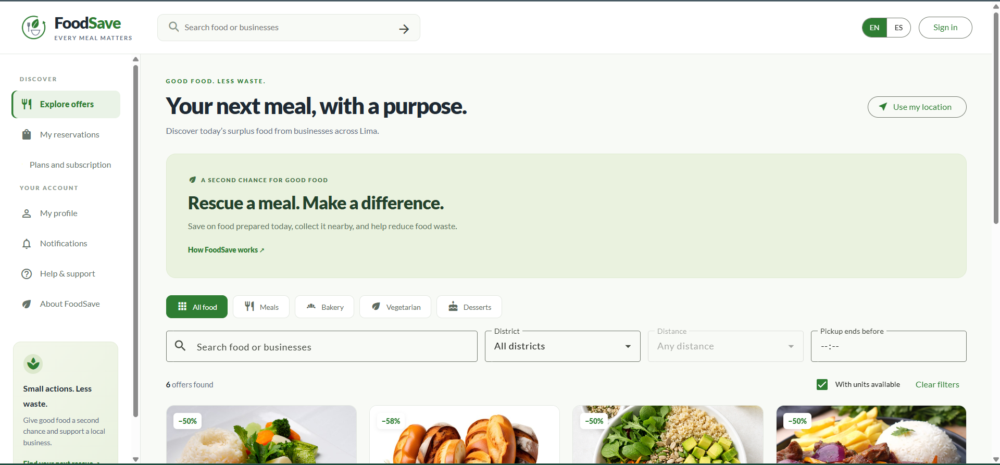
  <br><br>

  
  <br><br>

  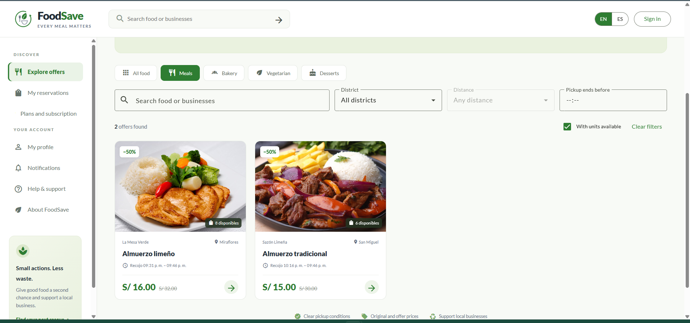
  <br><br>

  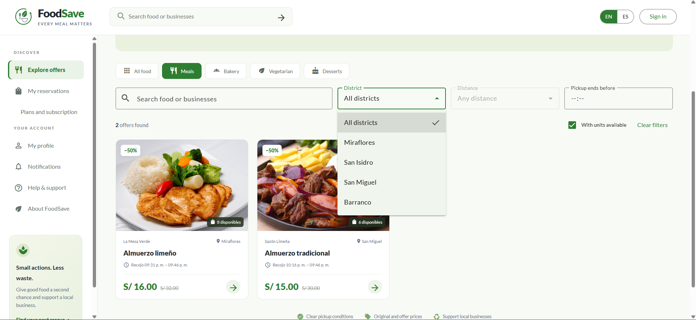
  <br><br>

  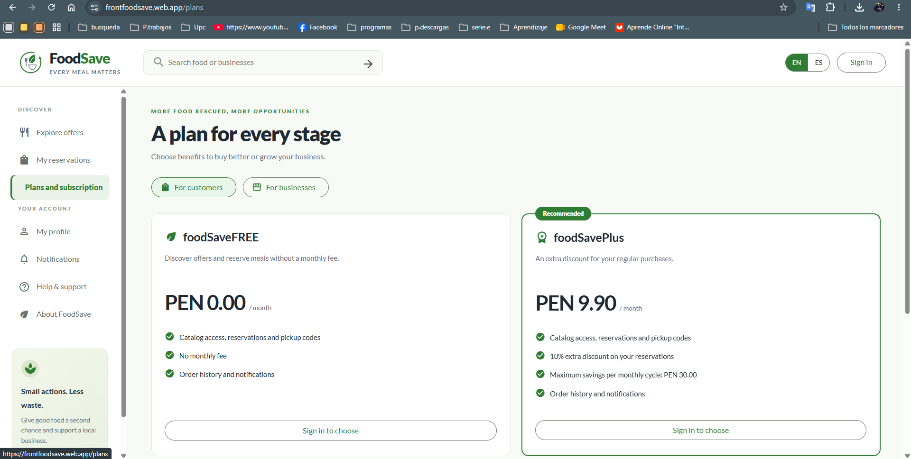
  <br><br>

  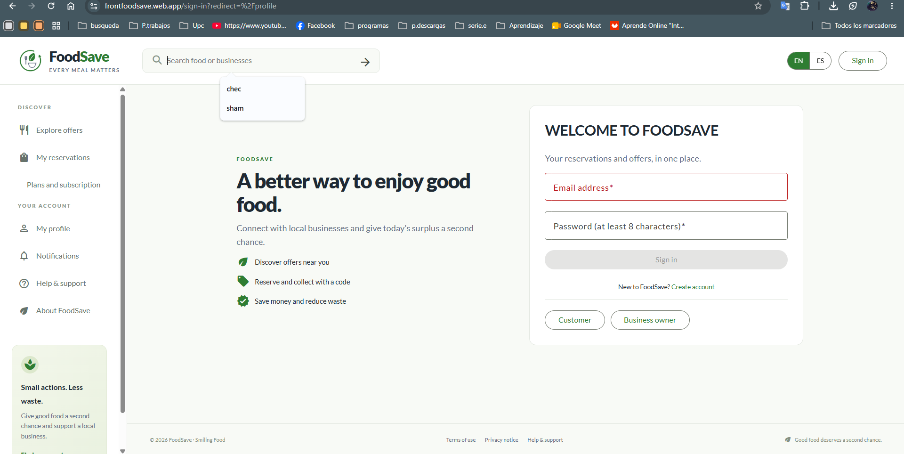
  <br><br>

  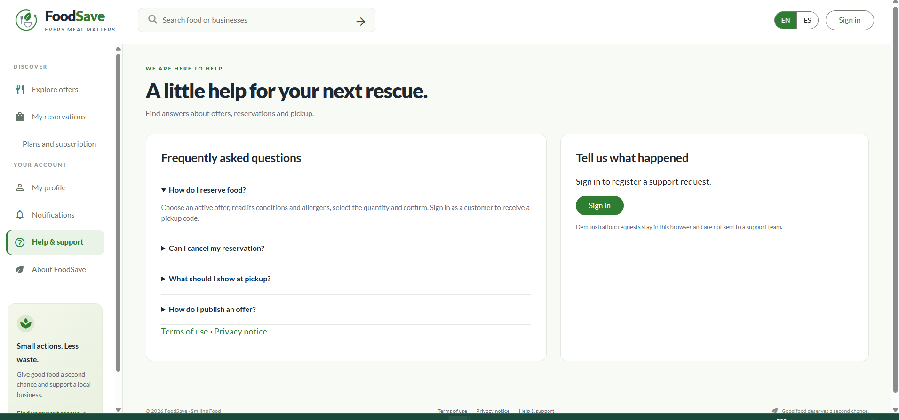

</div>

**Video de navegación del Sprint 2:** [Agregar video](URL)

#### 5.2.2.6. Services Documentation Evidence for Sprint Review

En esta sección se presentan las evidencias de documentación de los servicios implementados durante el Sprint 2.

| Endpoint / Service | Method | Description | Documentation Evidence |
| :--- | :---: | :--- | :--- |
| | | | |
| | | | |
| | | | |
| | | | |

<div align="center">

  <!-- Agregar aquí evidencias de Swagger / OpenAPI / Web Services -->

  

</div>

#### 5.2.2.7. Software Deployment Evidence for Sprint Review

En esta sección se presentan las evidencias relacionadas con el despliegue del software desarrollado durante el Sprint 2.

| Software Component | Deployment Platform | Repository / Branch | Deployment URL | Status |
| :--- | :--- | :--- | :--- | :--- |
| | | | | |
| | | | | |
| | | | | |

**URL de despliegue:** [Agregar URL](URL)

<div align="center">

  <!-- Agregar aquí las imágenes correspondientes al despliegue -->

  

</div>

#### 5.2.2.8. Team Collaboration Insights during Sprint

En esta sección se presentan las evidencias de colaboración del equipo durante el Sprint 2, considerando las contribuciones realizadas por cada integrante en los repositorios del proyecto.

| Team Member | GitHub Username | Repository | Commits | Pull Requests | Main Contribution |
| :--- | :--- | :--- | :---: | :---: | :--- |
| | | | | | |
| | | | | | |
| | | | | | |
| | | | | | |
| | | | | | |

Los gráficos de Contributors muestran las contribuciones realizadas por cada integrante durante el Sprint 2.

<div align="center">

  

  <br><br>

  

</div>

<!-- Salto de Pagina -->
<div style="page-break-after: always;"></div>

## Conclusiones

FoodSave presenta una propuesta orientada a conectar restaurantes de clase media y alta que generan excedentes de alimentos preparados con consumidores frecuentes de restaurantes que buscan opciones de calidad a precios accesibles. De esta manera, se plantea una alternativa para aprovechar alimentos que mantienen condiciones adecuadas para el consumo y que podrían terminar siendo desperdiciados.

A partir del análisis de los segmentos objetivos, se identificó que los restaurantes enfrentan dificultades para aprovechar los alimentos preparados que permanecen disponibles al finalizar la jornada, mientras que los consumidores consideran factores como el precio, la calidad y las promociones al momento de elegir dónde comer. Estas necesidades permiten establecer una relación de beneficio entre ambos segmentos.

Asimismo, el desarrollo de herramientas como User Personas, User Task Matrix y User Journey Mapping permitió comprender las actividades, necesidades, frustraciones y expectativas de los usuarios, proporcionando información relevante para orientar el diseño de FoodSave hacia una experiencia sencilla y acorde con las necesidades identificadas.

### Conclusiones y recomendaciones

El análisis realizado permite concluir que FoodSave puede funcionar como un intermediario entre la disponibilidad de excedentes de los restaurantes y consumidores interesados en adquirir comida de calidad a precios reducidos. Sin embargo, resulta fundamental que la propuesta mantenga como prioridad la confianza del consumidor, dejando claro que los productos ofrecidos son alimentos aptos para el consumo y no comida en mal estado.

Se recomienda continuar validando la propuesta mediante entrevistas y pruebas con usuarios pertenecientes a ambos segmentos, con el objetivo de comprobar su disposición a utilizar la plataforma y detectar posibles mejoras antes de avanzar hacia una implementación completa.

#### Conclusiones

- FoodSave busca reducir el desperdicio de alimentos preparados mediante su comercialización antes de que tengan que ser descartados.
- Los restaurantes pueden encontrar una oportunidad para recuperar parte del valor económico de productos que no lograron vender durante su jornada habitual.
- Los consumidores pueden beneficiarse al acceder a platos de calidad a precios más accesibles.
- La conexión entre ambos segmentos representa el principal valor de la propuesta de FoodSave.
- La calidad y el estado adecuado de los alimentos son elementos fundamentales para generar confianza en los consumidores.

#### Recomendaciones

- Validar constantemente las necesidades de restaurantes y consumidores mediante entrevistas y pruebas de usabilidad.
- Mostrar de manera clara el precio original, el precio reducido, la disponibilidad y las condiciones de cada oferta.
- Comunicar adecuadamente que los alimentos ofrecidos mantienen condiciones aptas para el consumo.
- Diseñar un proceso sencillo para que los restaurantes puedan publicar sus platos disponibles sin interferir con sus actividades habituales.
- Facilitar que los consumidores encuentren rápidamente ofertas disponibles de acuerdo con su ubicación y preferencias.


<!-- Salto de Pagina -->
<div style="page-break-after: always;"></div>

## Bibliografía

* Cordova-Buiza, F., Paucar-Caceres, A., Quispe-Prieto, S. C., Rivera-Garré, A. P., Huerta-Tantalean, L. N., Valle-Paucar, J. E., Ponce de León-Panduro, C. V., & Burrowes-Cromwell, T. (2022). Strengthening collaborative food waste prevention in Peru: Towards responsible consumption and production. Sustainability, 14(3), 1050. https://doi.org/10.3390/su14031050
* Instituto Peruano de Economía. (2024). Inseguridad alimentaria. Instituto Peruano de Economía. https://ipe.org.pe/wp-content/uploads/2024/12/Informe-IPE-EC-Inseguridad-alimentaria.pdf


<!-- Salto de Pagina -->
<div style="page-break-after: always;"></div>

## Anexos

### Anexo A. Contenido con Videos
|Sección|Características del video|
|---|---|
|Entrevistas| **Cantidad de videos:** 4 <br> **Nomenclatura:** upc-pre-202620-1asi0729-7747-SmilingFood-needfinding-av1  <br> **Duración:** cada entrevista dura entre 3 a 10 minutos <br> **URL:** https://acortar.link/vXBJIf|
|Video Exposición AV1| **Cantidad de videos:** 1 <br> **Nomenclatura:** upc-pre-202620-1asi0729-7747-SmilingFood-expo-av1  <br> **Duración:** 10:59 minutos <br> **URL:** https://acortar.link/vXBJIf  |  |

<!-- Salto de Pagina -->
<div style="page-break-after: always;"></div>

### Anexo B. Diseño y Prototipo
* **Wireframes Landing Page** 
https://www.figma.com/design/t7f1mAitmza4EHgwF66Yac/Landing-Page-WireFrames-FoodSave?node-id=0-1&t=RqPyZDD9dMOhJgPj-1

* **WireFrames Web Application** 
https://www.figma.com/design/90jUCaHcElRstVZN7W3oNA/Web-Application-Wireframes-FoodSave?node-id=1-3&t=k4QByTsTfUSHc9mv-1

* **Mock Ups FoodSave** 
https://www.figma.com/design/d9zxHR849EJYIkoBxsCFEM/Mock-Ups-FoodSave?node-id=0-1&t=5D6qbTCzcIyhA8zz-1


<!-- Salto de Pagina -->
<div style="page-break-after: always;"></div>

### Anexo B. Enlaces de despliegue de la solución FoodSave

A continuación, se presentan los enlaces correspondientes al despliegue de los principales componentes desarrollados para la solución FoodSave:

**Frontend Web**
Aplicación web de FoodSave desplegada en Firebase, desde la cual los usuarios pueden visualizar e interactuar con las ofertas disponibles.

https://frontfoodsave.web.app/offers

**Fake API**

API simulada desplegada en Render, utilizada como fuente de datos para las funcionalidades implementadas durante el desarrollo y las pruebas de la aplicación.

https://foodsavefakeapi.onrender.com/

Estos despliegues permiten evidenciar la ejecución e integración de los componentes desarrollados durante el proyecto FoodSave.

